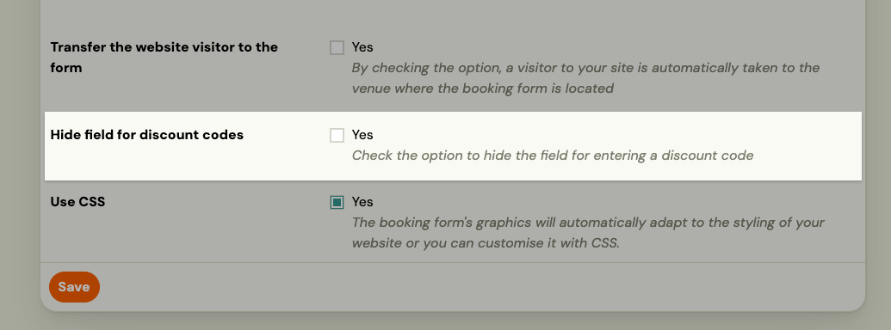
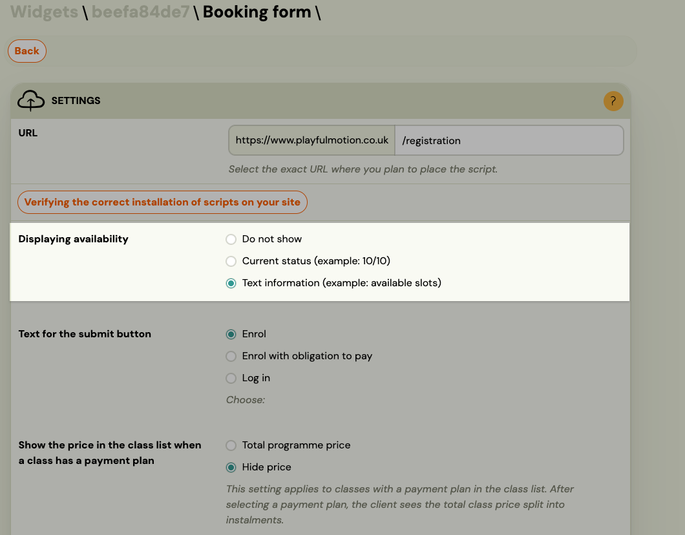

<!-- Synonyms: booking widget, registration form, booking form display, hide field booking form, widget customization, widget appearance, instructor not shown, instructor hidden, hide row widget, where are booking form settings, how to configure registration form, returning client booking form, person selection, select child booking form, pre-filled booking form, logged in booking, existing child booking, nastavení registračního formuláře, kde najdu formuláře, registrační formulář nastavení, kde nastavit registrační formulář, hogy tudom ezt a sort eltűntetni a regisztrációnál, oktató elrejtése regisztrációnál, oktató nem megadva regisztrációs form, registrációs urlap beállítás hol, registračný formulár zobrazenie, skryť pole registračný formulár, skryť inštruktora widget, ako vyzerá booking formulár pre klienta, kde sa nastavuje registračný formulár -->

# Booking Widget FAQ

## The booking widget shows "Instructor to be assigned" — how do I hide or change this?

When no instructor is assigned to a class, the booking widget displays a system placeholder text (e.g., "Will be assigned later"). You have two options:

**Option 1 — Create a placeholder instructor (recommended, no coding required)**

Create an instructor profile with a neutral name such as `TBD`, `To be announced`, or your organisation's name. Assign this placeholder to the class. The widget will display that name instead of the system default text.

To create an instructor: go to **Settings → Instructors** and add a new entry.

**Option 2 — Hide the instructor row using CSS**

If you want the instructor row to not appear in the widget at all, you can hide it with [custom CSS](https://docs.zooza.online/widgets/). Contact Zooza support to get the correct CSS selector for the instructor row, then add a hide rule in your widget's custom CSS settings.

See [Customizing widgets](../guides/customizing-widgets.md) for how to add custom CSS to your booking widget.

## How do I change what information is shown to clients in the booking widget?

The booking widget displays class details (name, dates, instructor, price) pulled directly from the class settings. To change what appears:

- **To change a value** (e.g., the instructor name, location) — update it in the class settings. The widget reflects these changes automatically.
- **To hide a row entirely** — use custom CSS to hide the element. See [Customizing widgets](../guides/customizing-widgets.md).
- **To change colours, fonts, or layout** — use custom CSS or the widget branding settings.

## Can I embed the booking form directly on my website?

Yes. The booking widget is a JavaScript snippet you embed on any webpage. Go to **Settings → Widgets**, copy the embed code, and paste it into your website's HTML.

For step-by-step instructions, see [Deploying Zooza on your website](../setup/deploying-zooza-on-website.md).

## Can clients register directly from my website without going to zooza.app?

Yes. The booking widget loads entirely within your website. Clients register without leaving your page or seeing the zooza.app domain. The widget inherits your site's styling and you can customise it further with CSS.

## The widget is showing outdated information — how do I refresh it?

The booking widget loads data in real time from Zooza. If a client sees outdated information (e.g., old class times, old instructor name), it is likely a browser caching issue on the client's side.

Ask the client to do a hard refresh (Cmd+R on Mac, Ctrl+R on Windows) or open the page in a private/incognito window.

If the data is incorrect in Zooza itself, update it in the class or programme settings — changes appear in the widget immediately after saving.

## Where do I find the booking form settings?

Booking form configuration is split across several places depending on what you want to change:

- **Global appearance** (button text, availability display, CSS, discount code field) — **Team & Settings → Publish** → click your widget → **Configure** next to Booking form.
- **What data is collected** (extra fields like date of birth, address, custom questions) — **Programmes** → open the programme → **Additional Fields**.
- **Which classes appear, field labels, multiple children per form, confirmation email** — **Programmes** → open the programme → **Online Booking → Edit**.
- **Price and payment method** — **Programmes** → open the programme → **Settings → Price and Payment**.

For a full overview of each level, see [Booking form settings overview](../guides/booking-form-settings.md).

## Can I rename the fields on the booking form (Name, Email, Phone)?

Yes, at the programme level. Go to **Programmes** → open the programme → **Online Booking → Edit** → scroll to **Customizing Booking Form**. You can enter a custom label for each standard field (Note, Name, Surname, Email address, Phone). You can also show or hide individual fields using the eye icon next to each one.

## Can I hide the instructor/provider row on the booking form?

No. There is no setting to hide the instructor (provider) row from the booking form. It is always shown as part of the session details.

If you do not want a specific instructor name to appear, the only option is to leave the instructor field blank on the class or session. In that case, the form will show "No instructor assigned" (or equivalent) instead of a name, but the row itself cannot be removed entirely.

If this is important for your setup, submit a feature request to the Zooza team.

## Can I hide the booking fee (registration fee) row on the booking form?

The booking fee row only appears if a booking fee is set on the programme. If you do not want it to appear:

- Go to **Programmes** → open the programme → **Settings → Price and Payment** and clear the booking fee or set it to 0. The row will no longer appear on the form.

If you need to keep the booking fee active but still hide the row from the visible form, this is not configurable in the app. It can be hidden via custom CSS or a script on your website — see [Customizing widgets](../guides/customizing-widgets.md).

## Can I hide the discount code field from the booking form?

Yes. Go to **Team & Settings → Publish** → click your widget → **Configure** next to Booking form → check **Hide field for discount codes**. This removes the discount code input for all programmes in that widget.

## Can I show only trial sessions (or only blocks) on the booking form?

Yes, per programme. Go to **Programmes** → open the programme → **Online Booking → Edit** → find **Booking Options Shown on Website** and choose one of:

- **Default** — client can choose between full programme, trial, or block (depending on what is available).
- **Offer full programme booking only** — hides trial and block options.
- **Trials only** — shows only trial sessions.
- **Blocks only** — shows only blocks.
- **Trials or blocks** — shows trials and blocks but not full programme booking.

## How do I set the display order of programmes on the booking form?

Go to **Programmes** → open the programme → **Online Booking → Edit** → set the **Priority** value (0–1000). Higher numbers appear first. By default all programmes have priority 0 and are sorted alphabetically.

## How do I hide the number of registered clients from the booking form?

Go to **Team & Settings → Publish** → click your widget → **Configure** next to Booking form → find **Displaying availability** and set it to **Do not show**.

The three options are:

| Option | What clients see |
|---|---|
| **Do not show** | No capacity or availability information is shown |
| **Current status** | Shows the number of filled and total spots (e.g. 10/12) |
| **Text information** | Shows a text label (e.g. "available slots") |

This setting applies to all programmes shown in that widget.

## Can I change the currency on the booking form?

There are two separate currency concepts in Zooza:

**Account currency** — set at the account level based on your country. If your currency is not available (e.g. ZAR — South African Rand), contact the Zooza team at support@zooza.online and request it be added. Zooza supports any country and currency, but not all may be pre-configured.

**Multi-currency display** — a separate per-programme feature that lets the booking form display prices in multiple currencies simultaneously (e.g. EUR, GBP, USD). Clients see all configured currencies and can choose their preferred one. This is configured in **Programmes → programme → Settings → Price and Payment → Additional currencies**.

If you are asking about changing your primary account currency, that requires a support request. If you want to offer multiple currencies on the form alongside your primary one, use the Additional currencies setting.

## Returning clients and person selection

### My client says the booking form looks different now — why?

Logged-in returning clients see an updated booking experience. When they open the form, a **person selection step** now appears before the main form. They can select a child or attendee from their previous bookings, or add a new person.

Once a person is selected, the form pre-fills the attendee's details automatically. The buyer's (account holder's) email is pre-filled and locked — it cannot be changed while logged in.

See [Booking widget experience for returning clients](../guides/returning-client-booking-widget.md) for a full explanation.

### Can returning clients use the booking form without logging in?

Yes. If a client does not log in, they see the standard form and fill in all details manually. The person selection step only appears for logged-in clients who have a booking history.

### Why can't a logged-in client change their email on the form?

The email is the key identifier used for invoicing, loyalty discounts, and booking history. Allowing it to change mid-booking would break the connection between the account and the booking record. If a client needs to book under a different email, they should log out and complete the booking as a new visitor.

### Will the loyalty discount change when a logged-in client selects a different child?

Yes. When the client selects a different person from the person selection list, the price is recalculated to reflect the correct loyalty discount tier for that child. For example, selecting a third child (rather than a second) may trigger a higher sibling discount tier automatically.

---

## Can I translate or customise the text labels on the booking widget?

Some fields can be relabelled directly in the programme settings — go to **Programmes → programme → Online Booking → Edit → Customizing Booking Form**.

For more advanced customisation (translations, styling, CSS, JavaScript options), refer to the [Zooza developer documentation at docs.zooza.online](https://docs.zooza.online). The docs cover:

- Custom translations via `window.ZOOZA = { translations: { 'key': 'value' } }`
- How to find translation keys using `print_debug: true` mode
- CSS and styling options for the embedded and WordPress plugin versions
- Filtering programmes and other embed parameters

Widget styling is handled on your website side (by your webmaster or developer) — it is not configurable from within the Zooza application itself.