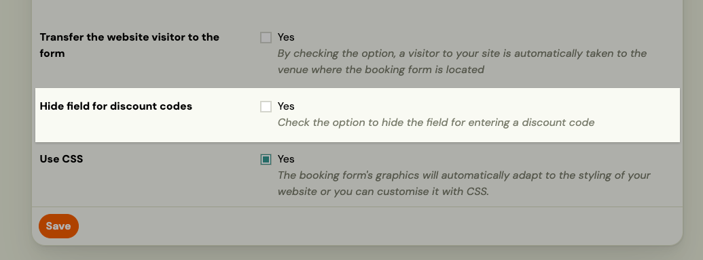
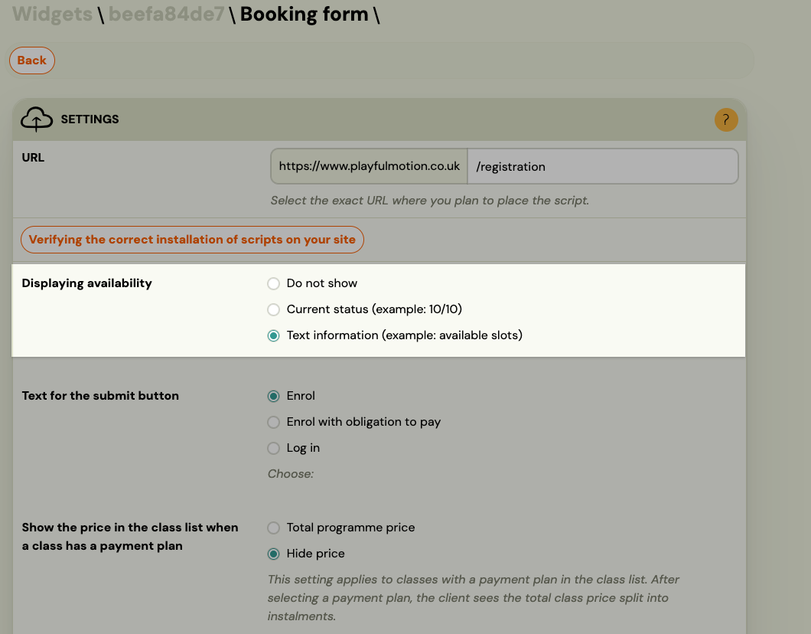

# Booking Widget FAQ

## The booking widget shows "Instructor to be assigned" — how do I hide or change this?

When no instructor is assigned to a class, the booking widget displays a system placeholder text (e.g., "Will be assigned later"). You have two options:

**Option 1 — Create a placeholder instructor (recommended, no coding required)**

Create an instructor profile with a neutral name such as `TBD`, `To be announced`, or your organisation's name. Assign this placeholder to the class. The widget will display that name instead of the system default text.

To create an instructor: go to **Settings → Instructors** and add a new entry.

**Option 2 — Hide the instructor row using CSS**

If you want the instructor row to not appear in the widget at all, you can hide it with [custom CSS](https://docs.zooza.online/widgets/). Contact Zooza support to get the correct CSS selector for the instructor row, then add a hide rule in your widget's custom CSS settings.

See [Customizing widgets](../guides/customizing-widgets.md) for how to add custom CSS to your booking widget.

## How do I change what information is shown to clients in the booking widget?

The booking widget displays class details (name, dates, instructor, price) pulled directly from the class settings. To change what appears:

- **To change a value** (e.g., the instructor name, location) — update it in the class settings. The widget reflects these changes automatically.
- **To hide a row entirely** — use custom CSS to hide the element. See [Customizing widgets](../guides/customizing-widgets.md).
- **To change colours, fonts, or layout** — use custom CSS or the widget branding settings.

## The booking form now asks people to log in — can they still book without an account?

Yes. **Continue as guest** is always there, and logging in is never required to book on the public form.

The form asks for an email address or phone number before continuing. If it matches someone you already have, Zooza sends a one-time code and signs them in without leaving the page — no redirect, no lost progress. If it matches nobody, or they would rather not, they click **Continue as guest** and carry on exactly as before.

**There is a way out at both steps**, which matters when a parent gets stuck:

- On the email/phone step, **Continue as guest** sits below an **OR** separator as a full button — logging in and carrying on as a guest are equally weighted.
- On the code step, after **Verify code**, the actions row offers **Resend code**, **Use a different email or phone**, and continuing as a guest. A parent whose code does not arrive is never trapped.

> If someone tells you they cannot get past the login screen, they are probably looking at an older version of your embedded widget. Refresh the page — the escape hatch is standard.

Where the prompt appears:

- At the top of the booking form, as **Already have an account? Log in**.
- On the details step, when they enter an email or phone that belongs to an existing customer.
- On a filtered or direct-link class list, as a hint that logging in may reveal a class they cannot see.

### Why the step exists

It is not there to collect accounts. Several features can only work if Zooza knows who the person is **before** the booking is made:

- **Loyalty and sibling discounts** — the price depends on what else this family has booked.
- **Priority registration** — a class can be open to returning customers weeks before the public. Anonymous visitors do not see it at all. See [Priority registration](../guides/priority-registration.md).
- **Auto-enrolment** — re-enrolling into the next term relies on the existing record.

A guest booking still works; it just cannot benefit from any of the above at the moment of booking.

### What changes after someone logs in

The step re-renders in place. The class list is fetched again, so a class that was hidden from anonymous visitors appears, and their saved details and children are filled in for them.

**Nothing they already chose is lost.** The class, whether they picked a trial, blocks or the full term, a delayed start date and any products all survive the login — they carry on from where they were rather than starting again.

> **If a parent says the class you sent them is not on the list**, ask whether they are logged in. A class in its priority window is genuinely invisible until Zooza knows they are eligible — the link is not broken.

## Can I embed the booking form directly on my website?

Yes. The booking widget is a JavaScript snippet you embed on any webpage. Go to **Settings → Widgets**, copy the embed code, and paste it into your website's HTML.

For step-by-step instructions, see [Deploying Zooza on your website](../setup/deploying-zooza-on-website.md).

## Can clients register directly from my website without going to zooza.app?

Yes. The booking widget loads entirely within your website. Clients register without leaving your page or seeing the zooza.app domain. The widget inherits your site's styling and you can customise it further with CSS.

## The widget is showing outdated information — how do I refresh it?

The booking widget loads data in real time from Zooza. If a client sees outdated information (e.g., old class times, old instructor name), it is likely a browser caching issue on the client's side.

Ask the client to do a hard refresh (Cmd+R on Mac, Ctrl+R on Windows) or open the page in a private/incognito window.

If the data is incorrect in Zooza itself, update it in the class or programme settings — changes appear in the widget immediately after saving.

## Where do I find the booking form settings?

Booking form configuration is split across several places depending on what you want to change:

- **Global appearance** (button text, availability display, CSS, discount code field) — **Team & Settings → Publish** → click your widget → **Configure** next to Booking form.
- **What data is collected** (extra fields like date of birth, address, custom questions) — **Programmes** → open the programme → **Additional Fields**.
- **Which classes appear, field labels, multiple children per form, confirmation email** — **Programmes** → open the programme → **Online Booking → Edit**.
- **Price and payment method** — **Programmes** → open the programme → **Settings → Price and Payment**.

For a full overview of each level, see [Booking form settings overview](../guides/booking-form-settings.md).

## Can I rename the fields on the booking form (Name, Email, Phone)?

Yes, at the programme level. Go to **Programmes** → open the programme → **Online Booking → Edit** → scroll to **Customizing Booking Form**. You can enter a custom label for each standard field (Note, Name, Surname, Email address, Phone). You can also show or hide individual fields using the eye icon next to each one.

## Can I hide the instructor/provider row on the booking form?

No. There is no setting to hide the instructor (provider) row from the booking form. It is always shown as part of the session details.

If you do not want a specific instructor name to appear, the only option is to leave the instructor field blank on the class or session. In that case, the form will show "No instructor assigned" (or equivalent) instead of a name, but the row itself cannot be removed entirely.

If this is important for your setup, submit a feature request to the Zooza team.

## Can I hide the booking fee (registration fee) row on the booking form?

The booking fee row only appears if a booking fee is set on the programme. If you do not want it to appear:

- Go to **Programmes** → open the programme → **Settings → Price and Payment** and clear the booking fee or set it to 0. The row will no longer appear on the form.

If you need to keep the booking fee active but still hide the row from the visible form, this is not configurable in the app. It can be hidden via custom CSS or a script on your website — see [Customizing widgets](../guides/customizing-widgets.md).

## Can I hide the discount code field from the booking form?

Yes. Go to **Team & Settings → Publish** → click your widget → **Configure** next to Booking form → check **Hide field for discount codes**. This removes the discount code input for all programmes in that widget.

## Can I show only trial sessions (or only blocks) on the booking form?

Yes, per programme. Go to **Programmes** → open the programme → **Online Booking → Edit** → find **Booking Options Shown on Website** and choose one of:

- **Default** — client can choose between full programme, trial, or block (depending on what is available).
- **Offer full programme booking only** — hides trial and block options.
- **Trials only** — shows only trial sessions.
- **Blocks only** — shows only blocks.
- **Trials or blocks** — shows trials and blocks but not full programme booking.

## How do I set the display order of programmes on the booking form?

Go to **Programmes** → open the programme → **Online Booking → Edit** → set the **Priority** value (0–1000). Higher numbers appear first. By default all programmes have priority 0 and are sorted alphabetically.

## How do I hide the number of registered clients from the booking form?

Go to **Team & Settings → Publish** → click your widget → **Configure** next to Booking form → find **Displaying availability** and set it to **Do not show**.

The three options are:

| Option | What clients see |
|---|---|
| **Do not show** | No capacity or availability information is shown |
| **Current status** | Shows the number of filled and total spots (e.g. 10/12) |
| **Text information** | Shows a text label (e.g. "available slots") |

This setting applies to all programmes shown in that widget.

## Can I change the currency on the booking form?

There are two separate currency concepts in Zooza:

**Account currency** — set at the account level based on your country. If your currency is not available (e.g. ZAR — South African Rand), contact the Zooza team at support@zooza.online and request it be added. Zooza supports any country and currency, but not all may be pre-configured.

**Multi-currency display** — a separate per-programme feature that lets the booking form display prices in multiple currencies simultaneously (e.g. EUR, GBP, USD). Clients see all configured currencies and can choose their preferred one. This is configured in **Programmes → programme → Settings → Price and Payment → Additional currencies**.

If you are asking about changing your primary account currency, that requires a support request. If you want to offer multiple currencies on the form alongside your primary one, use the Additional currencies setting.

## Returning clients and person selection

### My client says the booking form looks different now — why?

Logged-in returning clients see an updated booking experience. When they open the form, a **person selection step** now appears before the main form. They can select a child or attendee from their previous bookings, or add a new person.

Once a person is selected, the form pre-fills the attendee's details automatically. The buyer's (account holder's) email is pre-filled and locked — it cannot be changed while logged in.

See [Booking widget experience for returning clients](../guides/returning-client-booking-widget.md) for a full explanation.

### Can returning clients use the booking form without logging in?

Yes. If a client does not log in, they see the standard form and fill in all details manually. The person selection step only appears for logged-in clients who have a booking history.

### Why can't a logged-in client change their email on the form?

The email is the key identifier used for invoicing, loyalty discounts, and booking history. Allowing it to change mid-booking would break the connection between the account and the booking record. If a client needs to book under a different email, they should log out and complete the booking as a new visitor.

### Will the loyalty discount change when a logged-in client selects a different child?

Yes. When the client selects a different person from the person selection list, the price is recalculated to reflect the correct loyalty discount tier for that child. For example, selecting a third child (rather than a second) may trigger a higher sibling discount tier automatically.

---

## The widget shows "available" but my class should be full — why?

If the booking widget shows a class as available even though you believe it is fully booked, the reason is always in the class or group settings. Check the following:

1. **Class capacity** — open the class and check the **Capacity** field. If capacity is set higher than the number of current registrations, the class is not technically full even if it looks that way on your side.

2. **Trial registrations count toward capacity** — trial bookings occupy a spot in the class just like regular bookings. If you have several open trials that have not been converted or lost, they are holding capacity.

3. **Trial settings allow registration past capacity** — some configurations allow new trials even when the class is at capacity. Check the class settings to see whether trial registration is allowed beyond the capacity limit.

4. **Group or segment capacity** — if your class uses blocks or groups with separate per-group limits, the overall class may still appear available even if one group is full. Check the individual group/block capacity settings inside the class.

There is no single switch that controls this — the reason is always in the class or group configuration. Open the class and go through the settings above to find which one explains the discrepancy.

> **Note:** The widget availability display (Do not show / Current status / Text information) only controls what clients *see* — it does not affect whether they can actually register. Even if the widget shows "available", registration will fail at the point of submission if the class is genuinely full.

---

## The widget shows the class as available, but registration fails at the final step — why?

The widget and the registration form run separate checks. The widget shows the *current* availability snapshot; the actual registration runs a fresh validation at the moment of submission. These can differ.

Common causes:

1. **Class became full between loading and submitting** — another client completed their registration in the same window. The widget cached the "available" state before the last spot was taken. Refresh the page to see the updated availability.
2. **Age or eligibility restriction** — the class has a minimum or maximum age restriction set. The widget does not always surface this upfront; it appears as an error on submission when the child's age falls outside the allowed range. Check **Class Settings → Restrictions**.
3. **Registration deadline passed** — some classes have an online registration cut-off (a date after which new registrations are blocked). If the deadline passed between the client viewing the widget and submitting the form, registration fails.
4. **Payment configuration error** — if the programme's payment settings are incomplete (e.g. no price set, a required payment method missing), the form may load but fail on the payment step. Open the programme under **Programme Settings → Price and Payment** and verify the configuration.
5. **Widget embed outdated** — if the embed code on your website is old (from a previous version of Zooza's widget), it may load the form but fail to complete the registration. Update the embed code from **Team & Settings → Publish** and replace it on your website.

If the error message is visible on screen, note the exact wording — it tells you which check failed. If no message appears and the form just resets, check the browser console for JavaScript errors, which can indicate a conflict with your website's scripts.

---

## Some programmes are not showing in the booking widget on my website — why?

If the widget shows fewer programmes than expected, check the URL you are using to embed the widget on your website.

A common cause is a **hardcoded `place` or `location` parameter in the embed URL**. If your embed URL contains something like `?place=12` or `&pid=12_0`, the widget will only display programmes at that specific location and hide all others — even if those other programmes exist in Zooza.

**To fix:** Remove the `place`/`pid` parameter from the embed URL so the widget shows programmes from all locations. If you want to keep separate widgets per location, create separate widget embed codes in **Team & Settings → Publish**.

---

## The registration form on my website is not loading — clients see text but no form

There are two common causes:

### The class has no sessions scheduled

A booking form will not display the registration widget if the class it belongs to has no sessions in the system. Without sessions, there is nothing to sign up for.

**Fix:** Go to **Programmes → class → Sessions** and check that sessions have been generated. If the class is new or you added it recently without generating a schedule, add sessions manually or via the schedule generator. Once sessions exist, the registration form will load.

### The text on the page is plain text, not the Zooza widget embed code

Sometimes what looks like a registration form on a website is actually a block of text that someone typed or pasted. The Zooza widget only works if the actual embed code (a `<script>` tag or WordPress shortcode) is in the page source.

**Check:**
1. Right-click the area where the form should appear and select **Inspect** (or **View Page Source**).
2. Look for a `<script>` tag containing `zooza.online` or a `[zooza ...]` WordPress shortcode. If it is not there, the widget embed code is missing.

**Fix:** Go to **Team & Settings → Publish** in Zooza, copy the correct embed code for your widget type, and paste it into the page editor on your website. Refer to [Widget Embedding Troubleshooting](../troubleshooting/widget-embedding.md) for step-by-step instructions.

## Can I translate or customise the text labels on the booking widget?

Some fields can be relabelled directly in the programme settings — go to **Programmes → programme → Online Booking → Edit → Customizing Booking Form**.

For more advanced customisation (translations, styling, CSS, JavaScript options), refer to the [Zooza developer documentation at docs.zooza.online](https://docs.zooza.online). The docs cover:

- Custom translations via `window.ZOOZA = { translations: { 'key': 'value' } }` — see the [translations reference](https://docs.zooza.online/widgets/registration-widget/#translations) for the full key list
- How to find translation keys using `print_debug: true` mode
- CSS and styling options for the embedded and WordPress plugin versions
- Filtering programmes and other embed parameters

The `window.ZOOZA` configuration object supports two properties: `translations` and `print_debug`. It does **not** support a `style` property or any layout/appearance overrides — those are applied using CSS on your website. If you need to change a visual aspect of the widget (e.g. dropdown height, font size, padding), add CSS to your website stylesheet rather than `window.ZOOZA`.

Widget styling is handled on your website side (by your webmaster or developer) — it is not configurable from within the Zooza application itself.