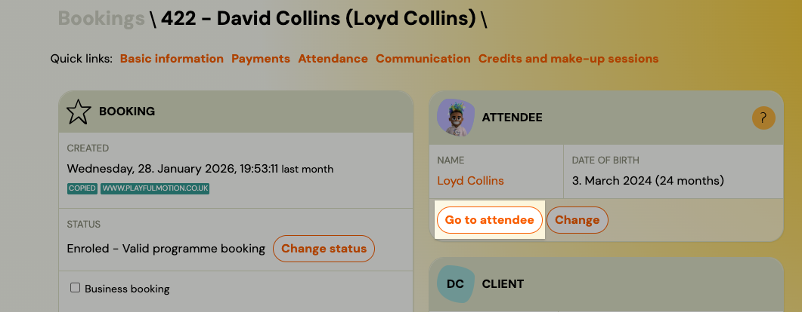
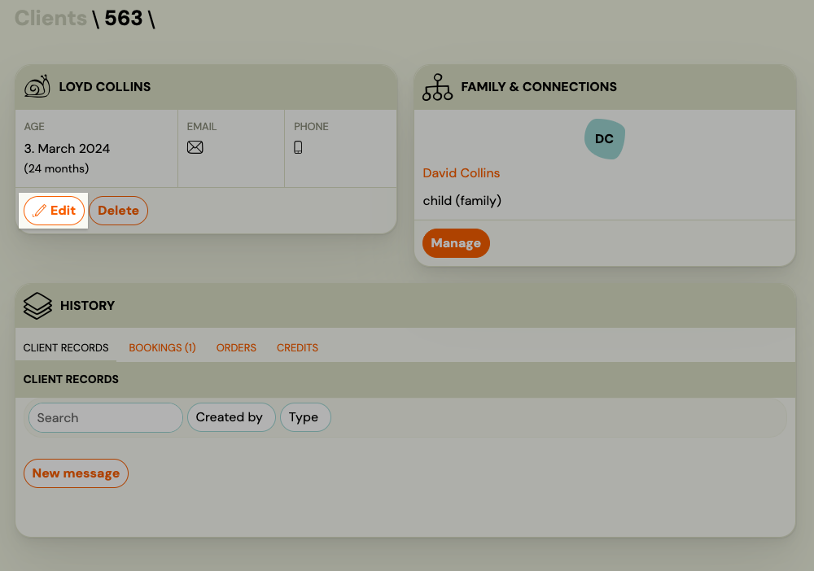

<!-- Synonyms: move client, delete client, remove client, cancel client, move child to group, move child to another class, change group, presunúť klienta, zmazať klienta, odstrániť klienta, presunúť dieťa, dieťa do inej skupiny, zmeniť skupinu, zrušiť klienta, klient iná skupina -->

# Client Management FAQ

## How do I create a new client manually (not through booking)?

Zooza does not have a standalone "Add client" button. A client record is created automatically when a booking is made. To create a client manually:

1. Go to the booking form and create a new booking on behalf of the client (choose any class).
2. Fill in the client's name and email address during the booking process.
3. If you only need the client record and not the booking, delete the booking afterwards. The client profile remains in the system.

This is the only way to create a client without the parent registering themselves through the online form.

## How do I change the client (parent) on an existing booking?

Changing the client on a booking reassigns that single booking to a different parent. It does not change the client's personal data across all their bookings.

1. Open the booking detail.
2. Click **Change Client**.
3. In the `Client` field, enter the email or name of the new client and click **Search**.
4. Select the correct client from the results and confirm.

The new client must already exist in the system (they must have at least one booking of any status). Communication history tied to the booking is preserved because it is linked to the booking number, not the email address.

See also: [Data Correction or Change Client](../guides/data-correction-change-client.md).

## A client has duplicate accounts -- how do I merge them?

Duplicates occur when a parent registers with two different email addresses, or when an admin creates a second record by mistake.

1. Go to **Clients** and open one of the duplicate client profiles.
2. Navigate to **Family & Connections** and click **Manage**.
3. Select the duplicate profiles you want to merge.
4. Click **Merge profiles**.

Merging combines the booking history and family connections from both profiles into one. You cannot undo a merge, so verify the records carefully before proceeding.

<!-- REVIEW: Confirm whether payments and communication history are fully preserved after a merge, or whether any manual reconciliation is needed. -->

## How do I change a client's email address?

You cannot edit a client's email address directly. Email changes go through a formal request process:

1. Go to **Clients** and open the client's profile.
2. Click **Data correction**.
3. Click **New Request** and fill in the new email address in the `New data entry` field.
4. Click **Submit**.

The Zooza team reviews and processes the request, usually within 2 business days. You receive a notification email when the request is approved or rejected.

A request may be rejected if the new email already belongs to a different client in the system, or if the details do not match the existing record. If you need to assign a booking to a completely different person (not just fix a typo), use **Change Client** on the booking instead.

## How does Client ID work across franchise accounts?

Each client profile can have a `Custom customer ID` field, which you set manually in the client detail. This is a free-text identifier you define for your own tracking purposes (e.g. an internal reference number).

When a child transfers between franchise accounts (separate Zooza companies), the child may exist as a different client record in each account. The Client ID does not sync automatically across franchise accounts. Each franchise manages its own client database independently.

<!-- REVIEW: Confirm whether cross-franchise child transfers create a linked record or a fully independent duplicate. -->

## Can I add a second email address for notifications on a booking?

Yes. You can add an additional email address that receives session reminders for a specific booking. This is useful when separated parents both need to receive notifications about their child's sessions.

1. Open the booking detail.
2. In the booking settings, find **Additional email for reminders before sessions**.
3. Enter the second email address.

This additional email receives session reminder notifications only. It does not receive payment reminders or other booking-level communications. The second email can also be added by the client themselves through their Client Profile.

> **Warning:** If you collect a secondary email address via an **extra field** on the booking form (e.g., Additional field 1), that value is **not** automatically transferred to the system's secondary email field. Extra fields are text-only data collection and are not linked to system notification fields. You must manually copy the email from the extra field into the booking's **Additional settings** → secondary email field for the second parent to actually receive notifications.

## How do I give a divorced parent separate access to the same child?

Zooza supports this through a combination of guest access and additional notification emails:

1. **Guest access to the booking** -- In the booking detail settings, use **Guest access to the booking** to grant a second parent read access via their email address. This lets them view the booking without needing a separate account.
2. **Additional email for reminders** -- Add the second parent's email in the **Additional email for reminders before sessions** field so they receive session notifications independently.

Both parents do not need separate Zooza accounts. The primary client (the parent who created the booking) retains full control, while the second parent gets visibility through guest access and reminder emails.

<!-- REVIEW: Confirm the exact scope of guest access -- does it include viewing attendance and payment status, or only session schedule? -->

## Where can I see which fields are visible to instructors on the attendance screen?

The fields visible to instructors on the attendance screen are determined by the instructor's role and your account settings. By default, instructors see the attendee's name and basic session details.

Whether additional fields like phone number or email are shown depends on the role assigned to the instructor in **Settings** > **Team** > **Access**. The standard instructor role has limited visibility and does not show client contact details on the attendance screen. If you need instructors to see phone numbers or other client data, check the permissions for their assigned role.

Go to **Settings** > **Team** to review which roles have access to client contact information.

<!-- REVIEW: Confirm exact settings path for controlling which client fields are visible on the instructor attendance view. This may require a role with elevated permissions rather than a per-field toggle. -->

## Where do I set or change a child's date of birth on a booking?

The date of birth is stored on the **attendee** (child) entity, not on the booking itself. You can edit it directly from the booking detail.

1. Open the booking detail.
2. In the **Attendee** card, click the child's name or the edit icon.
3. Update the **Date of birth** field and save.

> **Note:** This changes the child's date of birth across all their bookings — the attendee record is shared, not per-booking.

## Can I change the date of birth of the registering person (parent/buyer)?

No. Zooza does not store or display the date of birth of the registering person (parent/buyer) as an editable profile field. Date of birth can only be set and edited for the **attendee** (typically the child).

If you need to collect the parent's date of birth, add a custom extra field to the booking form — but this is stored as free text only, not as a system field.

## How do I move a child (or client) to a different group or class?

In Zooza, clients and their children are linked to **bookings**, not to classes directly. To move a child to a different group, you transfer the booking — not the client record.

> **Important:** You cannot move a client or child from the Clients page. The action is performed on the booking itself, found under **Clients → Bookings**.

1. Go to **Clients** → **Bookings** and open the booking you want to move.
2. Click **Transfer** (in the Class card).
3. Select the target class and confirm.

The child (attendee) and their booking move to the new class. Their client profile stays the same.

See [Transfer and copy bookings](../guides/transfer-and-copy-bookings.md) for a step-by-step walkthrough.

## How do I delete or remove a client?

Zooza does not have a standalone "Delete client" button on the Clients page. What most users mean when they want to "delete a client" is one of these booking-level actions:

| What you want to do | Action on the booking |
|---|---|
| Client registered by mistake or was a test entry | Set booking status to **Deleted** |
| Client is leaving or cancelling their enrolment | Set booking status to **Cancelled** |
| Client is taking a temporary break | Pause the payment plan (do not delete) |

> **Navigation:** Go to **Clients** → **Bookings** → open the booking → change the status in the booking detail.

Setting a booking to **Deleted** is typically used in the early phase (test registrations, duplicates, or bookings created by mistake). The client record itself remains in the system — it is not removed.

If you need to delete a client record entirely, contact Zooza support.

See [Common booking scenarios](common-booking-scenarios.md) for details on each status.

## Why can't I find "move" or "delete" actions on the Clients page?

The **Clients** page (and the individual client profile) shows contact and personal information only. It does not contain actions for moving, cancelling, or deleting enrolments.

All enrolment-level actions — transferring to another class, cancelling, deleting, pausing — are performed on the **booking**, not on the client record.

To manage enrolments, go to **Clients → Bookings** (the Bookings list), find the booking, and open it. All available actions appear there.

## What does "active client" mean in Zooza?

A client is active if they have at least one booking in **Enrolled**, **Trial not started**, **Trial started**, or **Trial finished** status in a class that has not ended yet. A client is also active if they have a scheduled make-up session or unused credit. Active status is determined automatically — you cannot set it manually. For the full technical definition, see [Active and inactive clients](../guides/active-inactive-clients.md).

## Why is a client still showing as active after I cancelled their booking?

Client deactivation runs once a day at **midnight**. If you cancel or delete a booking during the day, the client remains active until the next midnight run. Also check that the client does not have other active bookings, unused credits, or scheduled make-up sessions — any of these keeps the client active.

## How does the active client count affect my Zooza subscription?

Your Zooza service package is based on the **peak number of active clients** within the month — not the count at month-end. If you exceed your current package limit at any point during the month, you are automatically upgraded. To downgrade, you must request it in writing by the end of the month. For details, see [Active and inactive clients](../guides/active-inactive-clients.md).
