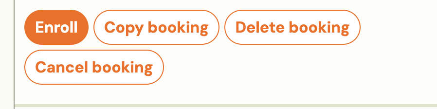
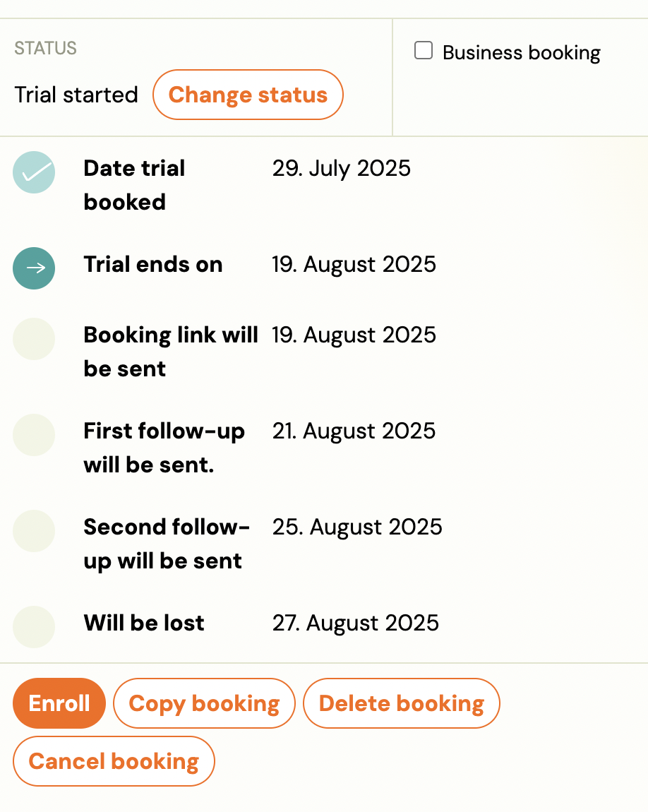
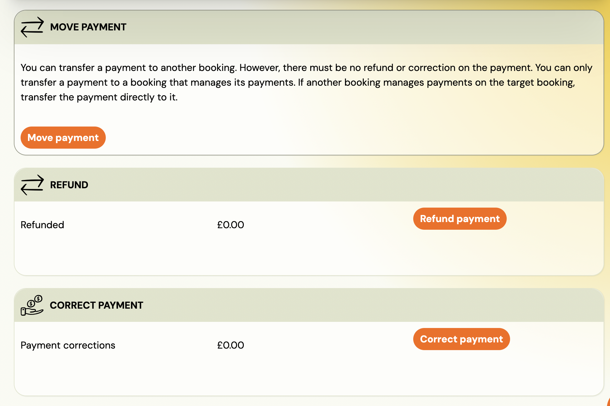

# Common Booking Scenarios

## 1. How do I delete a booking?

Use this when the client won’t start or it’s a duplicate.
Steps: Bookings → Detail → Change status to Deleted.
(You will still have a data in CRM under filstre Deleted bookings)

## 2. How do I pause a booking?

Use this when a client takes a break for a defined period.
Steps:
Bookings → Detail → Payments → Payment Plan → Update the next scheduled payment date.
(Billing restarts after the pause.)

## 3. How do I cancel a booking?

Use this if the client is leaving.
Steps: Bookings → Detail → Change status to Cancelled.
(Keeps history, frees the spot, can be reactivated later.)

## 4. How does the waitlist work?

When a class is full, new clients go to Waitlist automatically.
When a place opens, they receive a notification to confirm.
Steps: Bookings → Detail → Status = Waitlist.

## 5. What is a trial booking?

Clients attending their first class will have a status Trial.
Steps: Bookings → Check that status = Trial.

## 6. How do refunds work?

Refunds (full or partial) can be done directly in Zooza.
Applies to Stripe, not GoCardless, etc.
Steps: Booking → Detail → Payments → Select transaction → Process refund.
(Money is automatically sent to the client. Or note is created and manually process in your payment gateway. )

## 7. How do I handle missed classes?

Go to Booking → Payments → Payment plan → Adjust the next payment.
Automation options (on request):

- Offer [make-up classes](https://support.zooza.online/portal/en/kb/articles/replacement-lessons).
