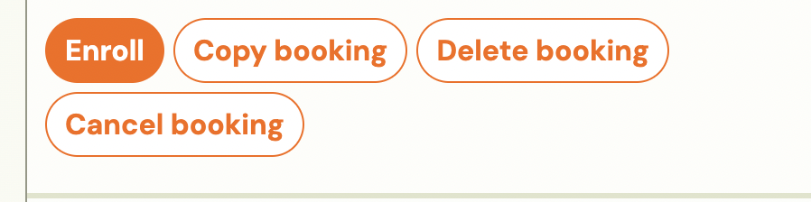
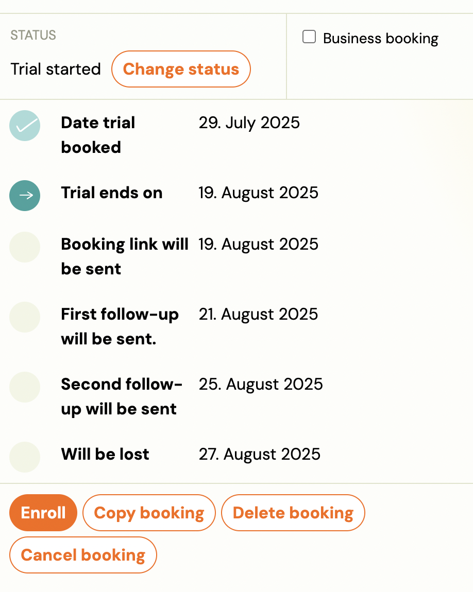
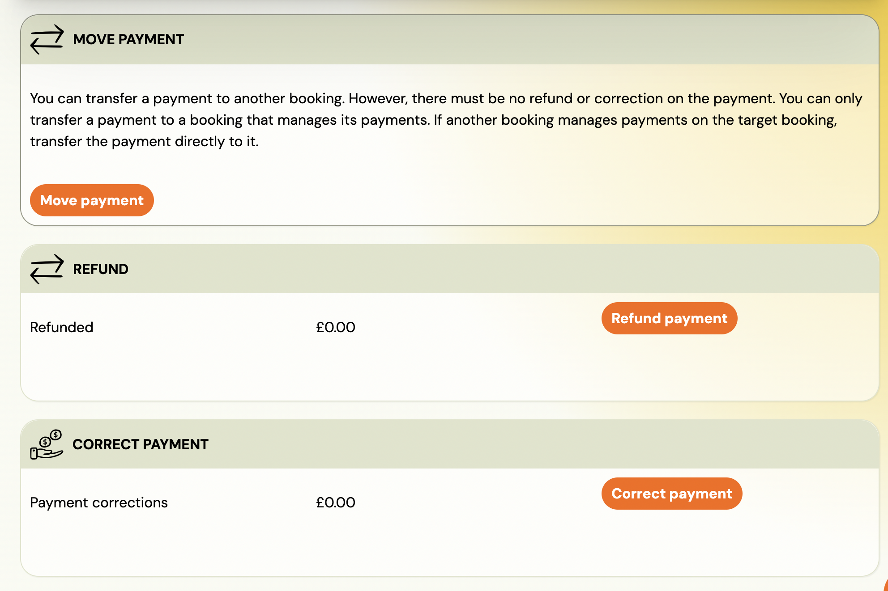

# Common Booking Scenarios

## 1. How do I delete a booking?

Use this when the client won’t start or it’s a duplicate.
Steps: Bookings → Detail → Change status to Deleted.
(You will still have a data in CRM under filstre Deleted bookings)

## 2. How do I pause a booking?

Use this when a client takes a break for a defined period and will return — for example, they are away for a few weeks, or the class venue is temporarily unavailable.

**Step 1 — Stop upcoming reminders by cancelling the sessions they'll miss.**

1. Go to **Calendar** and select the sessions that won't take place for this client's period of absence.
2. Click **Bulk Edit → Cancel** (or set individual sessions to Cancelled).
3. Cancelled sessions will not trigger automated reminders.

> If the whole class is pausing (not just one client), cancel the sessions for the whole class. If it's one client only, you can mark their attendance as absent instead — but the reminder will still be sent unless the session itself is cancelled.

**Step 2 — Defer the payment plan so nothing is charged during the break.**

1. Go to **Bookings → Detail → Payments → Payment Plan**.
2. Click on the next scheduled payment.
3. Update the **Scheduled for** date to after the client returns.
4. Save.

Billing will resume from that new date. Any subsequent scheduled payments will shift accordingly if the plan is set to follow-on billing.

**When the client returns:**

- Add back any sessions that were cancelled for their period (if they need to make up missed time), or simply let the next scheduled sessions continue as normal.
- If sessions were deleted rather than cancelled, recreate them from the class detail.

> **Keeping the booking active vs cancelling it:** A paused booking keeps the client's place in the class and their history intact. Use Pause (defer payment + cancel sessions) when the client *will* return. Use Cancel (status → Cancelled) only when they are leaving permanently.

## 3. How do I cancel a booking?

Use this if the client is leaving.
Steps: Bookings → Detail → Change status to Cancelled.
(Keeps history, frees the spot, can be reactivated later.)

## 4. How does the waitlist work?

When a class is full, new clients go to Waitlist automatically.
When a place opens, they receive a notification to confirm.
Steps: Bookings → Detail → Status = Waitlist.

## 5. What is a trial booking?

Clients attending their first class will have a status Trial.
Steps: Bookings → Check that status = Trial.

## 6. How do refunds work?

Refunds (full or partial) can be done directly in Zooza.
Applies to Stripe, not GoCardless, etc.
Steps: Booking → Detail → Payments → Select transaction → Process refund.
(Money is automatically sent to the client. Or note is created and manually process in your payment gateway. )

## 7. How do I handle missed classes?

Go to Booking → Payments → Payment plan → Adjust the next payment.
Automation options (on request):

- Offer [make-up sessions](https://support.zooza.online/portal/en/kb/articles/replacement-lessons).
