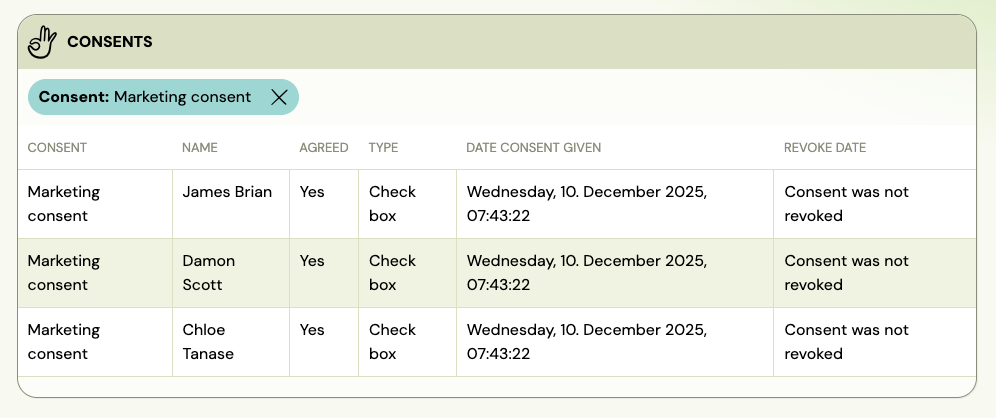

<!-- Synonyms: terms and conditions registration, GDPR consent booking, add terms to booking form, consent checkbox, accept terms, marketing consent, data processing consent, terms not showing, consent not required, photo consent, video consent, check who gave consent, verify parent consent, szerződési feltételek regisztrációkor, GDPR hozzájárulás, feltételek elfogadása, beleegyezés regisztrációnál, fénykép hozzájárulás, videó hozzájárulás, hozzájárulás ellenőrzése, súhlas pri registrácii, podmienky registrácia, GDPR súhlas zákazník, obchodné podmienky registračný formulár, foto súhlas, video súhlas, overiť súhlas rodičov, acord fotografii, acord video, verificare acord parinti, acord privind imaginea copiilor, cum verific acordul pentru poze -->

# Consents and Agreements FAQ

## How do I check whether all parents have given photo or video consent?

There are three places where you can verify consent status:

**1. Filter the bookings list by consent (best for checking all at once)**

Go to **Settings → Consents & Agreements**, find your photo/video consent, and click the **Has consent** or **No consent** filter button. This opens the bookings list filtered to show only clients who have (or have not) given that consent — with their name, consent type, date given, and revoke date.

This is the fastest way to get a full list of who has and has not accepted.

**2. Session detail (useful during a class)**

Open a session detail. At the bottom of the page, you can see the consent status for each participant attending that session.



**3. Individual client detail**

Open the client's detail page (not the booking — the client profile itself) and scroll to the **Consents given by client** section. This shows the full consent history for that client: which consents they gave, when, and whether any were revoked.

## How do I make clients accept terms and conditions during registration?

Go to **Settings → Consents & Agreements** and click **Add**. Fill in the consent name and text, set **Consent type** to **Check box** (so clients must tick it) or **No separate confirmation needed** (so agreeing is implicit in clicking the Register button). Set **Require from** to **All bookings** or limit it to specific programmes.

For the full setup, see [Consents and agreements](../setup/setting-gtc-gdpr-consents.md).

## What is the difference between the consent types?

| Type | What the client sees |
|---|---|
| **No separate confirmation needed** | No checkbox — agreeing is implied by clicking the registration or order button |
| **Check box** | A checkbox the client must tick before proceeding |
| **Choose Yes or No** | An explicit Yes/No choice — clients can decline, and you can filter by their answer |

Use **Check box** or **No separate confirmation needed** for mandatory consents like T&C or GDPR. Use **Yes or No** for optional consents like marketing opt-in where you need to track both acceptance and refusal.

## How do I add a health declaration or "I confirm my child is healthy" checkbox to the registration form?

Use **Consents & Agreements** — not Additional fields. Additional fields only support text input or dropdown selection. A mandatory checkbox that requires no text response must be set up as a consent.

Steps:

1. Go to **Settings → Consents & Agreements → Add**.
2. Enter the declaration text in the **Consent text** field (e.g. *"I confirm that my child shows no signs of illness and does not have any infectious disease at the time of enrolment."*).
3. Set **Consent type** to **Check box** — the client must tick this to proceed.
4. Set **Require from** to **All bookings** or limit it to the specific programme (e.g. a summer camp).
5. Save.

The checkbox appears on the registration form above the Register button. Clients cannot complete registration without ticking it.

> **Tip:** You can customise the link label shown to clients. In the **Name of the consent in the booking form** field, you can replace the default "More" link with your own text — for example: `<a href="*|AGREEMENT_URL|*">Health declaration</a>`. This text appears as the clickable link that opens the full consent text.

## Can I link to my own website for the full T&C text instead of typing it in Zooza?

Yes. In the **Name of the consent in the booking form** field, replace the `*|AGREEMENT_URL|*` tag with a direct link to your page:

```
<a href="https://yourwebsite.com/terms">Terms and Conditions</a>
```

In this case, leave the **Consent text** field empty. Clients click the link and are taken to your website to read the full text.

## Can I show different consents for different programmes?

Yes. When creating or editing a consent, set **Require from** to **For select programmes** and pick which programmes it applies to. Consents set to **All bookings** always appear regardless of programme.

This is useful for:
- Photo or video consent — only for in-person classes, not webinars
- Special T&C for summer camps or one-off events
- Additional waivers for specific activities

## Where can I see whether a client has accepted a consent?

Open the client detail and scroll to the **Consents given by client** section. The table shows each consent, the version the client agreed to, whether it was mandatory, whether they agreed, the date, and whether it was revoked.

## Can I filter bookings by consent status?

Yes. In **Settings → Consents & Agreements**, each consent card has **Filter bookings** buttons. Click **Has consent** or **No consent** (for checkbox types) or **Accepted / Declined / No consent** (for Yes/No types) to jump directly to a filtered booking list.

## A client says they were not asked to accept the consent — why?

Check the following:

1. **Require from setting** — if the consent is set to **For select programmes**, it will not appear for bookings in other programmes.
2. **Consent type** — if set to **No separate confirmation needed**, no checkbox is shown. The consent is still recorded, but the client may not notice it.
3. **When the client registered** — if the consent was added after the client registered, it will not appear retroactively on their existing booking.

## Can a client revoke consent after registering?

Consent revocation is not currently done through the booking form. If a client requests revocation (e.g., for GDPR purposes), you can record it manually in the client detail. The revoke date is then shown in the consent record. Contact Zooza support if you need guidance on the revocation workflow.

## What happens when I update the consent text?

Zooza creates a new consent version. The updated text applies to new bookings from that point on. Clients who accepted the previous version retain their old consent record — they are not automatically prompted to re-accept. If re-acceptance is legally required, you must contact clients separately.

## Can I add multiple consents?

Yes. Click **Add** in **Settings → Consents & Agreements** to add as many consents as needed. Each one is configured and displayed independently. If you need the same consent to appear on both the booking form and the order form, create two separate entries — one for each form type.

## Can I change the "I agree / I don't agree" label text on consent choices?

Not through the Zooza admin app. The button/radio label text is rendered by the booking widget and is not configurable via the Settings UI.

It can be overridden via a custom JavaScript translation script on your website — this is the same mechanism used to customise any other widget text. See the widget translations reference at docs.zooza.online for the available translation keys.
