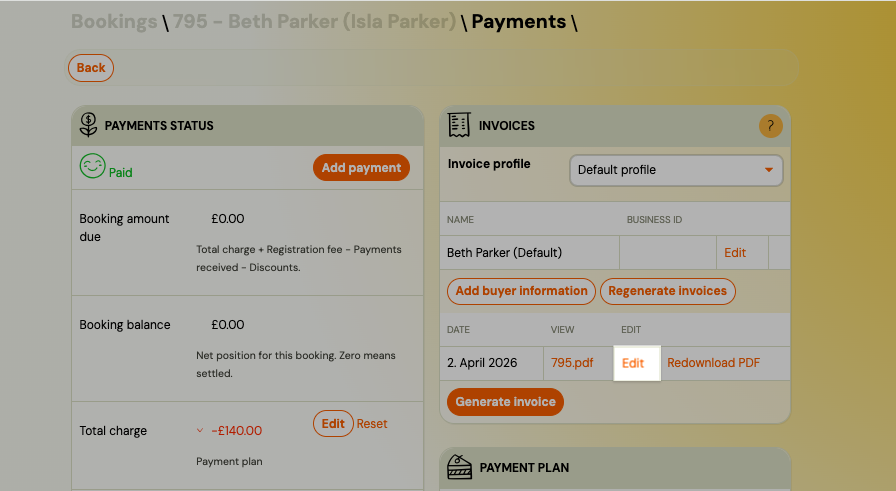

# Payments and Billing FAQ

## Where do I find invoices?

There are two different types of invoices in the Zooza context:

**Client invoices** — invoices generated for your clients (for their bookings):
Go to **Sales & Payments** → **Invoices**. You can filter by date, search by client, and download individual invoices or the full batch as a ZIP.

**Zooza subscription invoices** — invoices for your own Zooza subscription (what you pay Zooza):
Go to **Settings** → **Subscription** → **Manage subscription** → **Details** → **Invoices**. This opens the billing portal where past invoices can be downloaded.

## How do I resend an invoice to a client?

When you generate an invoice, it is automatically emailed to the client. If you need to resend it (for example, after making a correction):

1. Open the booking.
2. Click the pencil icon next to the invoice.
3. Check **Send invoice to client via email**.
4. Save.

The updated invoice is sent to the client's email address on record.

## How do I download all invoices at once?

Go to **Sales & Payments** → **Invoices**. Apply any filters you need (date range, etc.), then click **Download all**. This downloads all filtered invoices as a single ZIP file.

For bulk XML export or API-based access, use the Zooza API (`GET /v1/customer_invoices` and `GET /v1/customer_invoices/download`). Contact support or see the developer documentation for details.

## What does a negative balance mean on a booking?

The balance shows the difference between what the client should pay and what they actually paid.

- **0** = fully paid.
- **Negative amount** = payment was not completed or failed. The client needs to finish payment via their Client Profile.

A negative balance does not necessarily mean "overpaid" — it means there is an outstanding amount.

## What is the difference between "Awaiting payment" and "Unpaid"?

Both statuses mean the client owes money, but they indicate different urgency:

- **Awaiting payment** — the client has an outstanding balance and is still within the allowed payment window. The deadline has not passed. This is a normal, expected state for a booking that was just created.
- **Unpaid** — the payment window has closed. The balance is overdue.

The length of the grace window is set in **Settings → Payments** under **Number of days until payment is due** (Slovak: *Počet dní pre vystavenie splátky*). If this is set to 20, every new booking with a balance enters **Awaiting payment** for 20 days from registration, then automatically becomes **Unpaid**.

The default value is **0** — meaning no grace window; bookings go straight to **Unpaid** when created with an outstanding balance.

## Why are my bookings showing "Awaiting payment" when they used to show "Unpaid" immediately?

If you have a non-zero value in **Settings → Payments → Number of days until payment is due**, your bookings will now enter **Awaiting payment** for that number of days before becoming **Unpaid**.

Before May 2026, this setting only affected bookings with a payment schedule (instalments). From May 2026, it applies to **all** bookings with an outstanding balance.

If you want bookings to go straight to **Unpaid** (the original behaviour), set the field to **0**.

## Does "Awaiting payment" status automatically send reminder emails to clients?

No. The **Awaiting payment** status is for your internal tracking only — it does not trigger any emails.

To send email reminders to clients with outstanding balances, you must configure a **Payment Reminder** action on the programme under **Programme → Settings → Price and Payment → Payment Reminder Settings**. Without this action, bookings will silently move from **Awaiting payment** to **Unpaid** when the deadline passes — no notification is sent.

See [Automatic payment reminders](../guides/automatic-payment-reminders-detailed.md) for full setup instructions.

## What happens when a client registers but does not pay?

The booking is created even if the payment fails or is skipped. This ensures you still capture the lead. The parent can complete the payment later via their Client Profile.

Depending on your **Number of days until payment is due** setting, the booking will be in **Awaiting payment** (if a grace window is set) or immediately in **Unpaid** (if the setting is 0).

You can configure **payment reminders** per programme to automatically follow up with clients who have not paid. After a set number of reminders, the system can auto-remove the booking.

## How do payment reminders work?

Payment reminders are configured per programme under the payment settings. You set:

- How many reminders to send.
- The interval between reminders.
- Whether the system should automatically cancel the booking after all reminders expire.

Go to **Programme → Settings → Price and Payment → Payment Reminder Settings** to configure this. For a full walkthrough, see [Automatic payment reminders](../guides/automatic-payment-reminders-detailed.md).

## How do I issue a refund?

Refunds are handled directly in Zooza:

1. Go to **Bookings → Detail → Payments**.
2. Select the transaction.
3. Click **Refund** (full or partial).

The refund is processed through Stripe automatically. You do not need to log into Stripe separately.

## How does monthly billing (aliquot) work?

When a parent joins mid-month, the system can calculate a prorated first payment based on the remaining sessions in that month. This is called **aliquot** billing.

- **Aliquot ON:** First payment is adjusted for the number of sessions remaining. Subsequent months are the full fixed amount.
- **Aliquot OFF:** Every payment is always the same fixed monthly amount, regardless of when the client joins.

Choose the option that fits your business model. Most clients prefer aliquot OFF for simplicity during launch, and turn it ON later.

## Can I retrospectively generate invoices?

Yes. You can disable automatic invoice generation during launch, accept bookings and payments, and then generate invoices later once your accounting settings (e.g., VAT rates in Xero) are fully configured.

## How do I handle a client who forgot to use a discount code?

Instead of refunding, the easiest approach is to reduce the next instalment by the discount amount and send the client a quick note explaining the adjustment. This is simpler than editing past payments.

## How do I mark a booking as paid when payment was received outside the system?

If a client paid by direct bank transfer or you credited them manually, you can adjust the payment status in their booking detail. Go to **Bookings → Detail → Payments** and record the manual payment to clear the outstanding balance.

## When should I use "Edit payment" vs "Refund"?

Use **Edit payment** for corrections — for example, when the amount is wrong or a payment was assigned to the wrong booking. Use **Refund** only when you are actually returning money to the client.

Using **Refund** incorrectly (e.g., to zero out a manual entry) creates phantom transactions that appear in your financial reports and distort totals. If you need to correct or move a payment between bookings, a debt correction is the preferred approach.

<!-- REVIEW: Support tickets confirm "Edit payment" is accessed via the transaction list → More → Edit payment. Verify current UI label matches. -->

## What happens to payment schedules when I copy bookings to a new term?

Payment schedules are **not** automatically carried over when you copy bookings to a new term. Because the client did not go through the booking form and select a payment template, the system does not assign one.

After copying bookings, you must manually apply the correct payment template to each booking. Without this step, the system calculates the price as the base rate multiplied by the number of sessions, which may differ from the expected instalment amount.

<!-- REVIEW: Bulk activation of payment templates after copy is requested frequently — check if a bulk-apply feature has been added. -->

## How does pro-rata (aliquot) pricing work for late bookings?

When a client registers after the term has started and aliquot pricing is enabled, the system calculates the price as:

**remaining sessions ÷ total sessions × full price**

This adjusted price is then split according to the active payment template (e.g., monthly instalments). Zooza supports four calculation methods — session-based, day-based, no value, and full price — each suited to different business models.

For full configuration details and common scenarios, see [Late bookings (pro-rata management)](../guides/late-bookings.md).

## Why does the payments dashboard only show 10 unpaid bookings?

The **Unpaid Bookings** widget on the Payments dashboard displays only the first 10 unpaid bookings as a quick overview. It is not intended to show every outstanding balance.

To see the full list of unpaid bookings:

1. Go to **Bookings**.
2. Use the status or payment filter to show only unpaid or partially paid bookings.
3. The filtered list shows all matching bookings with full pagination.

## How do I set up a Netflix-style recurring membership?

For ongoing memberships where clients pay monthly and stay enrolled indefinitely (e.g., football club, dance studio, gym), use the **Membership** price type with automatic late booking approval.

1. Set the programme price type to **Membership**.
2. Under **Late bookings**, select **Automatically confirmed**.
3. Set `Aliquot price calculation` to **Full programme price**.
4. Uncheck `Include Initial Full Scheduled Payment` so new joiners are not charged a full instalment immediately on top of their first scheduled payment.
5. Create a monthly payment template with `Day of the month when the payment is due` set to **0** (charges on the same day each month that the client joined).

For the full step-by-step guide, see [Membership Subscription Setup](../guides/membership-subscription-setup.md).

## Why does the QR code in my payment email not work?

The QR code in payment emails pulls recipient details from your **billing profile**. If the profile name does not match the bank account holder name, some banking apps will reject or fail to process the QR code when scanned.

To fix this:

1. Go to **Settings → Billing Profiles**.
2. Open the relevant billing profile.
3. Verify that the **account holder name** and **IBAN** match your actual bank account details exactly.
4. Save and resend the payment notification to the client.

For full details on billing profiles, see [Billing and invoicing](../setup/billing-and-invoicing.md).

## How do I set up billing profiles and invoicing?

Go to **Settings** → **Billing**. There you can enable automatic invoice generation, set up your default billing profile (company name, IBAN, address), and create additional profiles for multi-entity businesses. Each programme can be assigned a specific billing profile. For the full setup guide, see [Billing and invoicing](../setup/billing-and-invoicing.md).

## Can I generate an invoice manually for a single booking?

Yes. Open the booking detail, click **Show payments**, and in the **Invoices** section click **Generate invoice**. Select the billing profile to use and confirm. The invoice is generated immediately and emailed to the client. This works regardless of whether automatic invoice generation is enabled.

> **Warning:** Clicking **Generate invoice** always creates a new invoice. If you need to change the price, discount, or other booking details, use **Edit** on the booking — do not click Generate invoice again. Clicking it a second time creates a duplicate (including a €0 invoice if the booking has no outstanding balance at that moment).

## I accidentally generated a duplicate or €0 invoice — what do I do?

This typically happens when **Generate invoice** is clicked after a price or discount was already adjusted, or clicked more than once.

**Zooza does not delete invoices or generate credit notes.** Handle the correction in your invoicing system:

- **Fakturoid / Számlázz** — issue a cancellation (storno) invoice against the incorrect one, or delete it if it has not been sent yet.
- **Xero / Abra Flexi / Smartbill** — void or delete the incorrect invoice in that system.

Correcting it in your invoicing system has no effect on the Zooza booking — the payment record and balance stay as-is.

**To avoid duplicates:** if you need to change a price or apply a discount after a booking is created, always use **Edit** on the booking — not Generate invoice.

## What is the difference between automatic and manual invoice generation?

**Automatic** — Zooza generates an invoice every time a payment status changes to "paid" on a booking. A single booking can produce multiple invoices if the client pays in instalments. **Manual** — you generate invoices one at a time from the booking detail. You can use both: leave automatic generation off during setup, and generate invoices manually or enable it later.

## Does Zooza support credit notes or debit notes?

- **Credit note** (reduces the original invoice — e.g. correcting an overcharge, issuing a partial refund on an invoice)
- **Debit note** (increases the original invoice — e.g. charging an additional amount not included originally)

Zooza does not have a dedicated **credit note** or **debit note** button. What is available depends entirely on which invoicing system you use:

| Invoicing system | Fix a wrong invoice | Credit note | Debit note |
|---|---|---|---|
| **Zooza built-in** | Edit the invoice (date, period, description only) — does not change the payment | Not supported | Not supported — increase the debt on the booking instead |
| **Xero** | Edit or void in Xero directly; create a credit note in Xero | Supported in Xero | Supported in Xero |
| **Abra Flexi** | Edit or delete in Abra Flexi | Supported in Abra Flexi | Supported in Abra Flexi |
| **Smartbill** | Edit or delete in Smartbill | Supported in Smartbill | Supported in Smartbill |
| **Számlázz** | Cannot modify — issue a cancellation (storno) invoice and reissue a new one | Storno invoice in Számlázz | Not applicable — issue a new invoice |

> **Important:** Changes made to invoices in external systems (Xero, Abra Flexi, Smartbill, Fakturoid, Oblio) do **not sync back to Zooza automatically**. Use the manual refresh button on the invoice in Zooza to pull the latest state. Zooza always keeps the original invoice reference it generated.

### To fix a wrong invoice — general process

1. Identify which invoicing system you use (**Settings → Billing → Invoice Settings**).
2. If using **Zooza built-in**: click the pencil icon next to the invoice on the booking detail. You can correct the period, date, payment method, and description. This does not change the payment amount.
3. If using an **external system**: open the invoice in that system and apply the correction there (edit, void, credit note, or storno — depending on the system). The corrected version will not appear in Zooza.
4. If the payment amount itself needs to change, adjust the debt on the booking in Zooza separately — see [Edit payment on booking](../guides/edit-payment-on-booking.md).

### To increase the amount owed (debit note equivalent)

Zooza does not issue debit notes. To charge a client an additional amount:

1. Open the booking detail.
2. Adjust the outstanding debt manually — see [Edit payment on booking](../guides/edit-payment-on-booking.md).
3. If an invoice is required for the additional amount, generate a new invoice for that booking once the additional payment is recorded.

## What happens to a client's scheduled payment when I cancel a session?

It depends on the payment type:

- **Pay-as-you-go** — the system automatically removes the payment obligation for that session. The client's next scheduled payment is reduced by the session unit price. No action is needed from you.
- **Fixed monthly / instalment plan** — cancelling a session does not automatically reduce the client's payment. Use **Adjust session payments** from the Calendar bulk edit to manually credit the affected clients. See [Session payment adjustments](../guides/session-payment-adjustments.md).

In both cases, the client is **not notified automatically** when their payment amount changes due to an adjustment.

## Can I manually credit or debit a client's scheduled payment?

Yes. Open the booking, go to **Payment plan**, and click on the specific scheduled payment. In the **Adjustments** section, enter a positive amount (credit — reduces what they owe) or a negative amount (debit — increases what they owe), add a description, and click **Save**.

For the full walkthrough, see [Session payment adjustments](../guides/session-payment-adjustments.md).

## Can I credit multiple clients at once after cancelling a session?

Yes, using bulk edit in the Calendar:

1. Go to **Calendar** and select the cancelled sessions.
2. Click **Bulk edit** → check **Adjust session payments**.
3. Select **Credit sessions**, set the amount, and confirm.

Zooza applies the credit to the next scheduled payment for each affected client. See [Session payment adjustments](../guides/session-payment-adjustments.md).

## What if a client has no upcoming scheduled payment when I apply a bulk credit?

If a client's payment plan has already ended or all their scheduled payments have been processed, the adjustment cannot be applied and is skipped for that client. You will need to handle any compensation for those clients manually (e.g. by recording a manual payment or issuing a refund).

## Can I reverse a manual payment adjustment?

Yes. In the **Adjustments** list on the payment detail, click **Reverse** next to the adjustment. A new entry with the opposite amount is created. The original adjustment remains visible in the list for the audit trail.

You can only reverse manual adjustments. Automatic adjustments (generated by session bookings or cancellations in Pay-as-you-go) are managed by the system.

## Why are payment reminder emails arriving in the middle of the night?

Payment reminder emails (unpaid debt, upcoming payment, missed payment) are sent as part of a **nightly batch process**. This means they can arrive at any time between midnight and approximately 6:00 AM — depending on the volume of emails being processed that night.

The sending time is **not configurable**. You cannot set a specific hour for when these emails go out.

**What you can do:**

- Add a note to the email template acknowledging it was sent automatically overnight, so clients are not alarmed by the timestamp. Go to **Communication → Templates**, find the relevant payment notification template, and add a line such as *"This reminder was generated automatically and sent during off-hours. Please do not reply to this email."*
- If the late-night delivery is causing significant client complaints, consider disabling the reminder type entirely and using a different follow-up workflow.

## Why is my client receiving a payment reminder before the due date?

Zooza can send an **"upcoming payment"** notification a set number of days *before* a scheduled payment becomes due. This is separate from the overdue reminder sent *after* the due date.

If clients are receiving reminders 1–3 weeks before they need to pay, this is likely the "upcoming payment" notification being triggered.

**To turn it off or adjust it:**

- **Globally:** Go to **Settings → Payment Settings** and disable or adjust **Notify before a scheduled payment is issued**. Set the number of days to a smaller value, or turn it off entirely.
- **Per programme:** Go to **Programme → Settings → Price and Payment → Payment Reminders** and adjust the reminder schedule for that programme.

> **Note:** This setting controls notification at the programme level. You cannot turn off reminders for a single client — only globally or per programme.

## Can I change the invoice buyer (orderer) on an existing invoice?

Yes. Zooza stores buyer (orderer) details per client and lets you update them and regenerate invoices without creating duplicates.

**To correct the buyer on an existing invoice:**

1. Open the client's profile in **Clients** and find the **Invoice Buyer Data** section.
2. Edit the existing buyer profile or add a new one (e.g. to switch from personal name to company name).
3. Go to the booking → **Invoices**, click the edit icon next to the invoice, and select the updated buyer profile.
4. Click **Regenerate invoices** to apply the change.

> **Supported engines:** Invoice regeneration is available for **Faktury Online** and **Xero** only. For other engines, update the invoice manually in your accounting software.

A client can have multiple buyer profiles — useful when the same person registers on behalf of different companies. Each registration tracks which buyer profile was used.

For the full workflow, see [Invoice buyer data](../guides/invoice-buyer-data.md).

## The price on the booking page is higher than expected — why?

The most common cause is a misconfigured **sessions per month** setting in the payment plan. Zooza uses the sessions-per-month count to calculate the monthly fee displayed to the parent. If this number is set too high (for example, 15 instead of 4), the displayed price will be a multiple of your intended monthly amount.

**To fix it:**

1. Go to **Settings → Payment Settings** and open the relevant payment plan.
2. Check the **Sessions per month** (or billing sessions) field.
3. Correct it to the actual number of sessions per billing period (e.g. 4 for a weekly class).
4. Save and verify the price on the booking page.

> **Note:** Changing this setting does not affect existing bookings or payment plans already assigned to clients — only new bookings will reflect the corrected price.

## How do I forecast income for the next term?

Use the **Payment Insights → Forecast** view, not the Scheduled Payments report:

- **Scheduled Payments Overview** (`Sales & Payments → Scheduled payments overview`) — shows payments that are already scheduled and their current status (Scheduled / Processed). This is useful for tracking what has been charged, not for projecting future income.
- **Payment Insights → Forecast** (`Sales & Payments → Payments → Reports → Insights and Trends`) — shows a monthly forecast based on active payment templates. This reflects expected income assuming current bookings and payment plans remain unchanged.

> **Note:** The forecast is based on active payment plans only. Trial bookings, pay-as-you-go sessions without a payment plan, and any bookings with no payment template assigned are excluded. The forecast also doesn't account for future cancellations or new enrolments.

## Can I use multiple billing profiles for different programmes?

Yes. Go to **Settings** → **Billing** → **Other billing profiles** and click **Add**. Each profile has its own company details, IBAN, and invoice numbering. Assign a profile to a programme in **Programme** → **Settings** → **Price and Payment** → **Invoicing**. If no profile is assigned, the default billing profile is used.

## How do I download a large number of invoices (e.g. for Pohoda)?

For accounting software imports (such as Pohoda), you need invoices as individual files, not a single combined PDF.

**Option 1 — ZIP download from the UI:**

1. Go to **Sales & Payments → Invoices**.
2. Apply a date filter to limit the batch (e.g. one month at a time).
3. Click **Download all** — this downloads all filtered invoices as a ZIP archive containing individual PDF files.
4. Import the PDFs into Pohoda (or your other accounting software) from the ZIP.

> **Tip:** If you have hundreds of invoices, split into monthly batches. Very large single downloads (several hundred invoices at once) can time out in the browser.

**Option 2 — API export:**

If you regularly need bulk exports, use the Zooza API:
- `GET /v1/customer_invoices` — list invoices with date/status filters
- `GET /v1/customer_invoices/download` — download invoice files

Contact Zooza support or your account manager to get API credentials and documentation.

> **SK:** Na hromadné stiahnutie faktúr (napr. pre import do Pohody) choďte na **Predaj a platby → Faktúry**, nastavte filter dátumu a kliknite **Stiahnuť všetky**. Stiahne sa ZIP so samostatnými PDF súbormi. Pri veľkom počte odporúčame stiahnuť po mesiacoch — väčšie dávky môžu vypršať.

## Does Zooza support in-person (POS) card payment terminals?

No. Zooza is an online management and payments platform — it does not provide, integrate with, or manage physical card payment terminals (POS devices).

**What Zooza handles:**
- Online card payments via Stripe (client pays through the booking form or client profile)
- Bank transfer via QR code or reference number (variabilný symbol)
- Manual payment recording (cash, bank transfer, etc. — you record it in the booking, Zooza does not process it)

**What Zooza does not handle:**
- In-person card terminals (mPOS, standard POS)
- Apple Pay / Google Pay at a physical location
- Cash register software

**For SK businesses subject to the cashless payment acceptance requirement (zákon o povinnej bezhotovostnej platbe — effective 1.3.2026):**

The obligation to accept cashless payments at a physical location applies to in-person transactions. Zooza's online payment infrastructure (Stripe, bank transfer) fulfils the cashless requirement for **online bookings and transactions**. However, if you accept in-person payments at a venue (e.g. at the door, at the reception), you need a separate POS solution.

Zooza does not provide or recommend a specific POS provider. Contact your bank or a payment provider (e.g. GP Webpay, Tatra banka mPOS, SumUp, iZettle) for in-person card acceptance.

> **SK:** Zooza nespravuje POS terminály. Pre fyzické platby na mieste (zákonná povinnosť od 1.3.2026) je potrebný samostatný POS terminál cez vašu banku alebo platobného poskytovateľa. Zooza pokrýva len online platby (Stripe, bankový prevod, QR kód).

## How do I set up a down payment (deposit) together with a payment plan?

A down payment (deposit) and a payment plan can be used together. The down payment is collected immediately at booking; the remaining balance is then split according to the payment plan you configure.

**Setup:**

1. Go to **Programme → Settings → Price and Payment**.
2. Under **Price**, set your total price and select a payment plan (e.g. monthly instalments).
3. Under **Down payment**, choose **Fixed amount** or **Percentage** and enter the value.
4. Save.

**How it works:**
- When the client books, the down payment is charged immediately (or shown as the first debt).
- The remaining balance is split into instalments according to the payment plan schedule.
- The total charged = down payment + all instalments. Make sure these add up to the full price.

**Common problem — double charge on the first instalment:**

If the down payment and the first scheduled instalment fall on the same day, the client may appear to owe both at once. To avoid this:

- Set the first instalment start date to a date *after* the down payment is due.
- Or use a **Fixed amount** down payment equal to the first instalment, and start the payment plan from the second month.

**Common problem — down payment not appearing in email templates:**

Use the `*|DOWNPAYMENT|*` dynamic tag in your booking confirmation template to show the deposit amount. See [Dynamic tags](../guides/dynamic-tags.md).

## Can I delete or edit a row in the payment transaction log?

No. The transaction log on a booking (the list of debt and payment movements) is an append-only record. Individual rows cannot be deleted or edited.

The log is visible only to admins — clients see only the final balance, not individual log entries.

If you added a manual correction by mistake and want to bring the balance back to zero, add a second corrective entry (e.g. a refund of the same amount). This is the only way to reverse a manual correction. The original entry stays in the log as an audit trail.

## A client has a credit on their booking — what does it mean and what should I do?

A **credit** on a booking means the client has paid more than the total amount owed (overpayment). The excess amount is stored as a credit on that booking.

**Where to see it:** Open the booking → **Payments** → the credit is shown on the payment tile.

**What you can do:**

1. **Apply to a future invoice** — if the client has upcoming scheduled payments, the credit is automatically offset against them. No action needed.
2. **Refund manually** — if there are no future payments, you can refund the excess amount to the client. Go to **Bookings → Payments → Refund** and enter the credit amount. For bank transfer clients, process the transfer in your bank separately and record it in Zooza.
3. **Keep it on account** — if the client will have future bookings, you can leave the credit and apply it to the next registration manually.

> **Note:** A booking credit (from overpayment) is different from an **Entry pass credit** (prepaid session bundle). Do not confuse the two — they are managed in different places.

> **SK:** Preplatok na registrácii znamená, že klient zaplatil viac, ako mal. Kredit sa zobrazuje na platobnej dlaždici v registrácii. Ak nemá ďalšie plánované platby, vráťte preplatok ručne (bankový prevod) a zaznamenajte ho ako platbu v Zooza.

## Related

- [Stripe payments FAQ](stripe-payments-faq.md) — card payment setup, disputes, and Stripe-specific questions
- [GoCardless FAQ](gocardless-faq.md) — direct debit setup and mandate management
- [Billing periods](../setup/billing-periods.md) — how billing periods work and how to configure them
- [Payment labels and drawers](../guides/payment-labels-drawers.md) — organise payments with labels
- [Payment tile on booking](../guides/payment-tile-on-booking.md) — reading and managing the payment tile
- [Billing and invoicing setup](../setup/billing-and-invoicing.md) — billing profiles, VAT, invoice settings
