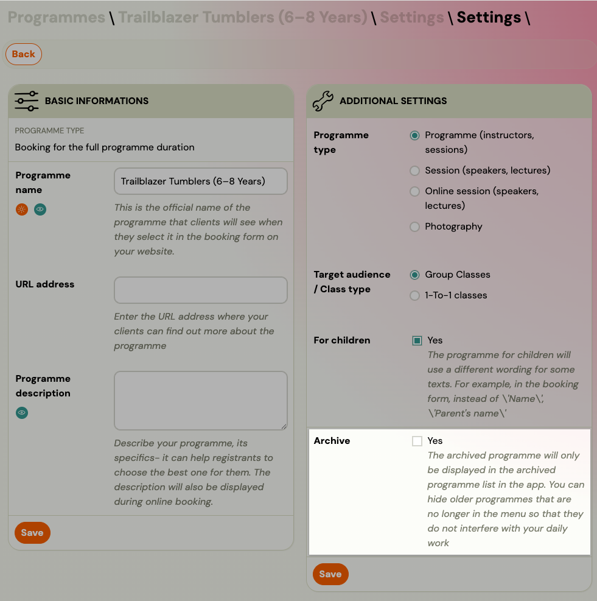

<!-- Synonyms: delete course, delete programme, remove course, archive course, create session every week, schedule sessions automatically, recurring sessions, merge classes, merge groups, combine classes, combine groups, join two classes, hogyan tudom törölni a kurzusokat, kurzus törlése, program törlése, törölni kurzus, hogy tudom a kurzusokat archiválni, kurzus archiválása, program archiválása, archiválni kurzus, minden héten létre kell hoznom egy órát, órákat ütemezni, automatikus órarend, csoportok összevonása, két csoportot összevonni, csoportokat egyesíteni, vymazať kurz, zmazať program, odstrániť kurz, archivovať kurz, archivovať program, vytvárať hodiny každý týždeň, automatické generovanie hodín, zlúčiť skupiny, spojiť skupiny, zlúčiť triedy, prepojiť skupiny -->

# Programmes, Timetables and Sessions FAQ

## What is the difference between programmes, timetables, and sessions?

- **Programme (Programme)** — the top-level entity (e.g., "Beginners Swimming"). It holds pricing, settings, and automation rules.
- **Timetable (Class/Class)** — a specific scheduled class within a programme (e.g., "Monday 9:00 AM at Main Hall"). It defines the recurring pattern, location, and instructor.
- **Sessions** — individual occurrences of a class (e.g., "Monday 6 January 9:00 AM"). Sessions are generated from the timetable and can be edited individually.

Changes made at the **timetable** level (e.g., assigning an instructor) do not always cascade to existing individual sessions. You may need to update sessions separately using bulk edit.

## How do I assign an instructor to sessions?

Assigning an instructor at the timetable level applies to future sessions. For existing sessions, use the **bulk edit** feature:

1. Go to the class detail.
2. Select the sessions you want to change.
3. Use bulk edit to assign the instructor.

## How do I change the time of a class?

You cannot change the time directly in the timetable settings for existing sessions. Instead:

1. Open the class detail.
2. Select the sessions that need the time change.
3. Use **bulk edit** to update the time.

You can choose whether to send a notification to parents about the change.

## How do I move a class to a different programme?

Open the class detail, go to **Settings / Edit → Other settings**, and change the programme from the dropdown. Save and refresh.

## How do I copy a class?

You can duplicate a class to create a similar one at a different time or location. When copying, double-check that all settings (price, payment methods, extra fields) have carried over correctly — some settings may need to be re-applied.

## Can I merge two classes into one?

No. Zooza does not have a merge function. Sessions cannot be shared between classes, and there is no built-in way to combine two classes into a single entity.

**Workaround — reschedule sessions to the same time:**

If you want clients from both classes to attend together (e.g., two small groups you want to run at the same time), reschedule the sessions of one class to match the time of the other:

1. Open the class you want to align.
2. Select all sessions.
3. Use **bulk edit** to change the time to match the other class.

Both classes now appear at the same time in the calendar and the admin app. Each class still has its own bookings, attendance, and payments — the system keeps them fully separate. Clients, reports, and invoices are unaffected.

> **Note:** This does not actually merge the classes — it only makes them overlap in time. If you later need to split them again, simply reschedule sessions back to a different time.

If one class has no bookings (e.g., it was set up to advertise a future slot), you can keep it in the system for future use without rescheduling — just archive it or leave it visible on the booking form as a separate option.

## How do I add a new class to an existing programme?

Go to the programme overview and click **New Class**. Fill in the class name, billing period, location, instructor, capacity, and session schedule. If the class should have a different price than the programme, enter it in the price step — otherwise the programme price applies automatically. For a full walkthrough, see [Creating a class](../guides/creating-a-class.md).

## Do I need to create a session manually every week?

No. When you create a class, you define the recurring schedule (day of week, time, start date, end date) and Zooza automatically generates all sessions for the entire period at once.

For example: if your class runs every Monday from 1 September to 30 June, Zooza creates all Monday sessions in one step — you do not touch them again unless something changes (holiday, substitute, etc.).

To set up the schedule when creating a class:

1. Go to **Programmes** → open the programme → **New Class**.
2. In the session schedule step, set the **day**, **time**, **start date**, and **end date**.
3. Zooza generates all sessions automatically. Review the list and confirm.

If you need to adjust individual sessions later (e.g. cancel one, change a time), you can edit them one by one or use bulk edit. See [Creating a class](../guides/creating-a-class.md) for the full walkthrough.

## What is the difference between a Fixed Period class and a Lead Collection class?

A **Fixed Period** class has scheduled sessions with specific dates and times — this is the standard class type for courses, terms, and camps. A **Lead Collection** class has no sessions initially — it is used to collect interest from potential clients before you finalise the schedule. Once you add sessions to a lead collection class, it becomes a regular fixed period class. See [Lead collection](../guides/lead-collection.md) for details.

## Can I set a different price for each class in the same programme?

Yes. When creating or editing a class, you can enter a class-level price that overrides the programme price. This is useful when different levels, locations, or time slots have different pricing. If you leave the class price empty, the programme price applies. See [Creating a class](../guides/creating-a-class.md).

## What do the financial numbers on the class tile mean?

Each class tile shows three financial figures (recalculated every 30 minutes):

- **Paid debt** — total amount already paid across all bookings.
- **Issued debt** — total debt created from all booking types (including late bookings and waiting list).
- **Balance** — current account status (difference between issued and paid).

## How do I hide a class from online registration?

In the class settings, you can toggle visibility for the online booking form. This keeps the class in the system for internal management but hides it from the public booking page.

## Why do changes I make not appear immediately?

Zooza uses browser caching to speed up page loading. When you create or edit something (like a location or class), the change may take a moment to appear. A quick browser refresh (Cmd+R on Mac, Ctrl+R on Windows) usually resolves this.

## Where can I find an archived class (group)?

Go to **Activities** → **Classes** and set the **Status** filter to **Archived**. This shows all classes that have been archived, across all programmes.

Archived classes are hidden from the active list but not deleted — all their sessions, bookings, and payment history remain intact.

## I accidentally deleted a class — can I recover it?

It depends on what happened:

- **If the class was archived** → it can be found and is fully recoverable. Go to **Activities** → **Classes** → set **Status** = **Archived**. Open the class and change its status back to active.
- **If the class was deleted** → it cannot be recovered. Deleted classes are permanently removed. Contact Zooza support if you believe there has been a data error.

To avoid accidental loss, prefer **archiving** over deleting when you want to keep history or plan to reuse the class.

## Can I delete a programme?

Programmes cannot be deleted through the application. Instead, use **archiving** — it hides the programme from the active list without removing any data, bookings, or history.

To archive a programme, go to the programme → **Settings** tile → **Edit** → check **Archive** → **Save**. To view or restore archived programmes, use the **Archived** filter in the Programmes list.

See [Programme settings tile — Archiving a programme](../guides/programme-settings-tile.md#archiving-a-programme) for the full how-to.

If you need to permanently remove a programme that has **no bookings and no classes**, contact Zooza support with the programme ID (visible in the URL, e.g. `#courses/6455`).

## How do I bulk-delete courses that have no bookings or classes?

Admins cannot bulk-delete courses directly from the application interface. To delete courses that have no registrations or classes (groups), you must send a list of course IDs to Zooza support, who will remove them from the database on your behalf.

Before requesting deletion:

1. Verify that each course has **no active registrations** and **no groups** attached.
2. If a course still contains groups with historical registrations you want to preserve, move those groups to an archive course first (via group settings — change the programme).
3. Compile the course IDs (visible in the URL when viewing a course, e.g., `#courses/6455`) and send them to support.

Courses that still contain registrations or groups cannot be deleted — they must be archived instead. <!-- REVIEW: confirm whether self-service course deletion is planned -->

## After rescheduling sessions, holiday-skip rules no longer apply — why?

When you create a class, Zooza generates sessions that respect your holiday and public-holiday skip settings. However, if you later **bulk-reschedule** those sessions to a different weekday or time, the system treats this as a manual override and **does not re-apply** the holiday-skip rules to the new dates.

This means sessions may land on public holidays or school vacation days after rescheduling.

**What to do after rescheduling:**

1. Open the class detail and review all rescheduled sessions.
2. Manually cancel or remove any sessions that fall on holidays or vacation days.
3. Add replacement sessions on valid dates if needed to maintain the correct total count.

The system displays a warning when you perform a bulk reschedule, reminding you to check the resulting dates. The admin who performs the change is responsible for verifying that the new session dates are correct.

<!-- REVIEW: Zooza support has acknowledged this as a known limitation and is evaluating whether holiday rules can be re-applied automatically after rescheduling. -->

## What is the colour used for on a programme?

The colour you assign to a programme appears in two places:

- In the **admin app** — on the programme tile and in the calendar view.
- In the **online booking widget and web calendar** — clients see the colour to visually distinguish between different programmes.

Each colour in the picker has a label and a short description. The label is also displayed next to the programme name in the web calendar. You can change the colour at any time in the programme settings without affecting bookings or classes.

## What programme type should I choose?

| Type | Use when |
|---|---|
| **One-off event** | The programme consists of a single session on a specific date (workshop, lecture, open day). |
| **Booking for full programme duration** | Clients sign up for a set of sessions and attend the full term or course. |
| **Pay-as-you-go** | Clients enrol once and then choose which individual sessions to attend, paying per session. |

If you are unsure, most ongoing group programmes (weekly classes, term courses) use **Booking for full programme duration**.

## Can I change the programme type after creating it?

Yes. Go to the programme settings and change the type. Be aware that changing the type may affect how existing classes and bookings behave — for example, switching to pay-as-you-go on a programme with existing full-duration bookings is not recommended. If in doubt, create a new programme with the correct type and migrate clients manually.

## What is the difference between Group classes and 1-to-1?

- **Group classes** — multiple clients attend the same session together. Capacity applies per session.
- **1-to-1** — each session is with one client only (private lessons, personal training, individual consultations). Capacity is automatically set to 1 per session.

## What does the "For children" toggle do?

When enabled, the booking form includes a **child profile** section where the parent fills in the child's name, date of birth, and notes. Attendance management and reporting also use child-relevant labels. Leave the toggle off for adult programmes where the participant and the paying client are the same person.

## What is the booking fee?

The booking fee is an optional one-time charge collected at the moment of registration, separate from the programme price. For example, you might charge a 5 EUR registration fee on top of the term price. Leave it at 0 if you do not charge a separate booking fee.

## How do I change the price for new bookings without affecting existing ones?

Price changes on a programme or class apply **only to new registrations**. Existing registrations keep the price that was set at the time the client registered.

To update the price for future bookings:

1. Go to the programme or class settings.
2. Change the price to the new amount.
3. Save.

All new registrations (including clients who convert from a trial) will use the updated price. Clients who registered before the change retain their original price — their payment schedule is not recalculated.

If you need to adjust the price for an existing registration, you must edit the payment on that registration manually. See [Edit payment on booking](../guides/edit-payment-on-booking.md) for details.
