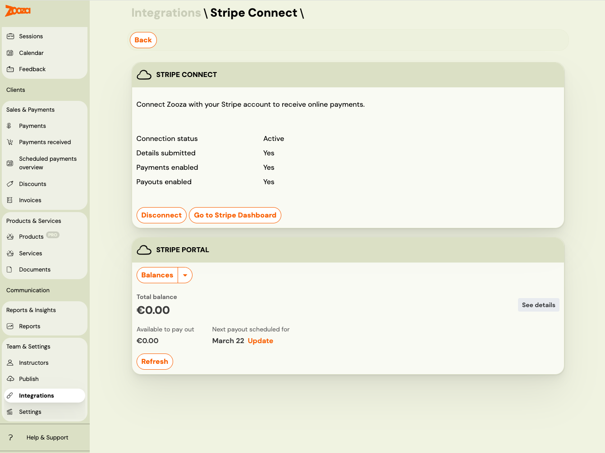

# Stripe Integration FAQ

## What type of Stripe account does Zooza use?

Zooza connects via **Stripe Connect**. All new connections use a **Stripe Standard** account — you get your own full Stripe account and manage it directly at [dashboard.stripe.com](https://dashboard.stripe.com).

If you connected Stripe before March 2026, you may have a **Stripe Express** account. Express accounts are fully supported and continue to work without any changes.

## How do I access my Stripe dashboard?

**Standard account:** Go to [dashboard.stripe.com](https://dashboard.stripe.com) and log in with your Stripe credentials. You have full access to all Stripe features.

**Express account:** Go to **Settings → Integrations → Stripe Connect** and click **Go to Stripe Dashboard**. This generates a secure one-time login link that opens your Express dashboard directly — no need to log in separately.

## Where can I see my Stripe invoices and payout reports?

**Standard account:** Log into [dashboard.stripe.com](https://dashboard.stripe.com) and navigate to your documents section.

**Express account:** Go to **Settings → Integrations → Stripe Connect**. Your Stripe invoices (VAT invoices) and payout reconciliation reports are available directly inside Zooza — no need to open the Stripe dashboard separately.

## Is Apple Pay / Google Pay supported?

Yes. Apple Pay and Google Pay are supported through Stripe. You need to enable them in your Stripe payment method settings. Once enabled, clients will see these options on mobile devices during checkout.

## How do I test payments before going live?

You can test the full payment flow by creating a booking yourself as a client. Use the public booking link, complete the booking, and make a test payment. Remember to:

1. Delete the test bookings afterwards.
2. Restore any prices you changed during testing.
3. Verify that all classes have the correct payment methods enabled.

## Where can I see payment reports for my accountant?

Payment reports are available in Zooza under **Reports**. For accounting purposes, the recommended approach is to use Zooza's reports and invoicing integration (Xero, etc.) rather than relying on Stripe's dashboard directly.
