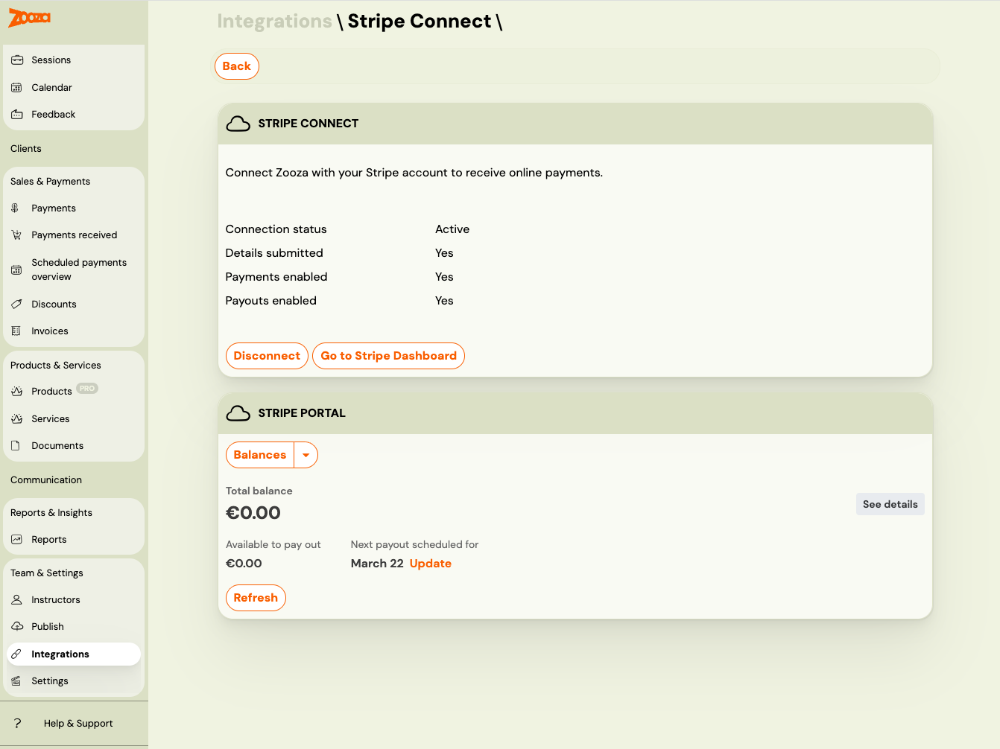

# Stripe Integration FAQ

## Own Stripe account, or Stripe through Zooza?

Two commercial arrangements. They differ in who the client is actually paying — not in how the payment works technically.

| | **Your own Stripe** ⭐ | **Stripe through Zooza** |
|---|---|---|
| Who holds the Stripe account | You | Zooza |
| Who the client pays | You | Zooza s.r.o. |
| Who invoices you | Stripe, for its fees | Zooza, together with the system invoice |
| **What you pay per transaction** | Stripe's own rates, **no Zooza commission** | **3.5%, all in** |
| Payouts | Stripe pays you on its own schedule | Zooza pays out 1–2× per month |
| Setup needed from you | Create a Stripe account | None |

**Your own Stripe is the option we recommend.** Zooza takes no commission on it at all — you pay Stripe's own rates and nothing more. You also keep direct control of payouts, reporting and refunds, which matters on the day a client wants their money back quickly.

**Stripe through Zooza exists for businesses that do not want their own Stripe account.** It works immediately with nothing to set up on your side, and it removes the Stripe Tax Invoice from your books — receiving invoices directly from Stripe can trigger monthly VAT filing, which is a real administrative cost for a small operation. You receive one domestic invoice from us instead.

> **The 3.5% is everything.** It already covers Stripe's own processing fees — they are not charged on top. A transaction never costs you more than 3.5%, so you can quote that figure into your pricing and be done with it.
>
> Compare on total cost, not on the headline: Stripe's own rates are lower than 3.5%, which is why your own account works out cheaper at volume. The flat 3.5% buys you no Stripe account, no Stripe invoices, and one number to reason about.

**What Stripe through Zooza requires:** payouts go only to a verified **legal entity in the EU**, never to a private account. Verification happens once, before the service is switched on. At higher volumes the 3.5% is negotiable, and payouts can be agreed more often than monthly so your cash flow is not held up.

> If you are choosing now and have no strong reason to avoid a Stripe account, open your own. The commission difference compounds with every transaction, and moving later means reconnecting payments mid-season.

> **CardPay** is a third option for card payments and carries the same 3.5%, but it handles **one-off payments only** — there is no automatic recurring charging. For recurring card payments use Stripe; for recurring bank collection use GoCardless.

## What type of Stripe account does Zooza use?

Zooza connects via **Stripe Connect**. All new connections use a **Stripe Standard** account — you get your own full Stripe account and manage it directly at [dashboard.stripe.com](https://dashboard.stripe.com).

If you connected Stripe before March 2026, you may have a **Stripe Express** account. Express accounts are fully supported and continue to work without any changes.

## How do I access my Stripe dashboard?

**Standard account:** Go to [dashboard.stripe.com](https://dashboard.stripe.com) and log in with your Stripe credentials. You have full access to all Stripe features.

**Express account:** Go to **Settings → Integrations → Stripe Connect** and click **Go to Stripe Dashboard**. This generates a secure one-time login link that opens your Express dashboard directly — no need to log in separately.

## Where can I see my Stripe invoices and payout reports?

**Standard account:** Log into [dashboard.stripe.com](https://dashboard.stripe.com) and navigate to your documents section.

**Express account:** Go to **Settings → Integrations → Stripe Connect**. Your Stripe invoices (VAT invoices) and payout reconciliation reports are available directly inside Zooza — no need to open the Stripe dashboard separately.

## Is Apple Pay / Google Pay supported?

Yes. Apple Pay and Google Pay are supported through Stripe. You need to enable them in your Stripe payment method settings. Once enabled, clients will see these options on mobile devices during checkout.

## How do I test payments before going live?

You can test the full payment flow by creating a booking yourself as a client. Use the public booking link, complete the booking, and make a test payment. Remember to:

1. Delete the test bookings afterwards.
2. Restore any prices you changed during testing.
3. Verify that all classes have the correct payment methods enabled.

## I get an error when trying to set Stripe Connect as the payment provider on a programme

If you see a "provider not connected" error when selecting **Stripe Connect** as the card payment provider on a programme and saving, it means your Stripe Connect account is not currently active in Zooza.

**What to do:**

1. Go to **Settings → Integrations → Stripe Connect** and check the connection status.
2. If the connection has expired or was revoked, click **Connect** and complete the Stripe onboarding or reconnection flow.
3. Once connected, try saving the programme again.

This validation prevents a misconfiguration that would cause payment failures at booking time. Previously, saving would succeed silently but payments would fail when a client tried to pay.

## Where can I see payment reports for my accountant?

Payment reports are available in Zooza under **Reports**. For accounting purposes, the recommended approach is to use Zooza's reports and invoicing integration (Xero, etc.) rather than relying on Stripe's dashboard directly.
