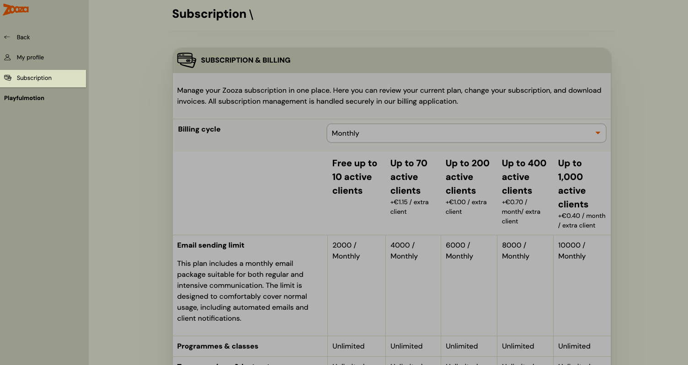

<!-- Synonyms: subscription invoice, download invoice zooza, zooza billing, where is my invoice, change plan, cancel subscription, upgrade plan, downgrade plan, manage subscription, odberateľská faktúra, faktúra za Zooza, kde nájdem faktúru, zmeniť licenciu, zrušiť licenciu, predplatiť, predplatné Zooza, licencia Zooza, stiahnuť faktúru, ako zaplatiť za Zooza, kde je faktúra za predplatné, előfizetési számla, számlám letöltése, licenc kezelése, előfizetés lemondása, előfizetés módosítása, Zooza számla, odběratelská faktura, faktura za Zooza, kde najdu fakturu, změnit licenci, zrušit předplatné, stáhnout fakturu -->

# Subscription and Billing FAQ

## Where do I find my Zooza subscription invoice?

1. Click your **name/profile** in the Zooza app — top right on mobile, bottom left on desktop.
2. Go to **Subscription**.
3. Scroll to the bottom and click **Manage subscription**.

This opens the external billing portal where you can:

- Download past invoices
- Update your billing details (company name, address, VAT number)
- Update your payment method (card)
- Upgrade or downgrade your plan
- Cancel your subscription

> **Note:** Subscription management is handled by an external billing service. If you have any issues accessing it, contact Zooza support.

## Where do I change my Zooza plan?

Go to your **name → Subscription**. The page shows all available plans with pricing (billing cycle: monthly or annual). To change your plan, click **Manage subscription** at the bottom of the page.

## How is Zooza pricing calculated?

Pricing is based on the number of **active clients** on your account. The tiers (monthly billing) are:

| Plan | Price / month | Active clients | Extra clients | Email limit / month |
|---|---|---|---|---|
| Free | €0 | Up to 10 | — | 2,000 |
| Starter | €39 | Up to 70 | +€1.15 / client | 4,000 |
| Growth | €99 | Up to 200 | +€1.00 / client | 6,000 |
| Business | €189 | Up to 400 | +€0.70 / client | 8,000 |
| Enterprise | €349 | Up to 1,000 | +€0.40 / client | 10,000 |

All plans include: client & family profiles, consent management, email automation, instructor management, payments & billing, and reporting. Annual billing is available at a discounted rate.

**Zooza PRO** is an optional add-on (available on all plans) that includes WhatsApp integration, Power BI integration, own payment gateway without extra fees, external marketing integrations, custom products, and advanced logs & reports.

> **Note:** Prices are in EUR. Check the **Subscription** page in your account for current pricing in your currency and up-to-date plan features.

## How do I cancel my Zooza subscription?

Go to your **name → Subscription → Manage subscription** and follow the cancellation steps in the billing portal. If you have trouble, contact Zooza support.
