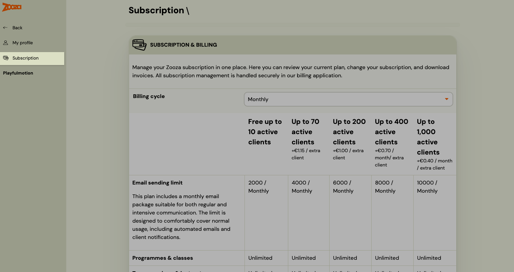

# Subscription and Billing FAQ

## Where do I find my Zooza subscription invoice?

1. Click your **name/profile** in the Zooza app — top right on mobile, bottom left on desktop.
2. Go to **Subscription**.
3. Scroll to the bottom and click **Manage subscription**.

This opens the external billing portal where you can:

- Download past invoices
- Update your billing details (company name, address, VAT number)
- Update your payment method (card)
- Upgrade or downgrade your plan
- Cancel your subscription

> **Note:** Subscription management is handled by an external billing service. If you have any issues accessing it, contact Zooza support.

## Where do I change my Zooza plan?

Go to your **name → Subscription**. The page shows all available plans with pricing (billing cycle: monthly or annual). To change your plan, click **Manage subscription** at the bottom of the page.

## How is Zooza pricing calculated?

Pricing is based on the number of **active clients** on your account. The tiers (monthly billing) are:

| Plan | Price / month | Active clients | Extra clients | Email limit / month |
|---|---|---|---|---|
| Free | €0 | Up to 10 | — | 2,000 |
| Starter | €39 | Up to 70 | +€1.15 / client | 4,000 |
| Growth | €99 | Up to 200 | +€1.00 / client | 6,000 |
| Business | €189 | Up to 400 | +€0.70 / client | 8,000 |
| Enterprise | €349 | Up to 1,000 | +€0.40 / client | 10,000 |

All plans include: client & family profiles, consent management, email automation, instructor management, payments & billing, and reporting. Annual billing is available at a discounted rate.

Optional add-ons are available on top of any plan. Check the **Subscription** page in your account to see which are enabled for you, or ask Zooza support.

> **Note:** Prices are in EUR. Check the **Subscription** page in your account for current pricing in your currency and up-to-date plan features.

## We run several locations — do we pay once, or per location?

The subscription is **per company (account)**, priced by that account's active clients. How many companies you need is a question about legal entities, not locations:

- **One legal entity, several venues or towns** — one company with several locations. That is the normal shape, and one subscription covers all of them; venues are a built-in part of the app.
- **Several legal entities** (each invoicing under its own name) — one company each, each with its own subscription. Bookings and clients can move between them as a network.

If you set up separate companies for what is really one business, they cannot be merged by a button. Consolidation is manual work — transferring registrations into the account you keep — so decide the structure before clients start registering, and ask support if you already have more accounts than you need.

## How do I cancel my Zooza subscription?

Go to your **name → Subscription → Manage subscription** and follow the cancellation steps in the billing portal. If you have trouble, contact Zooza support.
