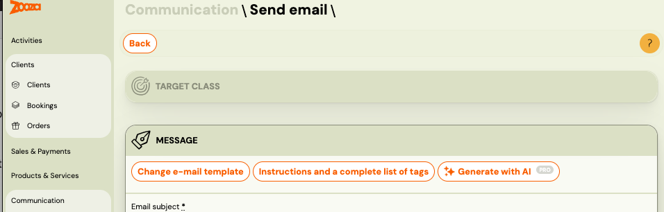
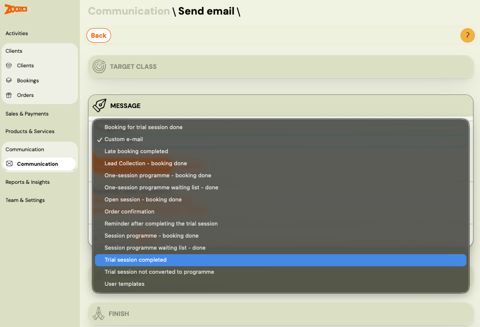

# Trial Classes FAQ

<!-- Synonyms: trial automation, check trial status, verify trial automation active, enroll after trial, manual enrollment trial, payment after trial, trial booking detail, trial timeline, trial won trial lost, skúšobná hodina automatizácia, ako skontrolovať stav skúšobnej hodiny, zápis po skúšobnej hodine, platba po skúšobnej hodine, ako zistiť či je aktívna automatizácia skúšobná hodina, trial vyhrany trial prehraný, próbaóra automatizáció, próbaóra státusz ellenőrzés, regisztráció próbaóra után, fizetés próbaóra után, automatizáció aktív-e, zkušební hodina automatizace, stav zkušební hodiny, zápis po zkušební hodině, platba po zkušební hodině -->

## How do I set up trial classes?

Trials are configured per programme. Go to **Programme → Settings → Trial** to enable them, and **Programme → Automations → Trials** to configure the rules.

You can set:

1. Whether the trial is free or paid.
2. How many trial sessions are offered (usually one).
3. Whether trial dates are shown on the booking form (and how many days ahead).
4. Whether trial bookings count towards class capacity.
5. Whether a trial booking temporarily holds a spot in the class.

## What is the trial-to-enrolment flow?

The full automated flow is:

1. Client registers for a trial and receives a confirmation.
2. Client receives a reminder before the trial session.
3. The instructor marks attendance after the trial.
4. The system automatically sends a booking link offering full enrolment.
5. Follow-up messages encourage enrolment.
6. If the offer is not used, the trial is marked as **Trial Lost**.

## Trial option is not showing on my website — why?

Trial uses the same booking widget as regular enrolment. If the trial option is not visible to clients, check these four things in order:

**1. Trial is not enabled in programme settings**
Go to **Programme → Settings → Trial → Edit** and make sure trial is turned on and fully configured — type (free/paid), length, session capacity, and which classes are included. If trial is not set up here, it will not appear anywhere regardless of other settings.

**2. Allow online booking is off**
Go to **Programme → Settings → Online Booking** and make sure **Allow online booking** is set to Yes. If this is off, the programme is hidden entirely.

**3. Booking Options Shown on Website excludes trials**
On the same screen, find **Booking Options Shown on Website**. If it is set to **Offer full programme booking only**, trials will not appear. Change it to one of:
- **Default – let customer choose** — shows both full enrolment and trial options
- **Trials only (if available)** — shows only the trial option
- **Trials or blocks (if available)** — shows trial and/or blocks

**4. No available trial dates**
If all classes are full (no free capacity for trials), there are no dates to display. Check the capacity settings in **Programme → Settings → Trial → Session Capacity** and make sure there is either available class capacity or extra capacity reserved for trials.

---

## Clients are not receiving emails after their trial — why?

The trial follow-up emails (booking link, reminders, Trial Lost notification) are sent by the **Automation Settings** configured inside the trial settings. If nothing is being sent, work through this checklist:

**1. Automation is not set up or not activated**
Go to **Programme → Settings → Trial → Automation Settings**. Check the **Automation status** — it must be **Set and activated**. If it shows **Not activated**, click **Edit** and switch it on.

**2. Attendance was not recorded**
The automation triggers only when the trial booking reaches the status **Trial Ended** — which happens when the instructor records attendance on the session. If attendance was not recorded, the automation never fires. Make sure the instructor marks each trial attendee on the session detail.

**3. Automation was set up after the booking was created**
If **The setting will only be valid for new bookings** is checked in the automation settings, bookings that were created before the automation was configured will not be affected. You need to contact those clients manually.

**What the automation sends (when active):**

| Step | What happens |
|---|---|
| Trial Ended | Sends a booking link email so the client can enrol in the full programme |
| +N days (first follow-up) | Sends a reminder if the client has not enrolled yet |
| +N days (second follow-up) | Sends a second reminder |
| +N days after last notification | Changes status to **Trial Lost** (if Automatically transition trial to lost is on) |
| Trial Lost | Sends a notification to the client (if Send notification after trial lost is on) |

---

## If I manually change a trial status, does the client receive an email?

When you manually change a trial status (e.g. from **Trial ended** to **Trial won** or **Trial lost**), Zooza shows a **"Send confirmation email"** checkbox. You can choose whether to send a one-off email for that status change.

**Important:** Manually changing the status does **not** trigger the automated follow-up sequence. The automation (enrolment link + reminder emails) is only triggered when the instructor records attendance on the trial session. If attendance was not recorded and you changed the status manually, you need to send the enrolment link to the client manually via **Communication → Send Email**.

---

## Why does it say "class full" when a trial client tries to enrol?

Trial bookings count towards class capacity. When the client finishes their trial and tries to enrol in the same class, the system may show "class full" because their trial seat is still counted. If you see this happening consistently, contact support — it may be a calculation issue that needs a fix on the backend.

## Can an admin manually create a trial booking?

No. Trial bookings can only be created by parents through the online booking form. As an admin, you can only create standard enrolments. If needed, you can go through the booking form on behalf of a parent as a workaround.

## How do I handle a client who wants to change their trial date?

If a parent can't make their booked trial, you can update their attendance in the system — mark the original session as absent and rebook them into a different session. This is managed through the booking detail.

## What happens when a client cancels a trial?

If a client cancels a trial, the system will follow the configured automation. You can manually change the status to **Trial Lost**, but this will not trigger automatic follow-up emails unless you explicitly choose to send one at that moment.

## Does instructor attendance tracking affect trials?

Yes. Tracking attendance is important because it triggers the trial-to-enrolment automation. When a instructor marks a trial attendee as "attended", it triggers the system to send the enrolment offer.

## Trials and blocks cause overbooking — what is happening?

This is a known limitation when a class uses both trial sessions and blocks (sub-periods within a class) at the same time.

When a client books a trial, the system can reserve a spot in the **class-wide** capacity. However, block capacity is calculated **per block**. Because the system does not know which specific block the trial client will eventually join, it cannot accurately reserve a per-block seat. In practice this means:

1. A trial booking may fill a session slot at the class level.
2. A paying client then registers for a specific block in the same class.
3. The system prioritises the paying client (confirmed revenue) over the trial (non-binding), which can push the session over its per-block capacity.

**Workaround:** Go to **Programme → Settings → Trial** and configure trial bookings to use **extra capacity** only. This ensures that trial reservations never consume spots intended for paying clients. The trial client is added on top of the normal capacity limit instead of inside it.

If you prefer to keep the current setting, you will need to manage overbooking manually — for example, by contacting the trial client and moving them to a different session that still has available spots. <!-- REVIEW: confirm "extra capacity" setting label matches current UI -->

## Can a client who finished a trial register again for a full programme in the same class?

Yes. Once the trial process reaches a final state, the client can register for a full paid programme in the same class. The exact flow depends on the trial status:

1. **Trial ended (Trial Won / Trial Lost):** Open the registration detail. You will see a **Start registration** button. Click it to convert the trial into a full paid booking. The client can also do this themselves through the enrolment link sent by the trial automation.
2. **Trial still in progress:** If the trial registration is still active (for example, in "Trial Started" state), the system will **not** allow a new registration with the same email into the same class. The trial must first reach a final state — either "Trial Won" or "Trial Lost" — before a new registration is possible.

To move a trial to a final state manually, change the registration status to **Trial Lost** (or **Trial Won** if they attended). After that, either use the **Start registration** button on the existing registration or have the client go through the booking form again.

## How do I check whether a client is currently in a trial?

Open the booking detail for that client. If the booking is a trial, you will see a **trial timeline** showing the current status and upcoming steps — for example:

- Trial started (booking creation date)
- Trial session date
- Booking link sent (date the enrolment offer was sent)
- First follow-up email sent
- Second follow-up scheduled
- Will be marked as Trial Lost (if no action)

The current step is highlighted so you can see exactly where in the process the client is.

> **Note:** If automation is not active for that programme, you will only see the trial session date and current status — no scheduled notification dates will be shown.

## How do I check whether trial automation is active for a programme?

1. Go to **Programmes** and open the programme.
2. Click the **Settings** tile → **Edit** → scroll to the **Trial** section. This shows whether trials are enabled and the trial type.
3. To see the automation rules, go to the programme's **Automations** tile → **Trials**. Here you can see and configure:
   - Whether an enrolment link is sent automatically after the trial session
   - The number of days before the first and second follow-up
   - Whether to automatically change status to Trial Lost after no response
   - Whether to send a notification when the status changes to Trial Lost

If the automation is not configured, no emails are sent automatically after the trial session ends.

## What happens after the last trial session?

Attendance must be recorded for the automation to trigger. Once the instructor marks the trial client as attended on the session detail, the system:

1. Sends the client a booking link to register for the full programme (if automation is active).
2. Sends follow-up emails after the configured number of days if the client has not registered.
3. Marks the trial as **Trial Lost** if no registration follows after the configured period.

If automation is not set up, nothing is sent automatically — you need to enrol the client manually.

## How do I manually enrol a client after their trial?

1. Open the trial booking detail.
2. Click **Enrol**.
3. Select the class you want to enrol them in.
4. Set the payment amount (or select a payment template — the system offers templates configured for the class).
5. Confirm. The trial status changes to **Trial Won** and a new standard booking is created.

> **Note:** When you enrol manually, the client receives a confirmation email. They then go to their **Client Profile** to complete payment — either by card, by setting up a GoCardless mandate, or by following bank transfer instructions. The payment instructions email is only sent if you trigger it manually.

## How does the client complete payment after enrolment?

After enrolment (whether self-registered or admin-enrolled), the client receives a confirmation email. To complete payment, they:

1. Open the link in the confirmation email to access their **Client Profile**.
2. Go to the **Payments** section of their profile.
3. Choose the payment method: card payment, GoCardless direct debit mandate, or bank transfer.

For bank transfer, they use the payment details (variable symbol and account number) shown in their profile. The payment is then matched automatically or manually by the admin.

If the client does not receive the confirmation email or cannot find payment instructions, you can resend the notification from the booking detail.

## Should I send trial clients the booking page link or the Client Profile link?

Send them the **booking page link** — not the Client Profile.

The Client Profile is designed for existing registered clients to manage their bookings, attendance, and payments. New parents still need to go through the booking process first. Once they have a confirmed booking, the portal becomes their place to manage everything.

For trial attendees you want to convert to full enrolments, the best options are:

- **Direct class link** — send the link to the specific class they attended. This is the most guided path and avoids them landing in the wrong class.
- **General booking page** — share your main booking URL. They select the correct class themselves and complete registration from there.

After a trial session, the system can also automatically send an **invitation link directly to the class they attended**. This link can be triggered from the attendance screen by selecting which class the follow-up notification should go to. This is the cleanest flow for converting a trial into a full booking.

## A trial client created a duplicate account — why does this happen and how do I fix it?

The most common cause is the parent using a **different email address** for the trial than the one they use when completing the full booking (e.g. a work email for the trial, personal email for the booking form, or vice versa).

**Prevention:** Use the invitation link sent after the trial session. This link is pre-connected to the parent's trial record and guides them into the correct class, reducing the chance of a new unlinked account being created.

**What it might look like:** Sometimes what appears to be a duplicate is not actually a separate account — it can be a second booking or an incomplete registration. Always check the booking history on both records before merging.

**To merge genuine duplicates:**

1. Go to **Clients** and open one of the duplicate profiles.
2. Navigate to **Family & Connections** → **Manage**.
3. Select the duplicate profiles to merge.
4. Click **Merge profiles**.

Merging combines booking history and family connections from both profiles. This cannot be undone — verify the records carefully first. See [Duplicate client accounts](../faq/client-management-faq.md#a-client-has-duplicate-accounts----how-do-i-merge-them) for full details.

## Can I resend a follow-up trial email using an edited template?

Yes. You can manually send a follow-up email to trial clients at any time, and choose which template to use — including a template you recently edited.

1. Go to **Communication** and select the target group of clients (e.g. clients with a trial in a specific programme).
2. Click **Send message**. 
3. Click **Change email template** to select a different template.
   
4. Pick your edited template from the list, or make further edits before sending.
   
5. Send.

The email goes out using the wording from the template you selected, not the default automation template.

You can manage all templates — including editing and saving custom versions — under **Communication → Templates**.

## What is the Retention feature and how do I use it?

**Retention** is a Zooza feature that gives clients who left (Trial Lost or cancelled booking) a time-limited opportunity to return — without the admin having to follow up manually.

When retention is active for a programme, clients whose trial was lost or booking was cancelled receive a re-engagement link. They can use this link to rejoin within the configured window. The admin can also add a personalised note that appears with the link.

**How to configure:**

1. Go to **Programmes** → open the programme.
2. Click **Settings** → scroll to the **Retention** section.
3. Set the number of days the re-engagement link remains active (default: 30 days).
4. Optionally add a custom note to include with the retention communication.
5. Save.

**What the client receives:** A re-engagement link that lets them return to the booking flow or enrol directly, depending on your programme setup.

**Retention vs. trial automation:** Trial automation handles the period *during and immediately after* the trial (enrolment link, follow-up, Trial Lost). Retention handles the period *after* Trial Lost or a cancelled booking — it's the last-chance re-engagement step.

> **SK:** Retencia je nastavenie kurzu, ktoré umožňuje oslovovanie klientov, ktorí predtým odišli (Trial Lost alebo zrušená registrácia). Nastaví sa v Programme → Nastavenia → Retencia — zadáte počet dní (predvolene 30) a voliteľnú poznámku. Klient dostane odkaz na opätovné prihlásenie.

## Related

- [Retention](../setup/retention.md) — re-engage clients after Trial Lost or cancellation
- [Trial sessions setup](../setup/trial-sessions.md) — configure trials per programme
- [Trials in daily business](../guides/trials-daily-business.md) — day-to-day trial management workflow
