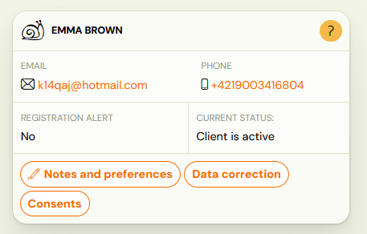
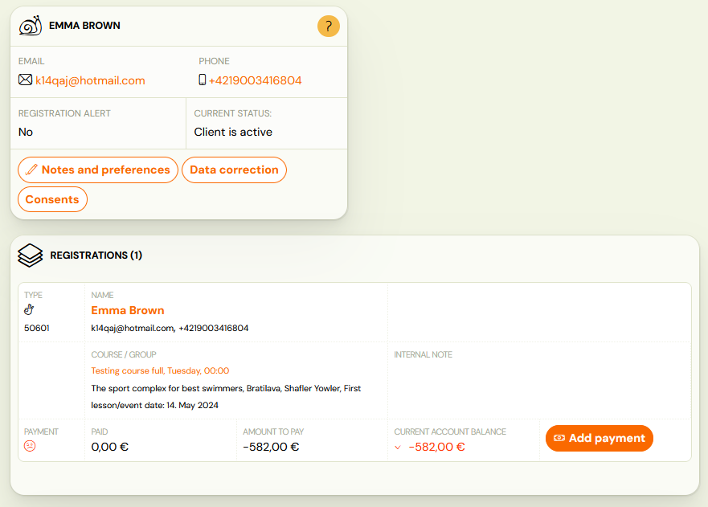
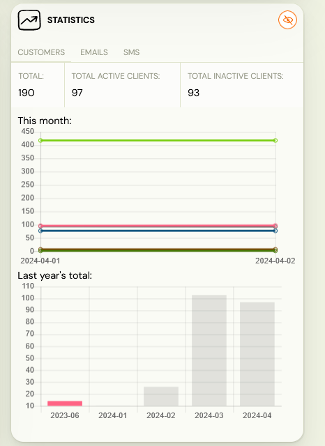
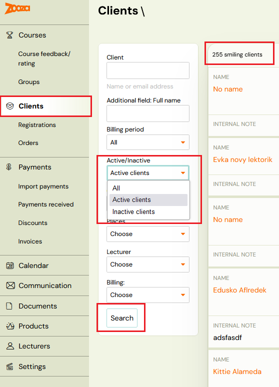

<!-- Synonyms: active client, inactive client, client status, client capacity, aktívny klient, neaktívny klient, kapacita klientov, servisný balík, počet klientov -->

# Active and inactive clients

This guide explains the difference between clients and bookings in Zooza, how the system determines whether a client is active or inactive, and how the active client count affects your Zooza service package.

## Clients vs. bookings

Every person who registers through your booking form is stored as a **client** in Zooza. The client record contains personal data, notes, consents, and preferences.

A **booking** is a separate record that links a client to a specific programme, class, and session schedule. One client can have multiple bookings — for example, attending two different programmes or enrolling multiple children.

The client's active or inactive status is determined automatically based on their bookings and credits.

## Active client

A client is considered **active** if any of the following conditions is true:

- They have at least one booking in any of these states:
  - **Enrolled** (registered)
  - **Trial not started**
  - **Trial started**
  - **Trial finished**

  ...and the booking is in a **class that has not ended yet** (the class is ongoing or has not started).

- They have at least one **scheduled make-up session**.

- They have **unused credit** (remaining prepaid entries or lessons that have not been used yet).

> **Important:** A client becomes active as soon as any of these conditions is met. Active status does not depend on the programme or timetable being active. If you create a programme for January and a client registers in December, that client counts as active from December — before the programme starts.

## Inactive client

A client becomes **inactive** when all of the following are true:

1. All their bookings are in **Late**, **Waiting list**, or **Cancelled** status.
2. All credits on all their bookings have **expired** or are **invalid**.
3. All their bookings are in **classes that have ended**.
4. They have **no booking** for any active or future class.

> **Note:** The system determines active/inactive status automatically. You cannot manually deactivate or delete a client to change their status.

### Timing of status changes

- **Activation** is immediate — the client becomes active as soon as a qualifying event occurs (e.g., a new booking is created).
- **Deactivation** happens once a day at **midnight**. For example, if you delete a client's last active booking during the day, the client remains active until the next midnight run.

## Impact on your Zooza service package

The number of active clients determines your Zooza service package tier. The key rules are:

- **Capacity** is calculated from all classes that are active (ongoing or future). This number tells you how many clients you can serve.
- If you **exceed the limit** of your current package, you are automatically upgraded to the next tier according to your confirmed pricing.
- The package calculation uses the **highest number of active clients reached within the month** — not the count at month-end.
- To **downgrade** to a lower package, you must request it in writing to [thanks@zooza.online](mailto:thanks@zooza.online) by the end of the month.

> **Important:** Because the system tracks the peak active client count for the month, a temporary spike (e.g., from early registrations before a new term starts) can trigger an upgrade even if the count drops later in the month. Plan your registration timing accordingly.

For details on service packages and pricing, see **Settings** → **Current product** in your Zooza account, or visit [Billing and Payments for Zooza](zooza-billing-payments.md).

## Viewing active and inactive clients

### On the dashboard

The home page (dashboard) shows a statistics overview including a graph and table of active and inactive client counts. Click the Zooza logo or go to the home page to see this.

> **Tip:** If you do not see some statistics in the report, enable them using the filter at the top of the report page.

### In the clients list

Go to **Clients** and use the **Active/Inactive** filter on the left side of the screen. The filtered count is displayed above the client list.

## Related

- [Clients](../reference/clients-list.md) — the clients list screen reference, including filters and client detail.
- [Client Management FAQ](../faq/client-management-faq.md) — common client management questions.
- [Billing and Payments for Zooza](zooza-billing-payments.md) — managing your Zooza subscription and invoices.
- [Types of bookings](types-of-bookings.md) — booking states and their meaning.
