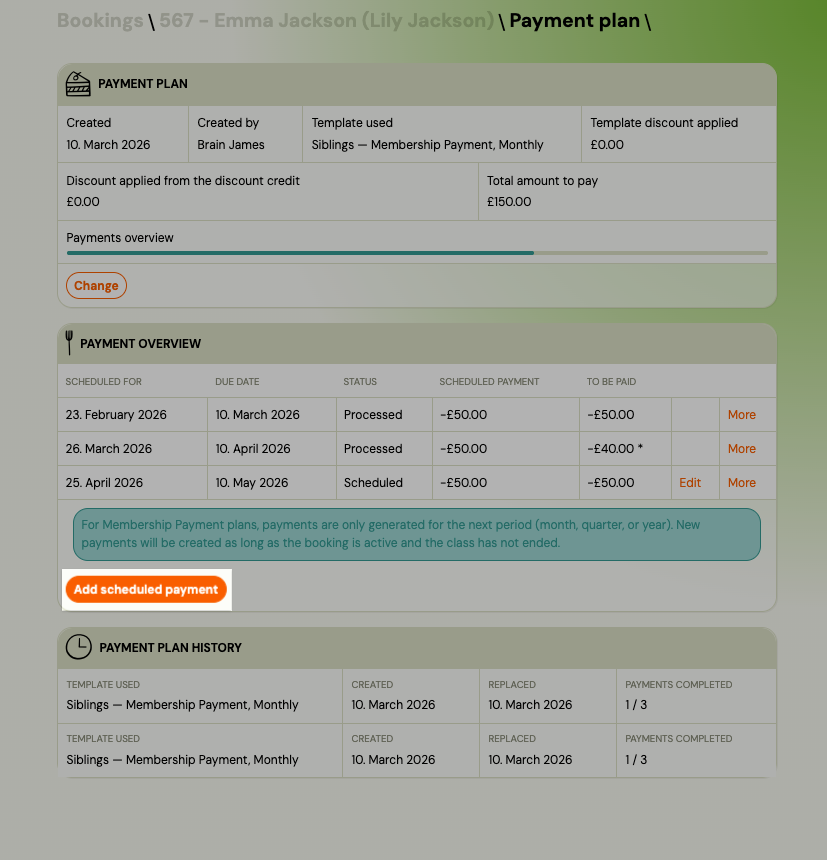
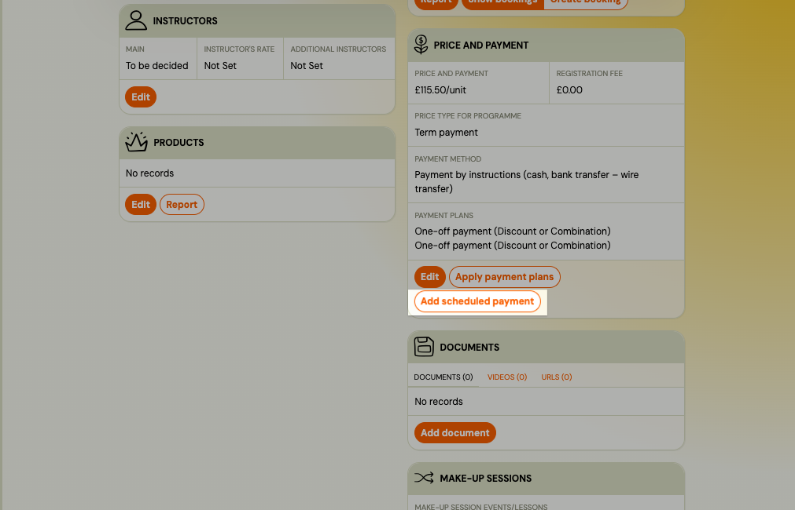
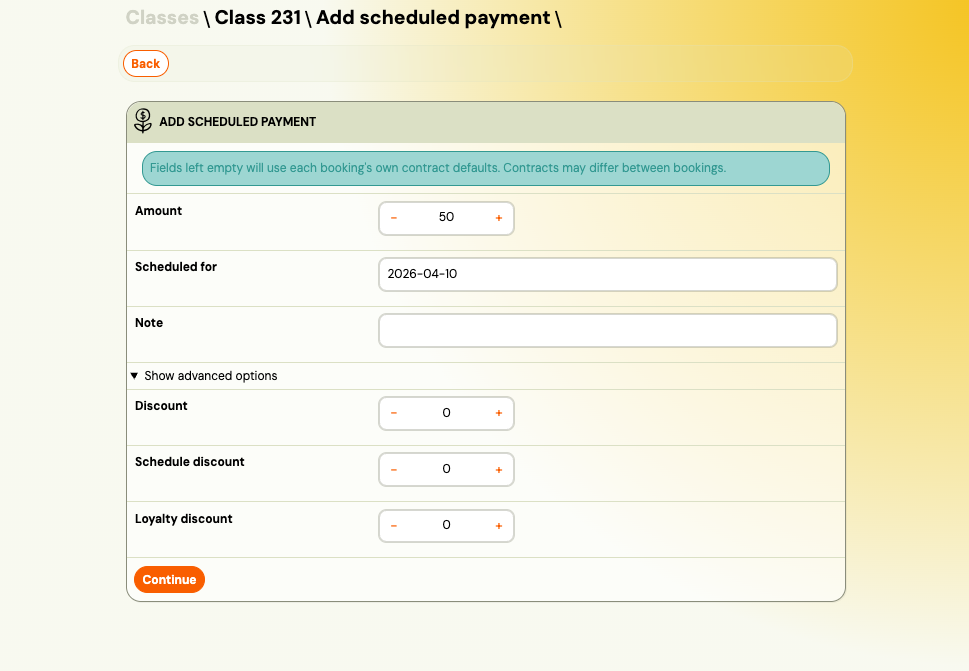
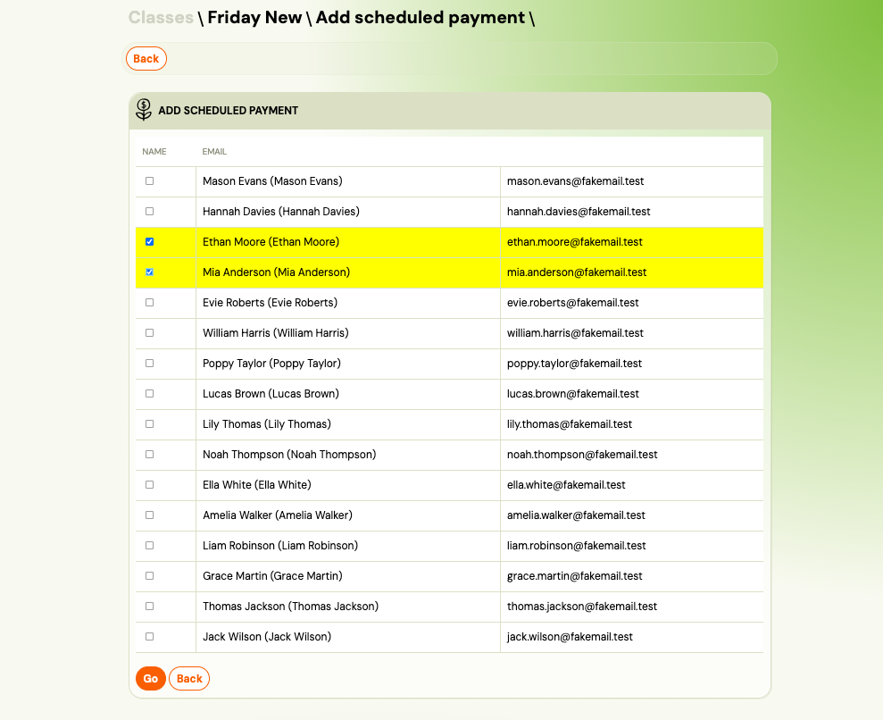
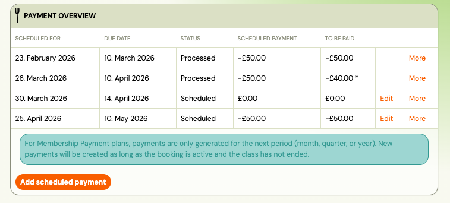
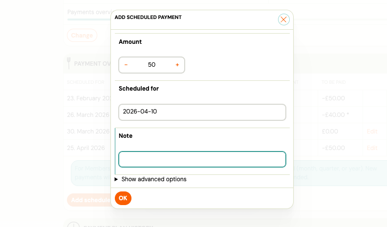
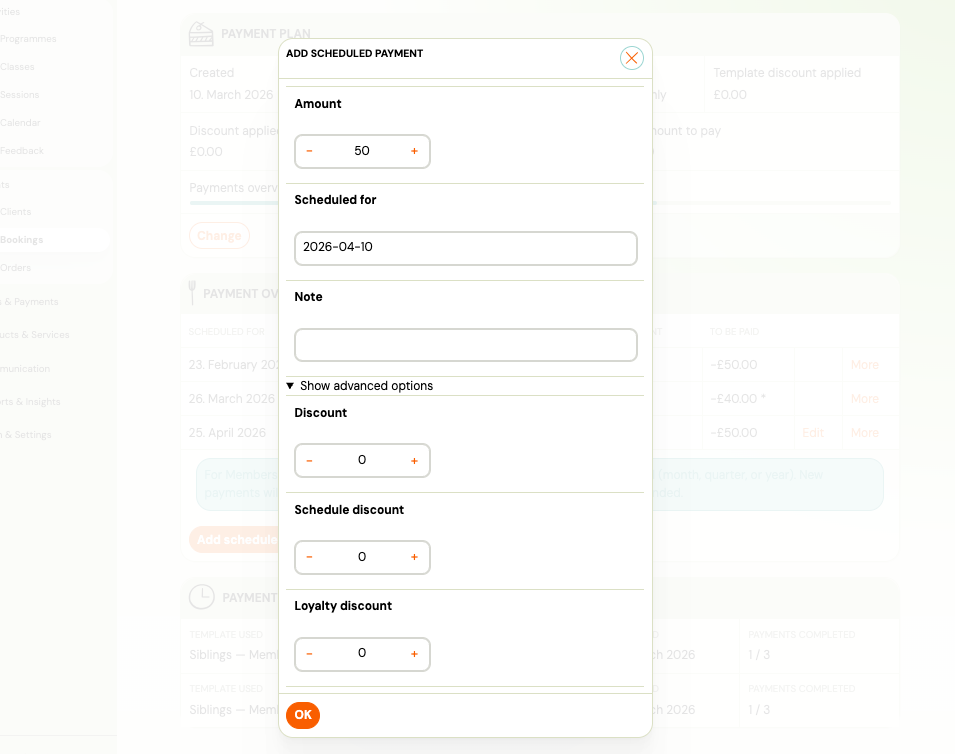

# Add a one-off scheduled payment

You can add a one-off (ad hoc) scheduled payment to an existing payment plan — for example a late fee, a partial top-up, or a custom agreed amount. This can be done for a single registration or in bulk across multiple registrations in a class.

---

## Add a payment to a single registration

Use this when you need to add an extra charge to one client's payment plan.

1. Go to **Bookings** and open the registration.
2. Go to the **Payment plan** tab.
3. Click **Add scheduled payment** in the Payment overview card.

   

4. Fill in the payment details:

   | Field | Notes |
   |---|---|
   | **Amount** | Enter a **negative** value (e.g. `-50`). Positive values are rejected. |
   | **Scheduled at** | Date the payment is due. Defaults to today. |
   | **Note** | Label for this payment. Defaults to "Extra payment". |

5. Optionally expand **Advanced** to set:

   | Field | Notes |
   |---|---|
   | **Due date** | Date after which an overdue reminder can be sent. |
   | **Notify at** | Date to send a payment reminder notification. |
   | **Discount**, **Schedule discount**, **Loyalty discount** | Discount amounts applied to this payment. |

6. Click **Save**.

The new payment appears in the scheduled payments table at its chronological position.

> **Note:** The **Add payment** button on the booking detail (price card) records a received payment — it is a different action. This guide covers scheduling a future payment obligation.

---

## Add a payment to multiple registrations (bulk)

Use this when you need to add the same extra charge to several clients in a class at once — for example a late registration fee.

1. Go to the **Class detail** page.
2. In the **Price and Payment** card, click **Add payment**.

   

3. **Step 1 — Configure:** Fill in the payment fields (same fields as the individual form above).

   

   > Fields left empty will use each registration's own payment contract defaults. Different registrations in the same class may have different contracts.

4. Click **Continue**.

5. **Step 2 — Select:** Choose which registrations to include. Only registrations with an active payment plan are shown.

   

   > If some registrations are not shown, it means they do not have an active payment plan and cannot receive a scheduled payment.

6. Click **Go**.

7. **Step 3 — Processing:** Zooza applies the payment to each selected registration in sequence. Each row shows its status (queued → done / error). Errors on individual registrations do not stop the rest of the batch.

   

---

## Payment plan history

The payment plan page now shows a history of previous payment plans for each registration, below the active plan.

Each historical entry shows:

| Field | Description |
|---|---|
| **Template** | Name of the payment plan template that was used. |
| **Created** | Date the plan was created and by whom. |
| **Replaced** | Date the plan was replaced (and by whom, if available). |
| **Payments** | How many payments were completed out of the total (e.g. "3 / 10"). |

Click a historical entry to expand it and see the full scheduled payments table from that plan (read-only).

### Admin note

Both the active plan and historical plans have an editable **Admin note** field — use it to record context such as why a plan was changed or what was agreed with the client.

1. Click **Edit** next to the note field.
2. Type your note and press Enter or click away to save.

---

## Why is the first instalment different from the others?

If the first instalment on a payment plan is a different amount than the rest, it is almost always a **pro-rated (alikvotný) payment**.

When a client registers mid-billing period, Zooza calculates the first payment proportionally — the client pays only for the days remaining in that period, not the full month or term fee.

**Example:** A class costs €60/month. A client registers on the 15th of March. The first instalment is €30 (half of March), and from April onwards the full €60/month applies.

The pro-ration calculation depends on your billing profile settings:
- The **billing period start date** (e.g., 1st of each month)
- The **registration date**
- The **pro-ration method** (calendar days or session-based)

To review or adjust how pro-ration is configured, go to **Settings → Billing profiles** and check the **Pro-rated payment** settings for the relevant billing profile.

> If you do not want pro-ration and prefer all clients to pay the full amount regardless of when they register, disable the pro-rated payment option in the billing profile.

## Can I change the amount on an existing payment plan?

You cannot edit the amounts in an existing active payment plan directly. The options are:

1. **Add an ad-hoc payment** (this guide) — to charge or credit an additional amount without changing the existing scheduled payments.
2. **Replace the payment plan** — go to the registration's **Payment plan** tab, click **Replace plan**, and select a new template or configure custom amounts. The old plan moves to history.
3. **Edit individual scheduled payments** — in the scheduled payments table, you can click on a future (unpaid) payment and manually adjust its amount or due date.

---

## Related

- [Payment tile on booking](payment-tile-on-booking.md) — overview of the payment card on a registration.
- [Payment options](payment-options.md) — types of payments and how they work.
- [Billing and invoicing setup](../setup/billing-and-invoicing.md) — billing profiles, pro-ration settings.
- [Payments and billing FAQ](../faq/payments-and-billing-faq.md) — common questions.
