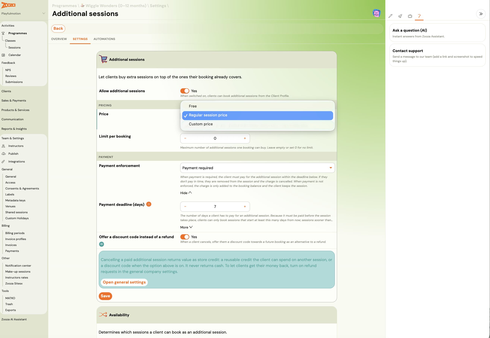
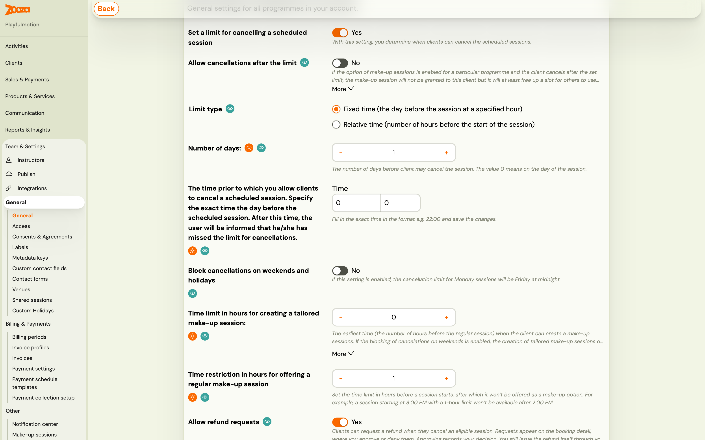
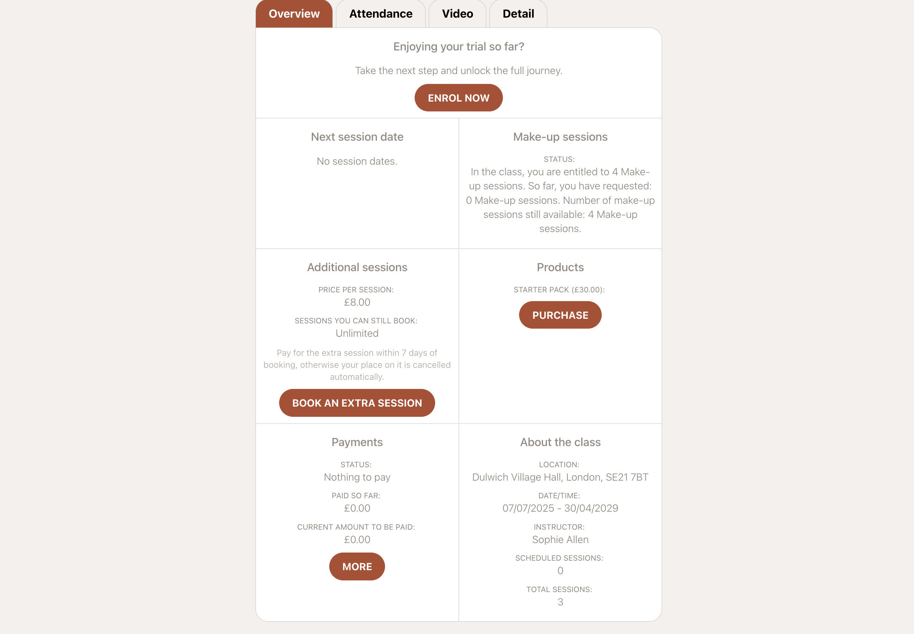
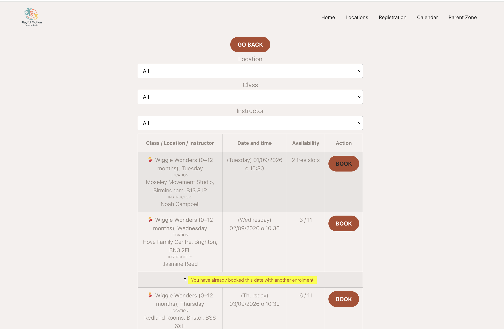
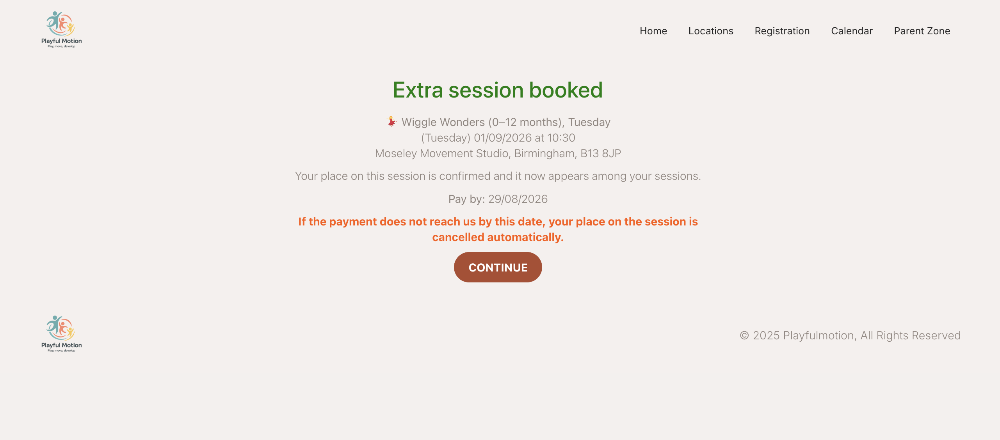
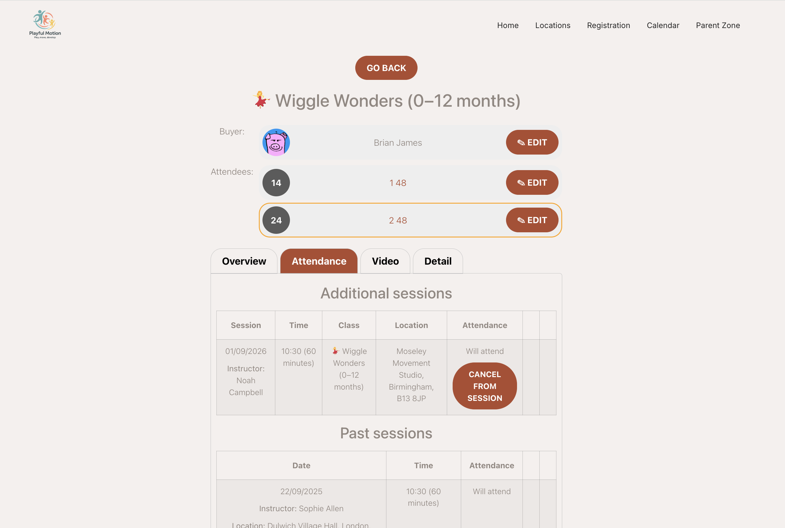
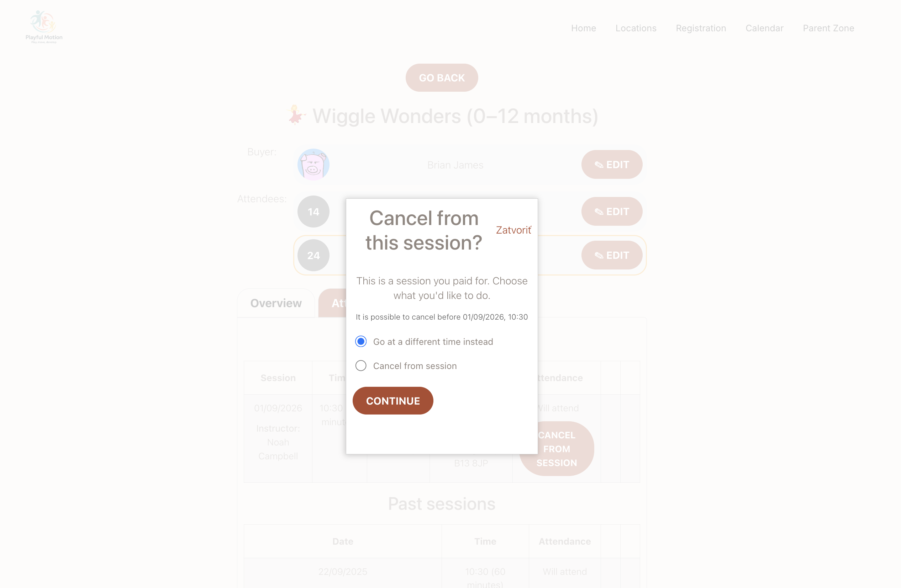

# Sell extra sessions on top of a booking

A child wants to come to an extra class this week — not to make up a missed one, just an additional session. Until now the only way to allow that was a make-up credit, which is a free entitlement and the wrong tool for something you want to charge for.

**Additional sessions** let a client book beyond what their booking covers, and let you charge for it.

> This is not the same as a make-up session. A make-up replaces something the client already paid for and missed. An additional session is extra attendance they are buying. See [Make-up sessions FAQ](../faq/make-up-sessions-faq.md).

## Turning it on

Go to **Programmes → the programme → Settings → Additional sessions** and switch on **Allow additional sessions**. Clients then book them from their **Client Profile**.

### Price

Choose one of three:

| Option | What it means |
|---|---|
| **Free** | No charge. Useful when you want to allow extra attendance without selling it. |
| **Regular session price** | The same per-session price the programme already uses. |
| **Custom price** | A **Price per session** you set specifically for extras. |

### Limit per booking

The maximum number of additional sessions one booking may buy. Leave it empty or set **0** for no limit.

### Payment enforcement

This is the setting that decides what happens if the client does not pay, and the two options behave very differently.

**Payment required** — the client must pay within the deadline. If they do not, they are **removed from the session** and the charge is cancelled. Use this when the seat is scarce and an unpaid booking would block someone else.

**Payment not enforced** — the charge is added to the booking balance and the client **keeps the session** regardless. Use this when you would rather they attend and settle up with everything else.

### Payment deadline, and the side effect worth knowing

**Payment deadline (days)** is how long a client has to pay. Because an additional session has to be paid for *before* it happens, this number also decides **how soon a client can book**.

Set the deadline to 5 days and a client cannot book a session starting in 3 days — it simply is not offered. A long deadline protects your cash flow but closes off last-minute bookings, which is often the very thing people want an extra session for. Keep it short unless you have a reason not to.

### Availability

The **Availability** settings decide which sessions a client may book as an additional session.

## What the client sees

In their profile, an **Additional sessions** card shows the **price per session** and how many they can still book — a number, or **Unlimited**. If payment is enforced, the card states the deadline in plain words: *pay within N days of booking, otherwise your place is cancelled automatically.*

They pick a session from a list showing the class, venue, instructor and time, and confirm.

**The place is confirmed straight away, before payment.** The confirmation says so, and gives a **Pay by** date. That is the point of the deadline setting — the seat is held, but only until that date.

### Cancelling one they already booked

A client can cancel an extra session themselves, up to a cut-off before it starts. They are told it is a session they paid for and offered two things:

- **Go at a different time instead** — move to another session rather than lose it.
- **Cancel from session** — give it up.

The cut-off comes from **Set a limit for cancelling a scheduled session** in the general settings for all programmes.

## Refunds are a request, not an automatic payout

There is a separate switch in the general settings — **Allow refund requests**. With it on, a client who cancels can ask for their money back and **you approve or deny it**.

Approving **records your decision. It does not move any money.** You still issue the refund through your payment provider yourself.

That is worth telling your team plainly: an approved refund request is a decision on record, not a transaction. Nobody is paid until someone actually refunds them.

## How the money is tracked

**Additional session charges sit apart from the booking's own payments.** They do not change the payment status of the booking — a client who owes for an extra session is not marked unpaid on their registration.

You see them as **Additional sessions charge** and **Additional sessions balance**.

Two consequences:

- **Cancelling an unpaid additional session** clears the charge automatically and records an **Additional session payment correction** entry.
- **Refunds for paid additional sessions are manual.** Cancelling one that has already been paid does not return the money — see [Refunds are a request](#refunds-are-a-request-not-an-automatic-payout) above, and [Administrative refund](../faq/administrative-refund-faq.md).

## The two emails

Both live under **Communication → Message templates**:

| Template | When |
|---|---|
| **Additional session - payment** | After they book. Carries the payment instructions, or a confirmation when the session is free. |
| **Additional session - cancellation** | Automatically, when an unpaid additional session is cancelled and they are unenrolled. |

The payment template can use `*|ADDITIONAL_SESSION_DUE_DATE|*` for the date they have to pay by, with a conditional wrapper so the sentence only appears when there is a due date. See [Dynamic tags](dynamic-tags.md).

On the calendar, a session booked this way is labelled **Additional session**.

## Troubleshooting

**A client cannot book a session that is only a few days away.** That is the payment deadline. They can only book sessions starting at least that many days from now. Shorten the deadline if you want last-minute bookings.

**A client attended but the booking still shows as paid.** Correct — additional session charges are tracked separately and do not affect the registration's payment status. Look at the additional sessions balance.

**A client cancelled and expects their money back.** Cancelling does not refund anything. If refund requests are switched on they can ask, you approve, and that approval is only a record — someone still has to issue the refund through the payment provider.

**A client was removed from a session they booked.** They did not pay inside the deadline and **Payment required** is on. The cancellation email tells them; if you would rather they kept the seat, switch to **Payment not enforced**.
