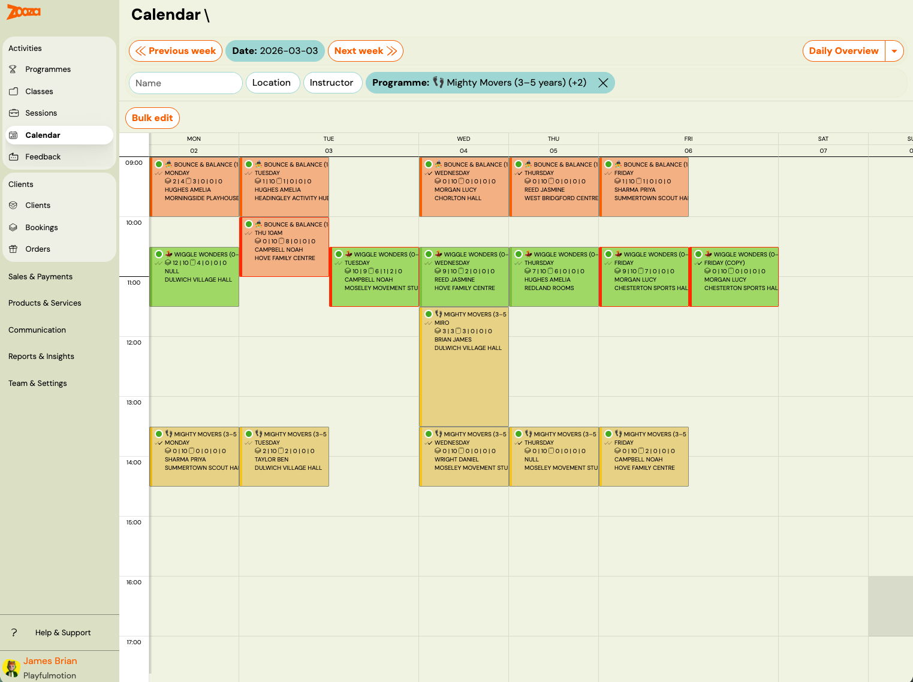
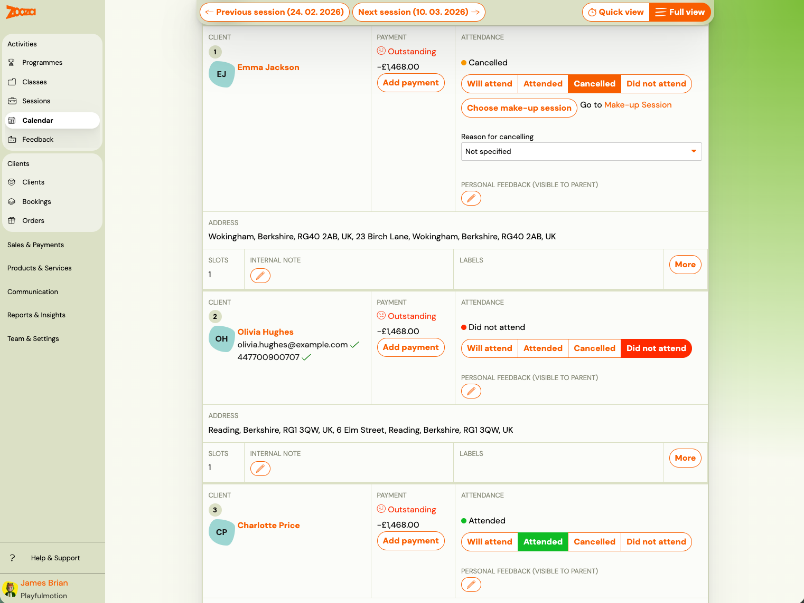
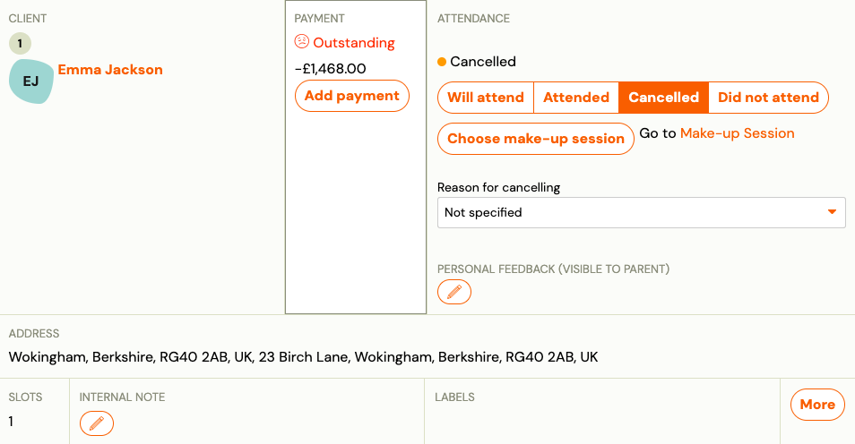
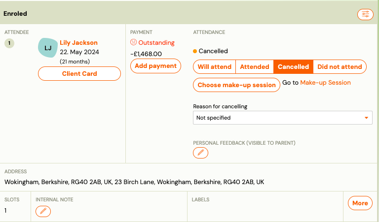
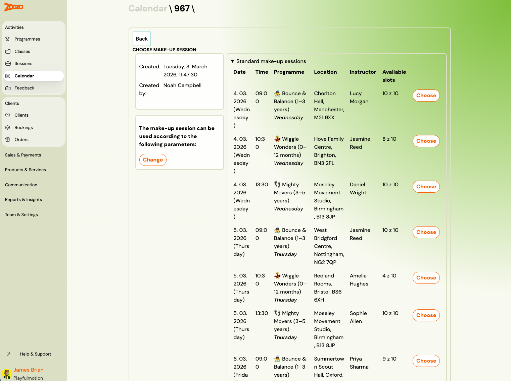
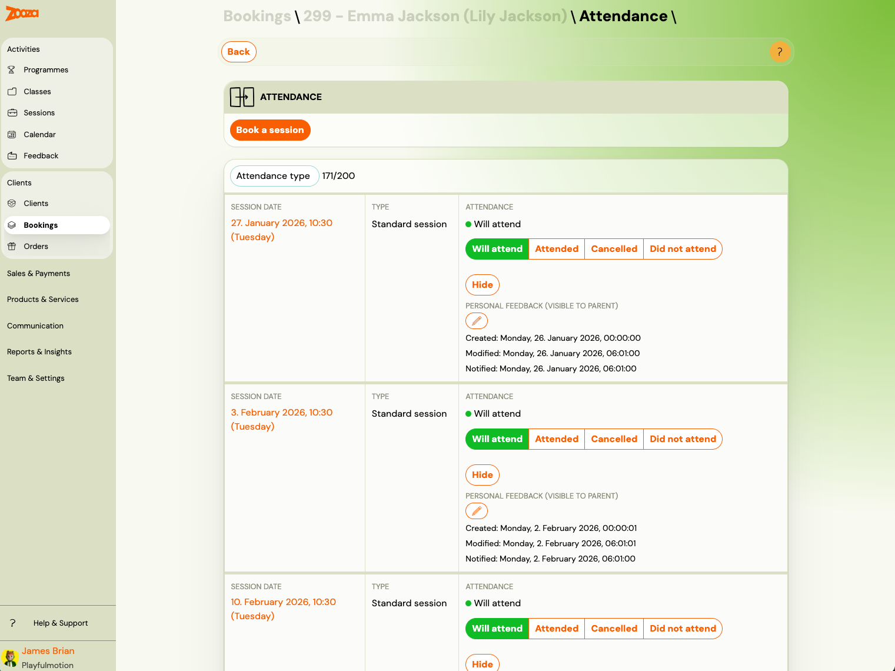
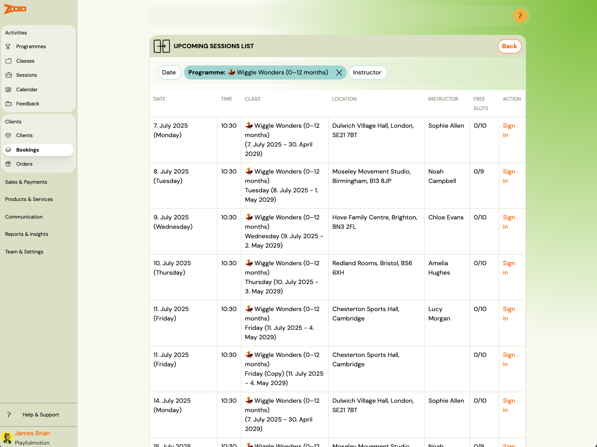

# Managing client attendance as Admin

Admins and instructors (with full report permission) can set or change attendance for any client on any session — including sessions in the past. There are no restrictions on when or how many times attendance can be updated.

## Two ways to reach attendance

### Via Calendar

Go to **Calendar** and click on a session tile. Switch to **Full view** (top right) to see all enrolled clients with their attendance controls on one screen.

This is the fastest way to mark attendance for an entire class at once.

### Via Booking

Go to **Bookings**, open a client's booking, and click the **Attendance** tab. This shows the full session-by-session attendance record for that one booking.

Use this view when you need to manage or review one specific client's attendance history.

## Attendance states

Each session row shows four state buttons:

| State | Meaning |
|---|---|
| **Will attend** | Default state — the client is enrolled and the session is upcoming or not yet marked. |
| **Attended** | The client was present at the session. |
| **Cancelled** | The client cancelled in advance. If make-up sessions are enabled, a **Choose make-up session** button appears. |
| **Did not attend** | The client did not show up and did not cancel. No make-up credit is generated. |

Click any button to set or change the state. The change takes effect immediately. You can change it again at any time, including for past sessions.

## When a session is set to Cancelled

Setting a session to **Cancelled** unlocks additional options:

- **Choose make-up session** — opens a list of upcoming sessions the client can be logged in to as a make-up.
- **Go to Make-up Session** — jumps directly to the make-up session already selected (if one was chosen).
- **Reason for cancelling** — select from available reasons (or leave as "Not specified"). This is for internal tracking.
- **Personal feedback (visible to parent)** — leave a note that the client can see in their profile.

## Choosing a make-up session

After clicking **Choose make-up session**, a list of upcoming sessions appears — filtered to sessions with available capacity from the same programme (or linked programmes, if cross-company make-ups are configured).

You can filter by **Date**, **Programme**, or **Instructor**. Each row shows the date, time, class, location, instructor, and number of free slots. Click **Log in** to assign the make-up.

Once confirmed, the original session shows the cancelled status with a link to the make-up, and the make-up session shows the client as logged in.

## Book a session (from the Attendance tab)

In the booking's **Attendance** tab, the **Book a session** button at the top lets you add any upcoming session from the class to the client's attendance record. This is used when you want to manually enrol the client into a specific session — for example, a make-up or an extra session — without going through the session picker.

## Related

- [Attendance management for instructors](instructor-attendance-management.md) — instructor-specific dashboard and calendar views.
- [Make-up session — complete guide](replacement-hours-complete.md) — how make-up credits are earned and configured.
- [King of a class](king-of-a-group.md) — delegating attendance management to one client.
- [Make-up sessions FAQ](../faq/make-up-sessions-faq.md)
