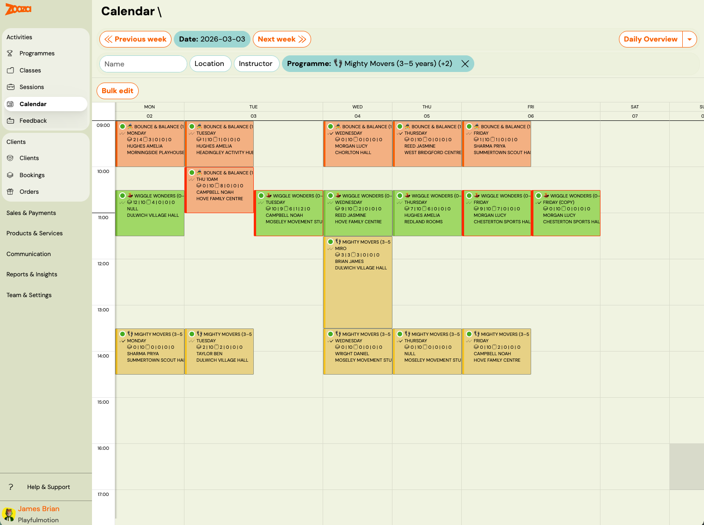
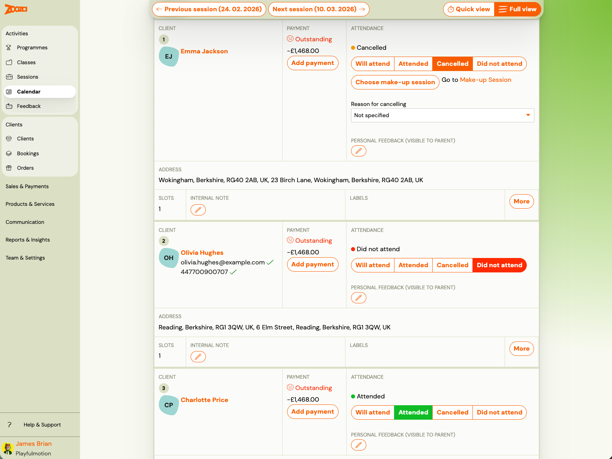
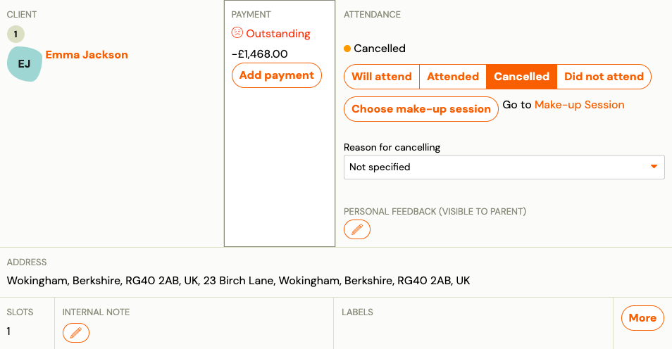
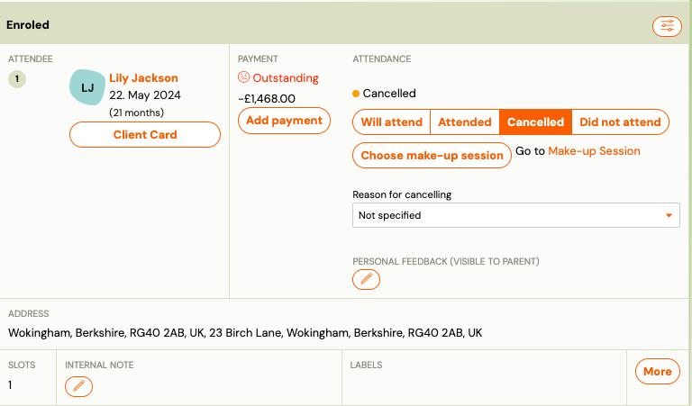
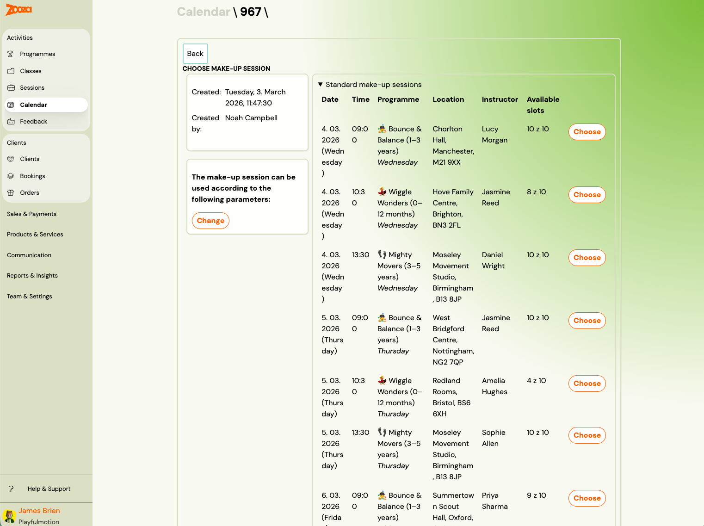
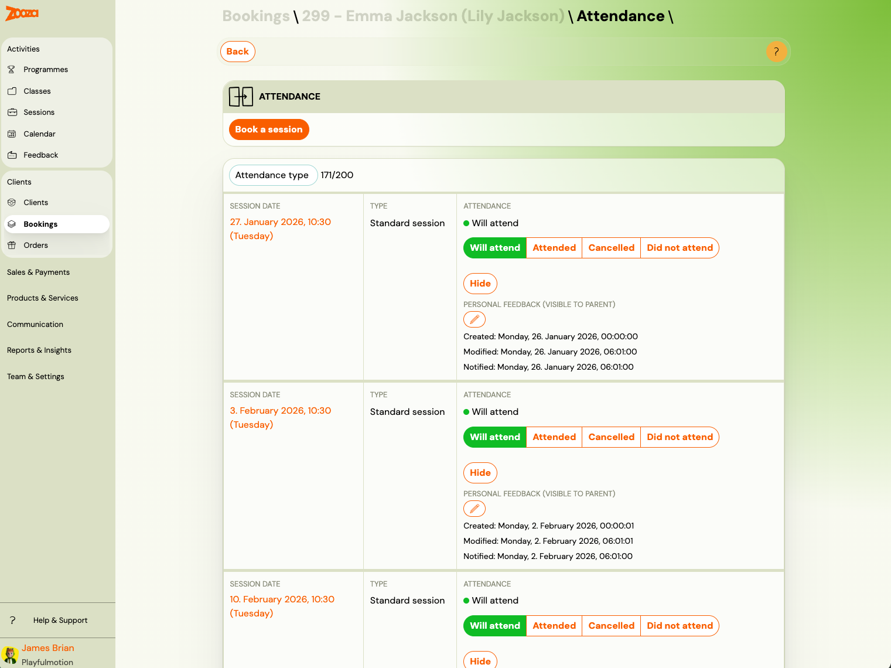
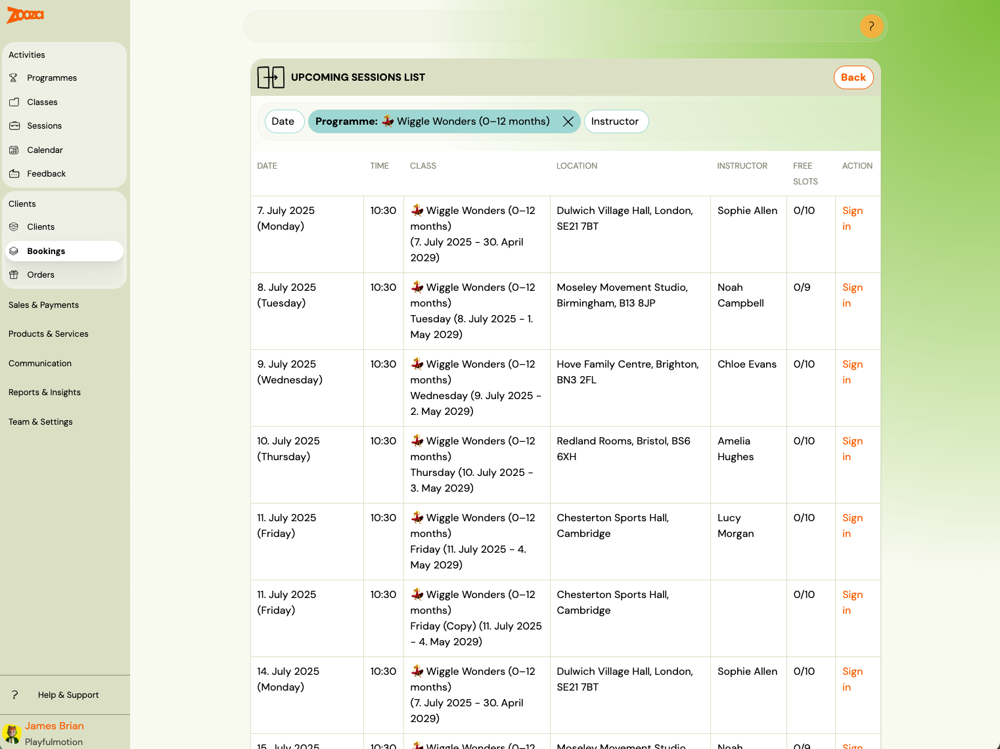

# Managing client attendance as Admin

Admins and instructors (with full report permission) can set or change attendance for any client on any session — including sessions in the past. There are no restrictions on when or how many times attendance can be updated.

## Two ways to reach attendance

### Via Calendar

Go to **Calendar** and click on a session tile. Switch to **Full view** (top right) to see all enrolled clients with their attendance controls on one screen.

This is the fastest way to mark attendance for an entire class at once.

### Via Booking

Go to **Bookings**, open a client's booking. Look for the **Attendance** tab or section within the booking detail. This shows the full session-by-session attendance record for that one booking.

Use this view when you need to manage or review one specific client's attendance history.

> **If you don't see an Attendance tab in the booking detail**, use the Calendar route instead: go to **Calendar**, click the session, switch to **Full view**, and find the client in the list. This view is always available regardless of how the booking detail is laid out.

## Attendance states

Each session row shows four state buttons:

| State | Meaning |
|---|---|
| **Will attend** | Default state — the client is enrolled and the session is upcoming or not yet marked. |
| **Attended** | The client was present at the session. |
| **Cancelled** | The client cancelled in advance. If make-up sessions are enabled, a **Choose make-up session** button appears. |
| **Did not attend** | The client did not show up and did not cancel. No make-up credit is generated. |

Click any button to set or change the state. The change takes effect immediately. You can change it again at any time, including for past sessions.

## How a client gets onto a session in the first place

Most "the client disappeared from attendance" questions are really about this, so it is worth knowing before you go looking for a bug.

1. **While the class runs**, the client is held against every session in it — on the assumption they will come. This is an expectation, not an attendance record.
2. **At midnight the day before a session**, Zooza enrols them on it for real, unless they have already cancelled.
3. **From then on the session carries a record** — will attend, attended, cancelled or did not attend — and that record is what you see and change.

So a session in the far future and a session tomorrow are not in the same state, even though both show the client. A cancellation, or a make-up credit being spent, changes which sessions carry a record and which do not.

## When a session is set to Cancelled

Setting a session to **Cancelled** unlocks additional options:

- **Choose make-up session** — opens a list of upcoming sessions the client can be logged in to as a make-up.
- **Go to Make-up Session** — jumps directly to the make-up session already selected (if one was chosen).
- **Reason for cancelling** — select from available reasons (or leave as "Not specified"). This is for internal tracking.
- **Personal feedback (visible to parent)** — leave a note that the client can see in their profile.

## Choosing a make-up session

After clicking **Choose make-up session**, a list of upcoming sessions appears — filtered to sessions with available capacity from the same programme (or linked programmes, if cross-company make-ups are configured).

You can filter by **Date**, **Programme**, or **Instructor**. Each row shows the date, time, class, location, instructor, and number of free slots. Click **Log in** to assign the make-up.

Once confirmed, the original session shows the cancelled status with a link to the make-up, and the make-up session shows the client as logged in.

## Book a session (from the Attendance tab)

In the booking's **Attendance** tab, the **Book a session** button at the top lets you add any upcoming session from the class to the client's attendance record. This is used when you want to manually enrol the client into a specific session — for example, a make-up or an extra session — without going through the session picker.

## Attendance after transferring a student to a different class

When you move a student from one class to another (via **Transfer** or **Copy**), their historical attendance does not move with them. Here is what happens:

| What | Where it goes |
|---|---|
| Attendance records from the **original class** | Stay on the **original booking** — linked to the original class |
| Attendance in the **new class** | Starts fresh from the date of transfer — no history |
| Make-up credits earned in the original class | Remain on the original booking; may or may not be usable in the new class depending on programme settings |

### What "Transferred" means on a session

After you move a client between classes, the session detail in the **new** class may list them under **Transferred** rather than with everyone else.

This is cosmetic. It records that the client was not in the group from the start — nothing about their booking, payment or attendance is different because of it. It does not need fixing and it does not go away.

### Why the client no longer shows on some sessions in the old class

In the class they left, the client stays only on the sessions where they have an **attendance record**. Sessions with no record are hidden automatically, so the old class stops listing them for dates they were never really going to attend.

That is why a client can look as though they vanished from a class mid-term: they did not, the sessions without a record are simply not shown.

**To take a client off a session they should not be on**, hide their attendance record for it. The session then drops out of their record the same way.

### Finding a session that is hidden, and putting it back

A hidden record is not deleted — it is still on the booking, just not in the list you are looking at. The **Attendance** tab shows only the four live states by default: will attend, attended, cancelled and did not attend. Anything else — a record that was deleted or ignored, or a place on a waiting list — is left out.

To see them:

1. Open the booking and go to the **Attendance** tab.
2. Use the **Attendance type** filter above the list. Every state that actually has records on this booking appears as an option, with the number of records in brackets.
3. Pick the state you are missing. Those sessions appear in the list, and you can put the record back from there.

> **Read the counter next to the filter.** It shows how many records are being listed out of how many exist on the booking — `18/24` means six are there and not being shown. If the two numbers match, nothing is hidden and the session you are looking for was never on this booking.

The filter only appears when the booking has records in more than one state, so on a straightforward booking you will not see it at all.

**How to find the original attendance after a transfer:**

1. Go to **Bookings** and search for the client.
2. Look for the **original (closed or cancelled) booking** — there may be two bookings for the same client: the old one and the new one.
3. Open the original booking and go to the **Attendance** tab to see the full session history.

> The attendance records are not deleted — they are just on a different booking. If you only look at the new booking, you will see a fresh start.

**Year-end attendance across multiple classes:**

If a student changed classes mid-year, there is no single view that combines their attendance from both classes. You need to check each booking separately and add up the counts manually. This is a current limitation — there is no built-in cross-class attendance report for a single student.

---

## Related

- [Attendance management for instructors](instructor-attendance-management.md) — instructor-specific dashboard and calendar views.
- [Make-up session — complete guide](replacement-hours-complete.md) — how make-up credits are earned and configured.
- [King of a class](king-of-a-group.md) — delegating attendance management to one client.
- [Make-up sessions FAQ](../faq/make-up-sessions-faq.md)
