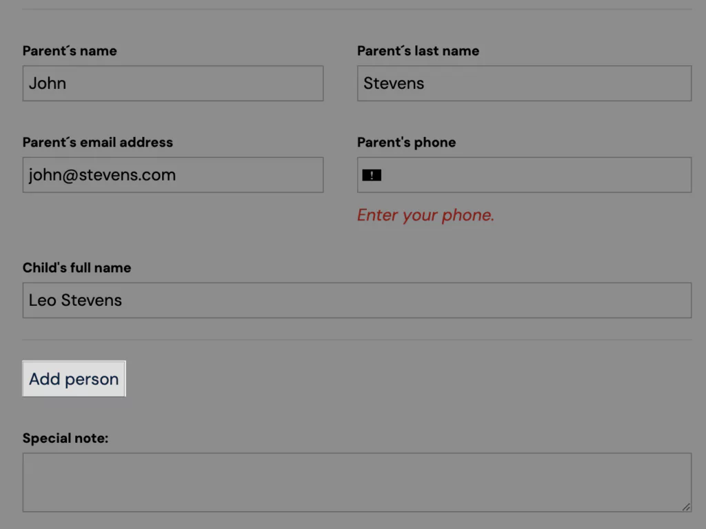
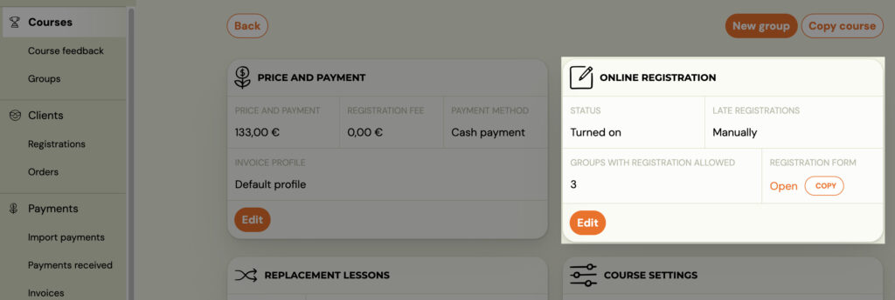
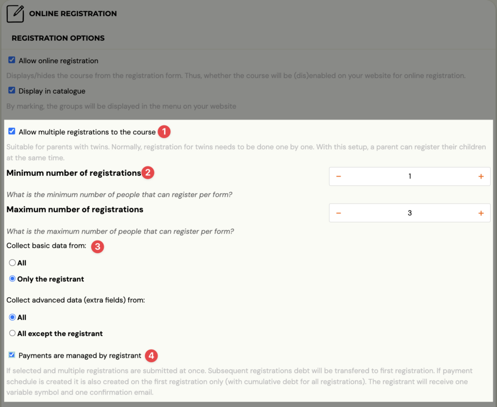

# Allowing multiple booking for a programme

You can expand the booking form not only with extra fields but also with the possibility to add another person. Thanks to this button, your client can quickly create a booking for both children at the same time in the case of children’s programmes, or a booking for themselves and their partner in the case of dance programmes.

The price per programme is automatically converted to the price for two or more bookings.

The button will be added automatically as soon as you enable multiple programme bookings. You can enable multiple programme bookings at the *Programme *level, in the *Online Registration *section.

## How to set it up

In the *Online Registration *section, click *Edit.*

1. Click on the *Allow multiple programme bookings* checkbox.
2. Choose the minimum and maximum number of bookings.

Example: if it is a ballroom dance where you want to allow clients to come without a partner and with a partner, choose option 1 minimum and 2 maximum.

 3. Determine from whom the basic fields of the booking form will be collected (first name, last name, email, phone number) and from whom the extra fields will be collected (child’s name, age, address… ).

TIP: If you are unsure of your choices – look at the booking form for the programme on your website and make sure everything is as you need it to be.

 4. If you want related bookings to combine payments for one booking and allow the main booking to pay for both (all) related bookings at the same time and with one variable symbol – enable the option – *Payments *are managed by the registrant. More on related bookings here.

 5. Don’t forget to *Save *settings

