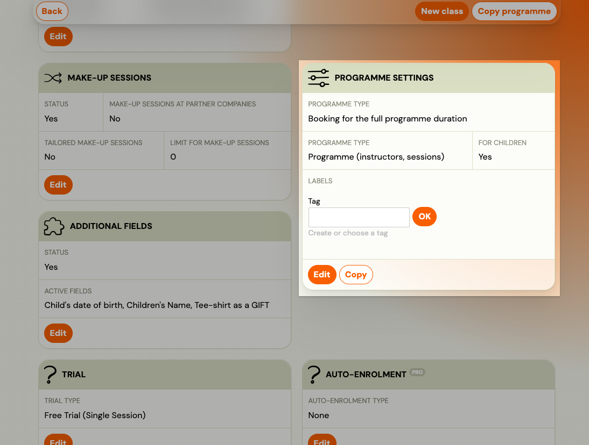
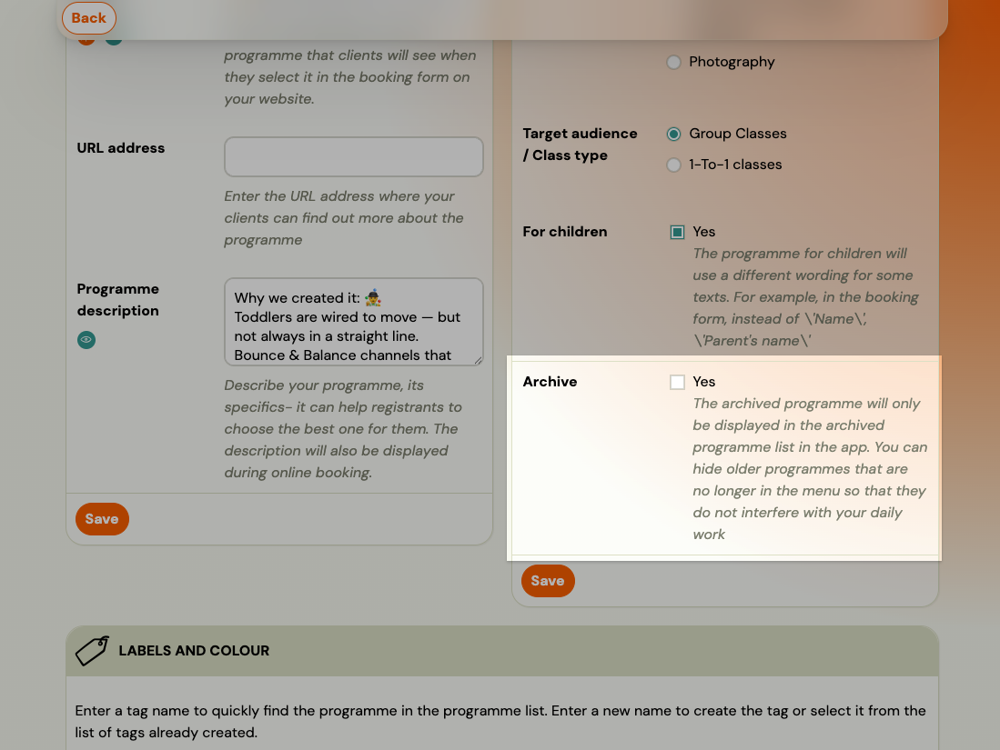
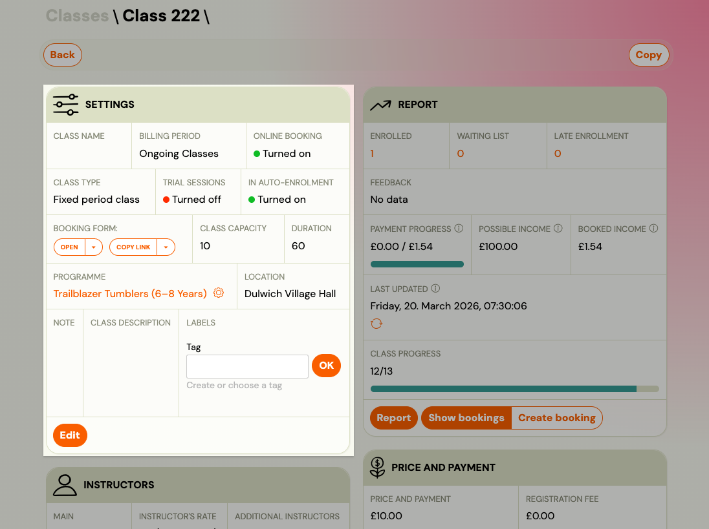
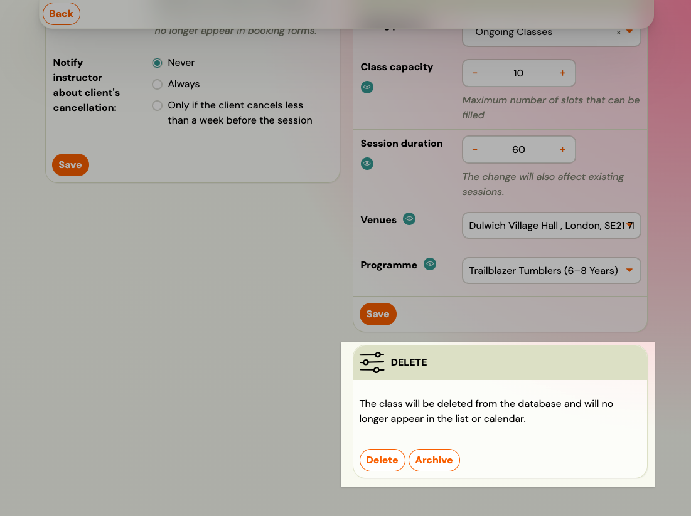

# Archive or delete a Programme

You cannot permanently delete a Programme directly in the app. Instead, you **archive** it — this hides it from your active list while keeping all data, bookings, and history intact.

Permanent deletion is possible in limited cases and requires contacting support.

---

## Archive a Programme

Archiving is the standard way to remove a Programme from your active list. Use this when a Programme has ended, is no longer needed, or contains existing bookings you want to keep.

1. Go to **Programmes**.
2. Click the name of the Programme you want to archive.
3. Go to **Programme Settings** → **Edit**.
4. Tick **Archive**.
5. Click **Save**.

The Programme disappears from your active list. It remains accessible via the **Archived** filter in the Programmes list.

> **To restore:** Open the archived Programme, go to Programme Settings → Edit, uncheck **Archive**, and save.

---

## Archive a Class

To hide a single Class (class) within a Programme without archiving the whole Programme:

1. Go to the Programme and open the Class you want to remove.
2. In the Class settings, tick **Archive**. 
3. Save.

> **Note:** You cannot delete a Class that has active bookings. Archive it instead, or transfer the bookings to another Class first.

---

## Permanently delete a Programme

Permanent deletion is only available if the Programme has **no bookings and no Classes**. It cannot be done from the app — you need to contact support.

1. Make sure the Programme has no bookings and no Classes (delete or transfer them first).
2. Note the Programme ID from the URL (e.g. `#courses/6455`).
3. Contact support with the Programme ID and request permanent deletion.

> **When to use this:** Programmes created automatically during account setup that you never used, or test Programmes you want fully removed.

---

## Summary

| Goal | Action |
|------|--------|
| Hide from active list, keep data | Archive the Programme |
| Remove one class, keep the Programme | Archive the Class |
| Fully remove (no bookings) | Request deletion from support |
| Restore a hidden Programme | Unarchive from Archived filter |

---
