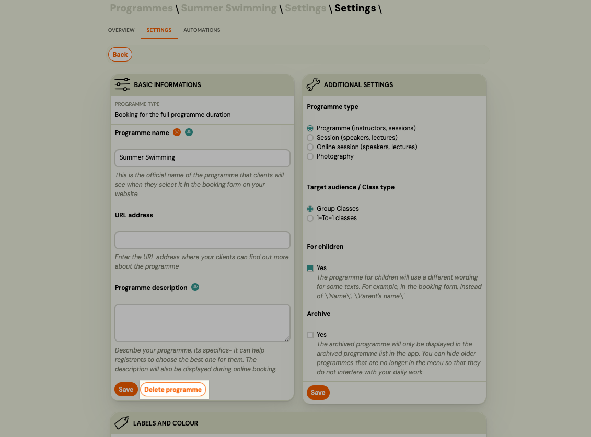
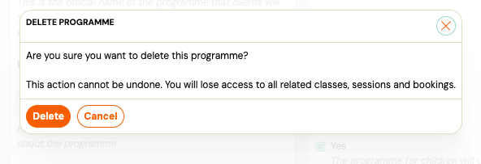

# Archive or delete a Programme

You cannot permanently delete a Programme directly in the app. Instead, you **archive** it — this hides it from your active list while keeping all data, bookings, and history intact.

If you need to fully remove a Programme, you can delete it from the Programme Settings page.

---

## Archive a Programme

Archiving is the standard way to remove a Programme from your active list. Use this when a Programme has ended, is no longer needed, or contains existing bookings you want to keep.

1. Go to **Programmes**.
2. Click the name of the Programme you want to archive.
3. Go to **Programme Settings** → **Edit**.
4. Tick **Archive**.
5. Click **Save**.

The Programme disappears from your active list. It remains accessible via the **Archived** filter in the Programmes list.

> **To restore:** Open the archived Programme, go to Programme Settings → Edit, uncheck **Archive**, and save.

---

## Archive a Class

To hide a single Class (class) within a Programme without archiving the whole Programme:

1. Go to the Programme and open the Class you want to remove.
2. In the Class settings, tick **Archive**. 
3. Save.

> **Note:** You cannot delete a Class that has active bookings. Archive it instead, or transfer the bookings to another Class first.

---

## Delete a Programme

Admins with the **edit_course** permission can permanently delete a Programme directly from Programme Settings. This action cannot be undone — you will lose access to all related Classes, sessions, and bookings.

> **Note:** Deletion is a soft delete. The Programme and its data are no longer accessible in the app, but are not erased from the database. There is no restore option from the UI.

1. Go to **Programmes** and open the Programme you want to delete.
2. Go to **Programme Settings → Edit**.
3. Click **Delete programme** (next to the Save button).

   

4. Read the warning in the confirmation dialog and click **Delete** to confirm.

   

Zooza redirects you to the Programmes list after deletion.

> **When to use this:** Programmes you no longer need and want fully removed from your active view. If the Programme has historical bookings you may want to reference later, consider archiving instead.

---

## Summary

| Goal | Action |
|------|--------|
| Hide from active list, keep data | Archive the Programme |
| Remove one class, keep the Programme | Archive the Class |
| Fully remove the Programme | Delete from Programme Settings |
| Restore a hidden Programme | Unarchive from Archived filter |
| Recover an accidentally deleted Programme, Class, or Registration | **Settings → Tools → Trash** (within 30 days) |

---

## Related

- [Recover deleted sessions, classes, and registrations](../guides/trash-and-restore.md) — restore accidentally deleted items within 30 days
