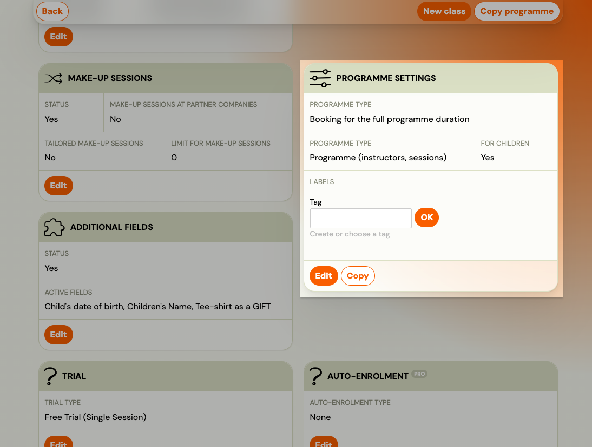
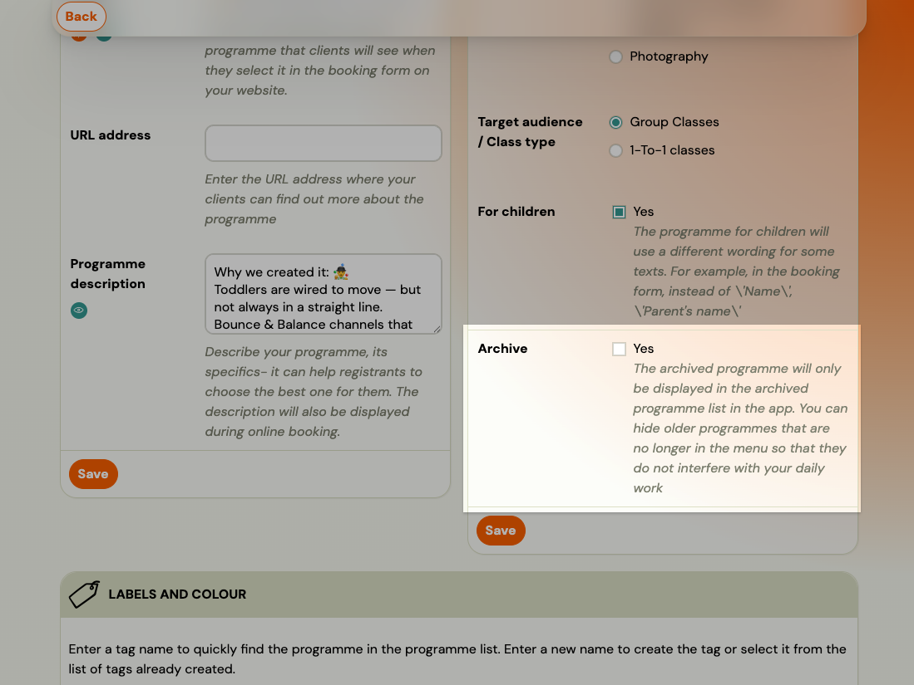
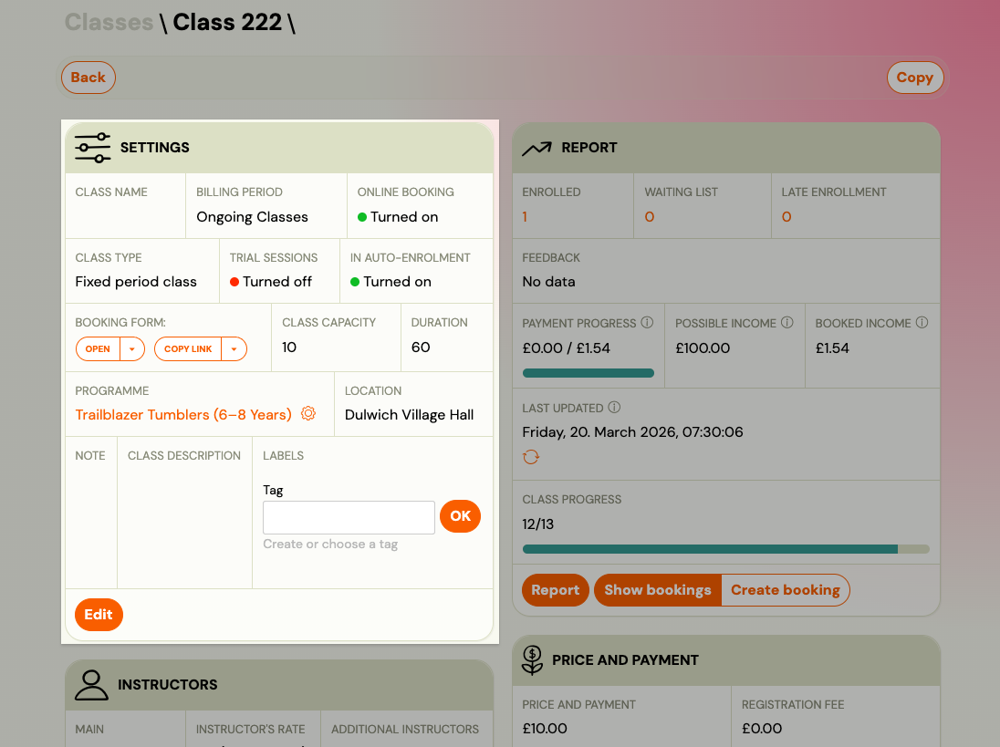
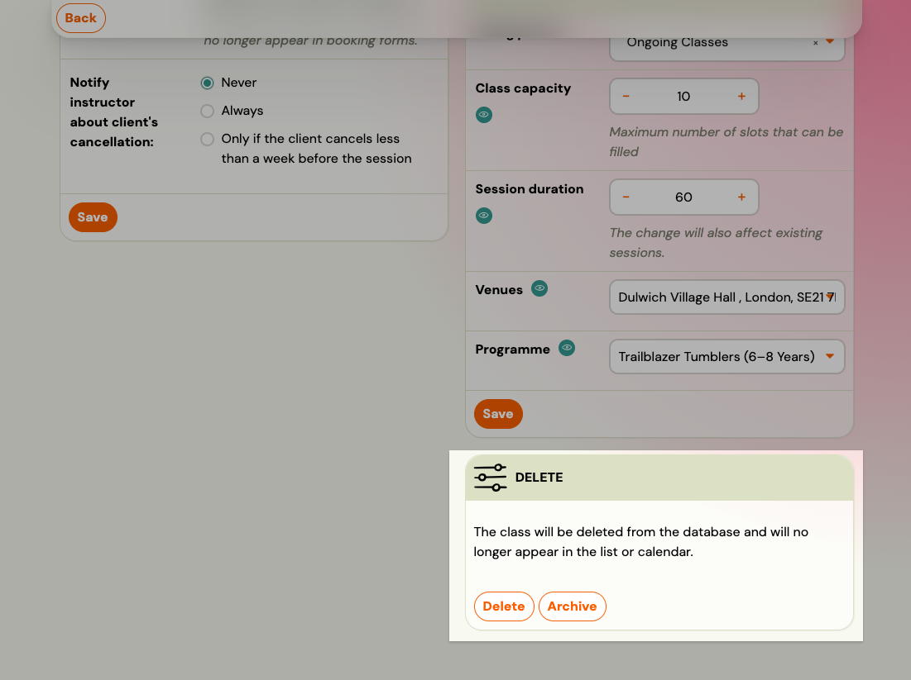
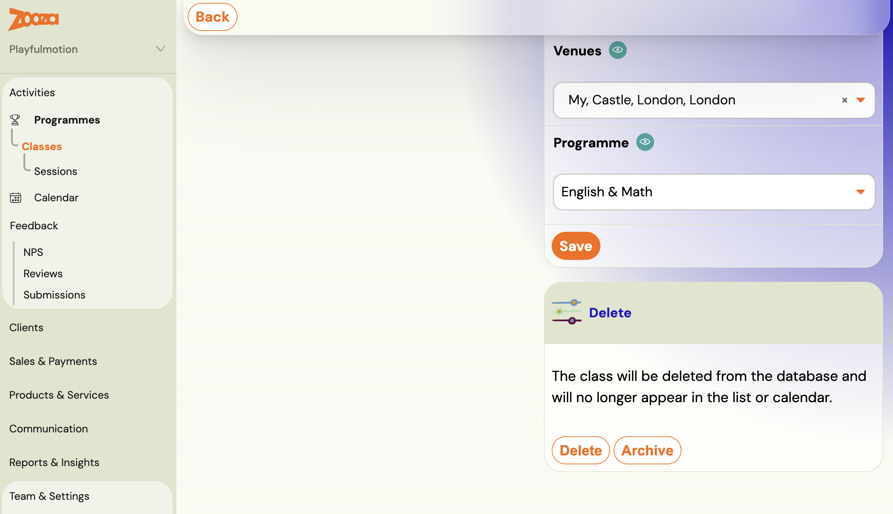
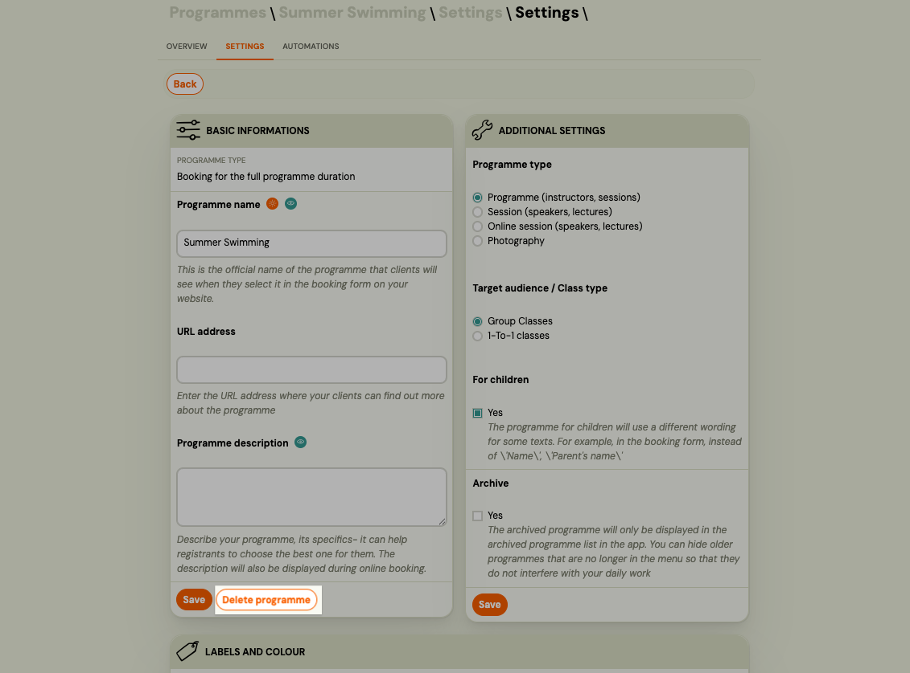
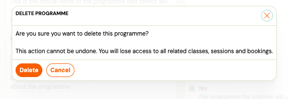

# Archive or delete a Programme

You cannot permanently delete a Programme directly in the app. Instead, you **archive** it — this hides it from your active list while keeping all data, bookings, and history intact.

If you need to fully remove a Programme, you can delete it from the Programme Settings page.

---

## Archive a Programme

Archiving is the standard way to remove a Programme from your active list. Use this when a Programme has ended, is no longer needed, or contains existing bookings you want to keep.

1. Go to **Programmes**.
2. Click the name of the Programme you want to archive.
3. Go to **Programme Settings** → **Edit**.
4. Tick **Archive**.
5. Click **Save**.

The Programme disappears from your active list. It remains accessible via the **Archived** filter in the Programmes list.

> **To restore:** Open the archived Programme, go to Programme Settings → Edit, uncheck **Archive**, and save.

---

## Archive a Class

To hide a single Class (class) within a Programme without archiving the whole Programme:

1. Go to the Programme and open the Class you want to remove.
2. In the Class settings, tick **Archive**. 
3. Save.

> **Archive rather than delete when the Class has bookings.** Archiving keeps
> everything as it is; deleting leaves the bookings without a Class — see
> [Deleting a Class does not delete its bookings](#deleting-a-class-does-not-delete-its-bookings) below.

### Archiving a Class does not delete its sessions

The sessions stay exactly where they are. Archiving takes the class out of your
active lists and off your website; it does not touch the calendar entries behind it.

**You do not need to clear them out.** Archived classes do not clutter your working
views and their sessions do not get in the way of anything — not capacity, not
reports, not the calendar you work from day to day. If you would rather remove them
anyway you can, in bulk, from the **Calendar** — but after archiving there is no
reason to.

---

## Delete a Class

1. Open the Class and go to its **settings**.
2. Scroll to the **Delete** card at the bottom of the right-hand column. It warns that
   the class will be removed from the database and will no longer appear in the list or
   calendar, and offers two buttons: **Delete** and **Archive**.
3. Click **Delete**.

Deleting is a soft delete, the same as for a Programme: the Class goes to **Trash**
and can be restored for **30 days**. Go to **Settings → Tools → Trash**. After 30
days it is gone for good.

> **Deleted a class by mistake?** Go straight to **Settings → Tools → Trash** and
> restore it — do not start rebuilding it by hand. See
> [Recover deleted items](trash-and-restore.md) for what can and cannot come back.

### Deleting a Class does not delete its bookings

**The bookings survive.** Deleting a Class does not delete the people enrolled in it
— it removes the Class they were assigned to. The bookings stay in your account; they
are simply no longer attached to that Class.

That is better than losing them, but it is not a tidy state: those bookings now have
no schedule behind them, so the clients have no sessions and nothing to attend. You
have to put them somewhere — restore the Class from Trash within 30 days, or assign
the bookings to another Class.

**So archive instead whenever the Class has run.** Archiving keeps every booking
attached to its Class along with payments and attendance, and is reversible at any
time — not just within a 30-day window.

---

## Last year's classes are still showing on my website

Because **"Ended" does not mean inactive.** A class can sit in the state *Ended (Active)* — it has finished running, but it is still an active record in the system, for example while final payments are settled. In that state it can still be picked up by the booking page and the calendar widget.

Two ways to take it off the site:

- **Archive the class** (above). Keeps every booking and all history, removes it from active lists and from the public offer. This is the right choice at the end of a term.
- **Turn off online booking** on the class, in its settings. Use this when you want the class to stay in your active lists internally but disappear from the website.

If old classes reappear every season, archiving as part of your term-reset routine is the fix — see [Run a term reset](term-rebooking-guide.md).

## Delete a Programme

Admins with the **edit_course** permission can permanently delete a Programme directly from Programme Settings. This action cannot be undone — you will lose access to all related Classes, sessions, and bookings.

> **Note:** Deletion is a soft delete. The Programme and its data are no longer accessible in the app but are kept in **Trash** for 30 days. Go to **Settings → Tools → Trash** to restore a deleted Programme within that window. After 30 days the item is permanently removed.

1. Go to **Programmes** and open the Programme you want to delete.
2. Go to **Programme Settings → Edit**.
3. Click **Delete programme** (next to the Save button).

   

4. Read the warning in the confirmation dialog and click **Delete** to confirm.

   

Zooza redirects you to the Programmes list after deletion.

> **When to use this:** Programmes you no longer need and want fully removed from your active view. If the Programme has historical bookings you may want to reference later, consider archiving instead.

---

## Summary

| Goal | Action |
|------|--------|
| Hide from active list, keep data | Archive the Programme |
| Remove one class, keep the Programme | Archive the Class |
| Fully remove the Programme | Delete from Programme Settings |
| Restore a hidden Programme | Unarchive from Archived filter |
| Recover an accidentally deleted Programme, Class, or Registration | **Settings → Tools → Trash** (within 30 days) |

---

## Related

- [Recover deleted sessions, classes, and registrations](../guides/trash-and-restore.md) — restore accidentally deleted items within 30 days
