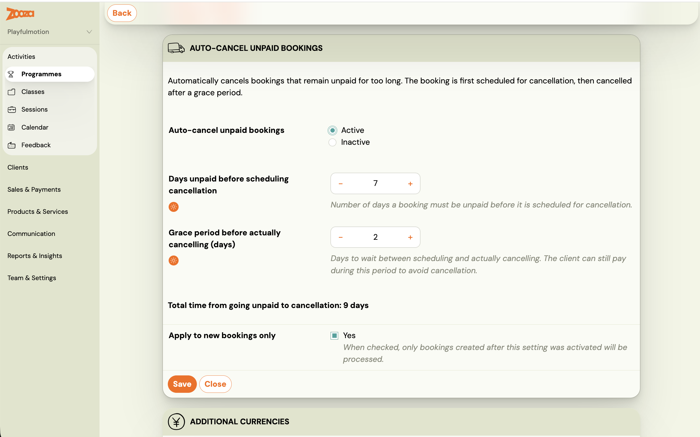
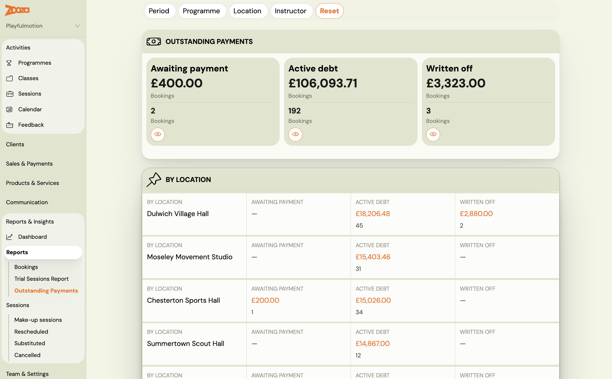

# Automatically cancel unpaid registrations

When a registration stays unpaid beyond a configured number of days, Zooza can automatically cancel it. The cancellation is not instant — the system first schedules it for a future date, giving the client a window to pay and have the cancellation revoked automatically.

This is different from payment reminder emails, which only notify the client. Auto-cancel actually removes the registration if the client does not pay.

---

## How it works

The auto-cancel flow has two stages:

1. **Trigger** — After a registration has been unpaid for the configured number of days (`cancel_after_days_unpaid`), the system schedules a cancellation for a future date.
2. **Lead time** — The cancellation is set `cancellation_lead_days` days into the future. During this window, the existing cancellation confirmation email is sent to the client, and the registration shows as pending cancellation.
3. **Resolution** — If the client pays before the cancellation date, the scheduled cancellation is automatically revoked and the registration remains active. If no payment arrives, the registration is cancelled when the lead-time window expires.

> **Only applies to new registrations.** The feature affects registrations created after it is enabled on a programme. Existing registrations at the moment of activation are not retrospectively affected.

---

## Where to configure

Auto-cancel is configured per programme, in the **Payment Reminder Settings** section of the programme's **Price and Payment** tile.

1. Open the programme and go to **Settings**.
2. Click **Edit** on the **Price and Payment** tile.
3. Scroll to **Payment Reminder Settings** and click **Change**.
4. Set the following fields:
   - **Cancel after N days unpaid** — how many days a registration may remain unpaid before the cancellation process starts.
   - **Cancellation lead time (days)** — how many days in advance the client is notified before the cancellation actually takes effect.
5. Save.

---

## What happens after cancellation

When a registration is cancelled by this process, it receives the status **Auto-unenrolled**. The client receives the standard cancellation confirmation email.

To find all auto-cancelled registrations for a programme, go to **Bookings** and filter by **Status: Auto-unenrolled**.

---

## Outstanding payments report

Go to **Reports & Insights** → **Reports** → **Outstanding payments** to see an overview of unpaid registrations grouped into three cohorts:

| Cohort | What it shows |
|---|---|
| **Awaiting payment** | Registrations with an outstanding balance still within the payment grace window |
| **Active debt** | Registrations past the grace window with unpaid debt — auto-cancel may be scheduled |
| **Written off** | Registrations that were auto-cancelled (status: Auto-unenrolled) |

Use this report to monitor which clients are approaching the cancellation threshold and decide whether to intervene manually before the cancellation fires.

---

## Related

- [Automatic payment reminders](automatic-payment-reminders-detailed.md) — email reminders and grace period settings (a separate, complementary feature).
- [Registration statuses](../faq/registration-status-faq.md) — full list of registration statuses including Auto-unenrolled.
