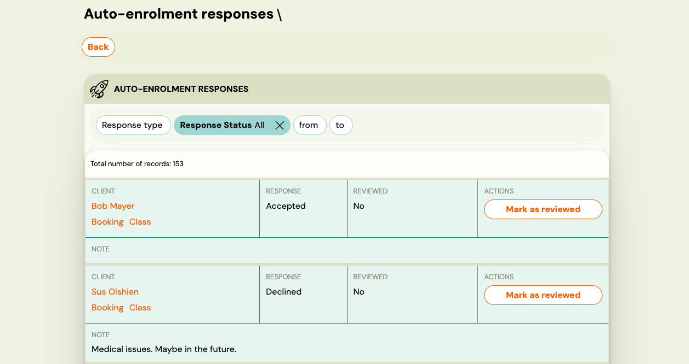
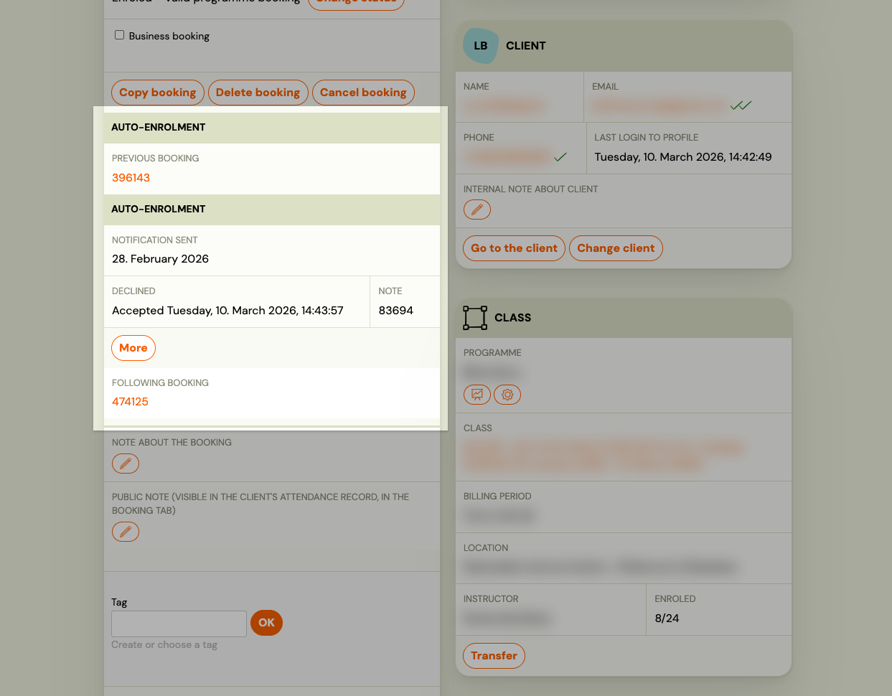
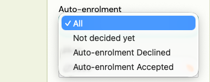

# Monitoring auto-enrolment responses

After you send auto-enrolment invitations, clients respond (or don't) from their Client Profile. There are two places to track those responses: the dedicated **Auto-enrolment responses** page and the **Bookings** list filter.

## Auto-enrolment responses page

Go to **Programmes → Auto-enrolment responses**, or navigate directly to `/#retention_responses`.

This page shows every client who received an auto-enrolment invitation, grouped with their response status, any note they left, and whether you have already acted on their response.

| Column | What it shows |
|---|---|
| **Client** | Client name with links to their Booking and Class |
| **Response** | The client's answer — see statuses below |
| **Reviewed** | Yes / No — your internal tracking flag |
| **Note** | Optional reason the client typed when declining |
| **Actions** | **Mark as reviewed** button |

### Response statuses

| Status | Meaning |
|---|---|
| **Auto-enrolment Accepted** | Client confirmed they want to continue |
| **Auto-enrolment Declined** | Client declined — check the Note column for their reason |
| **Not decided yet** | Client opened the invitation but has not responded |
| *(no entry)* | Client has not opened the invitation link |

### Filters

Use the filters at the top to narrow the list:

- **Response type** — filter by Accepted, Declined, or Not decided yet
- **Response Status** — reviewed / not reviewed
- **From / To** — date range of when the invitation was sent

### Mark as reviewed

**Mark as reviewed** is a personal bookkeeping tool for admins. It sets the **Reviewed** column to Yes for that row.

It has no effect on the client or their booking. Use it to track which responses you have already acted on — for example, after contacting a client who declined or after creating a booking for a client who accepted.

## Booking detail

You can also see an individual client's auto-enrolment response directly in their booking. Open the booking and look at the **Auto-enrolment** field in the booking detail — it shows whether the client accepted, declined, or has not responded yet.

This is useful when you are already viewing a specific client's booking and want to check their status without navigating to the responses page.

## Bookings list filter

The **Bookings** list (`/#bookings`) has an **Auto-enrolment** filter in the sidebar with four options:

- **All** — no filter applied
- **Auto-enrolment Accepted** — show only bookings where the client accepted the invitation
- **Auto-enrolment Declined** — show only bookings where the client declined
- **Not decided yet** — show only bookings where the client has not responded

This is useful for bulk actions — for example, exporting the list of accepted clients, or sending a follow-up email to those who have not decided yet.

## Following up after responses

### Client accepted — create a booking in the new class

Accepting an auto-enrolment invitation does **not** automatically create a new booking. It is the client's signal that they want to continue. You still need to either:

- Let the client complete the booking themselves via the invitation link, or
- Create the booking for them manually: open their existing booking → **Copy booking** → select the new class.

### Client declined — contact them

1. Go to `/#retention_responses` and filter by **Auto-enrolment Declined**.
2. Check the **Note** column for their reason.
3. Use **Communication → Send Email** to reach out if needed.
4. Click **Mark as reviewed** once you have acted on the response.

### Client has not responded

1. Filter by **Not decided yet** in either the responses page or the Bookings list.
2. Send a reminder via **Communication → Send Email** — select the relevant class as the target and include the programme link.
3. Note: auto-enrolment invitations are not re-sent automatically. You must send the reminder manually.

