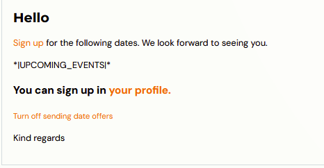
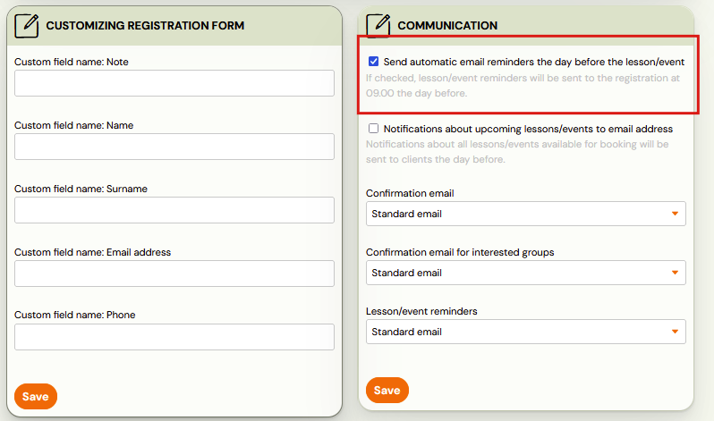
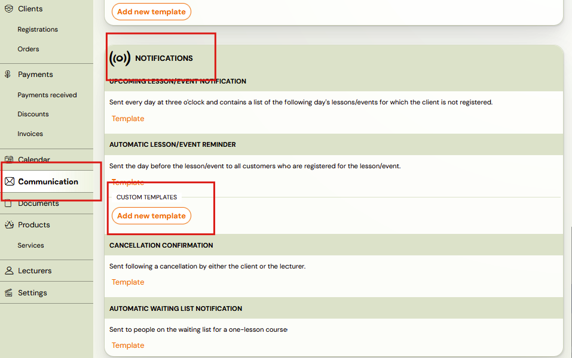
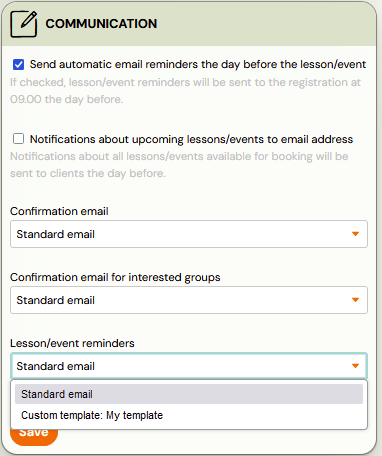

# Automatic notification of an upcoming session

This is the email that always arrives to the client the day before a session or session. If a client is enrolled in a class that has sessions every Tuesday, they will receive a reminder on Monday that there is a session/session tomorrow.

The reminder is helpful for several reasons:

- Clients may forget what day it is in the rush of daily responsibilities.
- It informs them of the time and place -- especially useful for replacement sessions that take place at a different time or location.
- Reminders can go to an additional email, for example to remind the other parent about the child's session. This helps when parents have alternating care. The additional email can be added by the client in their profile, or you can do it at the booking level.
- Most importantly -- **a reminder allows the client to log out of the session with one click**. If they are home sick, it is very easy to forget to log out via their profile.
- An automatic reminder with an opt-out option ensures clients do not forget to opt out, creating a spot in the class for someone who wants to use a replacement session.

A sample reminder email:

You can easily edit the text in the administration. [How to do it](edit-event-notification-template.md).

## Turning off email notifications about an upcoming session

If you wish to disable sending these notifications for some programmes, this can be done at the programme level:

1. Find the programme for which you want to turn off notifications and open it.
2. In the **Online Registration** section, click **Change**.
3. Scroll down and click on the blue toggle at the bottom right of the **Communication** section so that it disappears. Each programme is pre-configured so that automatic notifications are sent.
4. Confirm the settings by clicking **Save**.

## Setting up different notification emails for different programmes

Do you need to send a different notification email to clients attending an adult programme versus a children's programme? Or a different text for online programmes?

In Zooza, you can create multiple templates and associate either a standard notification email or a custom template with each programme.

To create a new notification template:

1. Go to **Communication --> Message templates**.
2. Scroll down to **Notifications**.
3. Under **Automatic session reminder**, there is a standard template and the option **Add new template**.

4. Click on this option and name your template (e.g., "automatic term reminders -- for online programmes").
5. Fill in the subject and body text for the notification.

## Adding a new custom template to a programme

Now that you have a new custom template, you can assign it to a specific programme:

1. Click on the desired programme.
2. Open the **Online Registration** section by clicking **Change**.
3. Scroll down and select your desired template at the bottom right of the **Communication** section.
4. Click **Save**.

