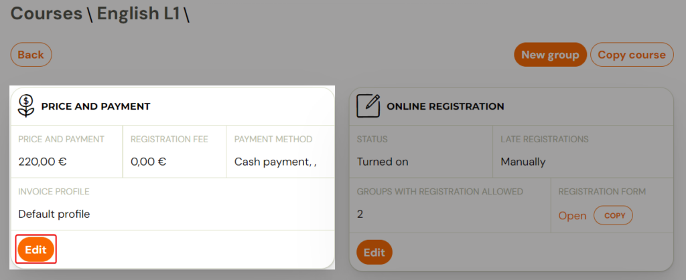
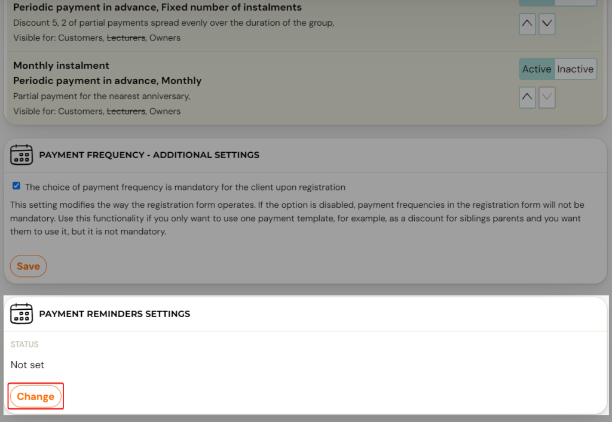
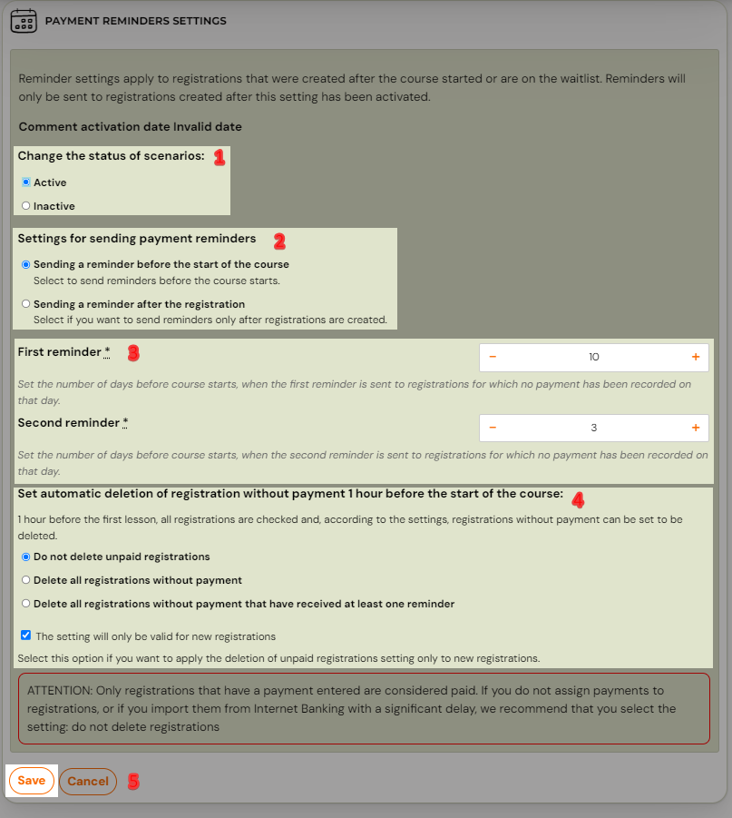
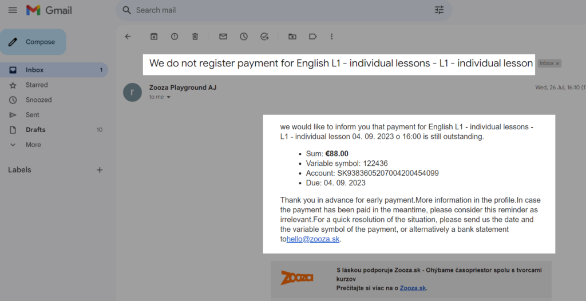

# Automatic payment reminders

Automated client communications include automatic payment reminders that are sent to outstanding bookings and can help you improve your clients’ payment discipline. Automatic reminders are only sent if you set them to be sent.

If you set them to be sent, you can set when the first reminder is sent and when the second reminder is sent. Of course, reminders are only sent if the client still hasn't made the payment in the meantime. This is an advanced setting within the application. We recommend turning it on only based on poor payment discipline of clients.

## Setting automatic reminders

Payment reminders are set at the programme level. So you can choose which programmes, sessions, workshops or lectures you need them for and set different rules for each programme.

1. At the level of the selected programme, click *Edit* in the *Price and Payment* section.
 
2. Scroll down the screen to *Payment Reminder Settings *and click *Change.*
 
3. This will open a number of settings from which you can choose according to your requirements. The setup is done in several steps:
4. Start sending reminders
5. Conditions under which reminders will be sent
6. Setting up dates, when reminders will be sent
7. Automatic deletion of bookings
8. Saving

## 1. Start sending reminders

To start sending reminders, change the status of scenarios to *Active*.

## 2. Conditions under which reminders will be sent

You have the option to select the condition under which the reminders will be sent.

### Before the start of the programme

With this option, you send reminders for bookings before the programme starts - before the first programme date. A reminder will be sent to all valid bookings that do not have a paired payment. The sending of the 1st and 2nd reminder will take place at an interval you set, which you specify by the number of days. The number of days for reminders is counted as the number of days before the 1st session of the programme takes place.

### After the booking

With this option, you send reminders for bookings as they occur - after the booking has occurred, regardless of the progress of the programme. A reminder will be sent to all valid bookings that do not have a recorded payment. The sending of the 1st and 2nd reminders will occur at an interval set by you, which you specify by the number of days. The number of days for reminders is counted as the number of days after the booking has been cancelled.

TIP: If you also provide the option for clients to sign up for ongoing classes after the programme has started, you can change the reminder setting from before the programme starts to after booking has started after the first reminder period.

### 4. Automatic deletion of bookings

Next, you can choose whether to automatically delete outstanding bookings. This is recommended if you have also set up automatic payment matching, as all functionality is evaluated on the day reminders are sent. This way, you won't automatically delete a booking that has indeed paid for a programme, but the payment has not been recorded in the app. Read more about automatic payment matching.

1. If you select the option to send reminders before the programme starts in the previous step, all valid bookings will be checked one hour before the first programme date and those that do not have a payment recorded will be automatically deleted.
2. If you choose in the previous step to send reminders based on the origination of bookings, then 10 days after the 2nd reminder is sent, the bookings will be automatically deleted.

## What does a reminder look like?

The text of the comment is default, it uses dynamic tags to pull in the correct data and looks like this:

