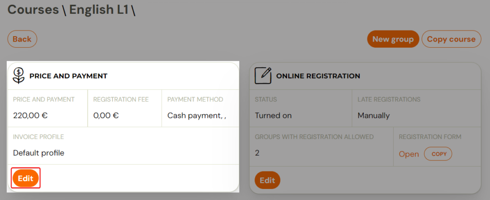
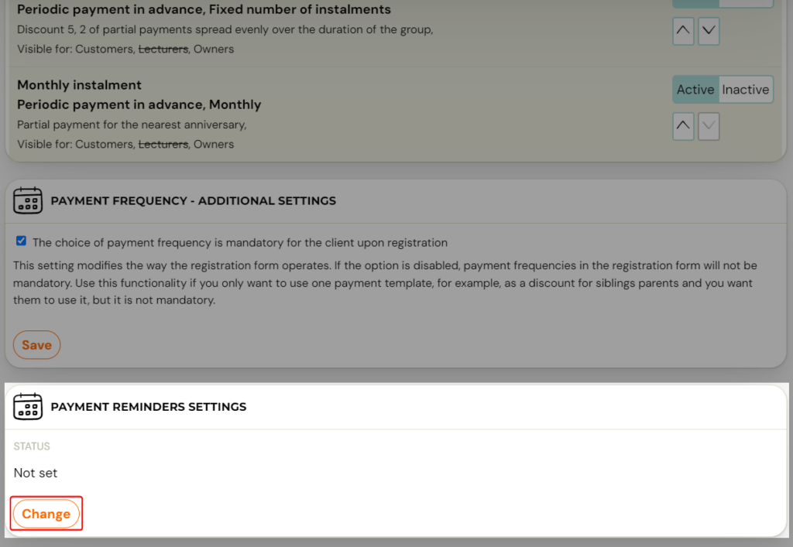
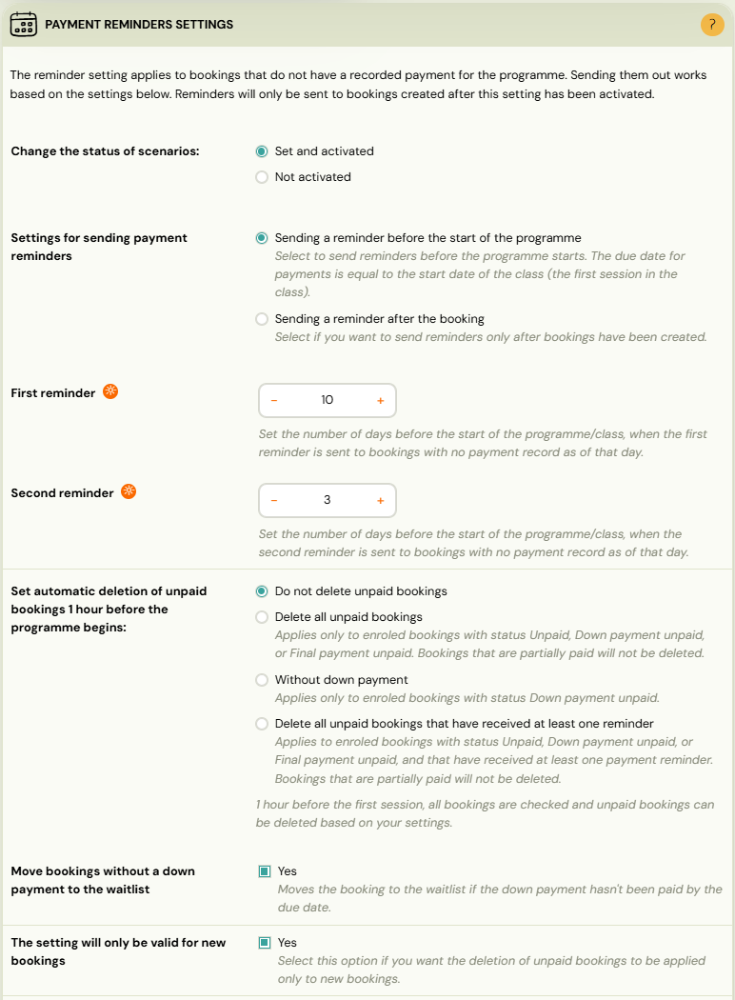
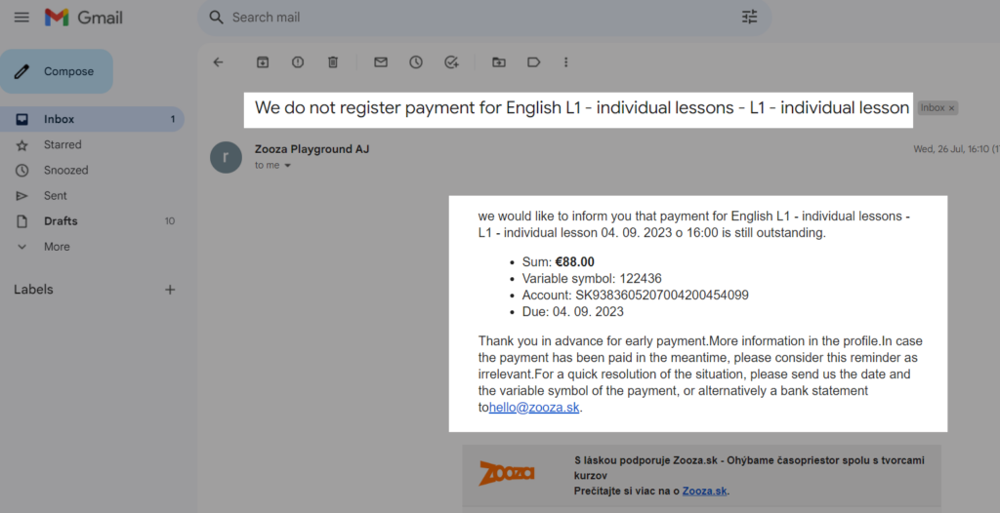

# Automatic payment reminders

This guide covers two related but independent concepts:

1. **Awaiting payment status and the company-wide payment due window** — controls how long a booking stays in "awaiting payment" before becoming "unpaid".
2. **Per-programme reminder emails** — the optional action that sends email reminders to clients with outstanding balances.

These two things work independently. Understanding the distinction prevents common setup mistakes.

---

## Awaiting payment vs. Unpaid — what is the difference?

Every booking with an outstanding balance has one of two payment statuses:

| Status | Meaning |
|---|---|
| **Awaiting payment** | The client has an outstanding balance but is still within the allowed payment window. The debt exists, but the deadline has not passed yet. |
| **Unpaid** | The payment window has closed. The balance is overdue. |

Zooza distinguishes these statuses so you can tell at a glance which clients owe money and still have time to pay, versus which ones are genuinely overdue.

---

## Company-wide payment due window

The **Number of days until payment is due** field (go to **Settings → Payments**) sets a company-wide grace window for every new booking with an outstanding balance.

> **SK:** Pole sa nazýva *Počet dní pre vystavenie splátky* v **Nastavenia → Platby**.

### How it works

When a client registers and owes money, Zooza immediately checks this setting:

- **Field is 0 (default)** — no grace window. The booking goes straight to **Unpaid** from the moment it is created.
- **Field is set to N days (e.g. 20)** — the booking enters **Awaiting payment** for 20 days from the registration date. After 20 days, it automatically transitions to **Unpaid** overnight.

The calculation is always based on the registration date, not the programme start date.

### Setting to 0 — always unpaid immediately

If you do not want any grace window — you want every booking with a balance to show as **Unpaid** immediately — set this field to **0**. This is the default and matches how the system worked before this feature was introduced.

### When the per-programme reminder action overrides this

If a programme has a **Payment Reminder** action configured (see below), the due date from that action takes precedence over the company-wide setting for bookings on that programme. The company-wide setting acts as the fallback for programmes with no reminder action attached.

---

## Important: breaking change for existing setups

> **If your account already had a non-zero value in the Number of days until payment is due field before May 2026**, the behaviour of this field has changed.

**Before:** The field only affected bookings that had a payment schedule (scheduled instalments). All other bookings were unaffected and went directly to **Unpaid**.

**After:** The field now applies to **all** bookings with an outstanding balance — whether or not they have a payment schedule.

This means bookings that previously went straight to **Unpaid** will now enter **Awaiting payment** for the configured number of days before becoming **Unpaid**.

**What to do:** Review the current value of this field in **Settings → Payments**. If you want the original behaviour (all bookings go straight to **Unpaid**), set the field to **0**.

---

## Email reminders: a separate configuration

The **Awaiting payment** status and email reminder delivery are two independent things.

Setting the payment due window does **not** automatically send any emails to clients. A booking can sit in **Awaiting payment** for the entire grace window without any notification being sent — the status is for your internal tracking only.

To send email reminders to clients with outstanding balances, you must configure a **Payment Reminder** action on the programme (see below). This action is the per-programme opt-in for email communication. A course without a Payment Reminder action attached will produce correct **Awaiting payment** status for your records, but will send no emails at all.

---

## Setting up per-programme reminder emails

Automatic email reminders are configured at the programme level. You can set different rules for each programme.

1. At the level of the selected programme, click *Edit* in the *Price and Payment* tile.
 
2. Scroll down the screen to *Payment Reminder Settings* and click *Change.*
 
3. This will open a number of settings from which you can choose according to your requirements. The setup is done in several steps:
	1. Start sending reminders
	2. Conditions under which reminders will be sent
	3. Setting up dates, when reminders will be sent
	4. Automatic deletion of bookings
	5. Saving

### 1. Start sending reminders

To start sending reminders, change the status of scenarios to *Set and Activated*.

### 2. Conditions under which reminders will be sent

You have the option to select the condition under which the reminders will be sent.

#### Before the start of the programme

With this option, you send reminders for bookings before the programme starts — before the first programme date. A reminder will be sent to all valid bookings that do not have a paired payment. The sending of the 1st and 2nd reminder will take place at an interval you set, which you specify by the number of days. The number of days for reminders is counted as the number of days before the 1st session of the programme takes place.

#### After the booking

With this option, you send reminders for bookings as they occur — after the booking has occurred, regardless of the progress of the programme. A reminder will be sent to all valid bookings that do not have a recorded payment. The sending of the 1st and 2nd reminders will occur at an interval set by you, which you specify by the number of days. The number of days for reminders is counted as the number of days after the booking was created.

**Tip:** If clients can register after the programme has already started, use **After the booking** mode. This mode continues to send reminders even when the course is underway — **Before the start of the programme** stops working once the first session has passed.

### 3. Setting up reminder dates

Set the number of days for the 1st reminder and the 2nd reminder. Reminders are only sent if the client has not paid by that point.

### 4. Automatic deletion of bookings

You can optionally choose to automatically delete outstanding bookings after all reminders have been sent.

> **Note:** Only enable automatic deletion if you also have automatic payment pairing active. The system checks payment status at the moment deletion runs. If a payment has been received but not yet matched (e.g. GoCardless syncs once daily), the booking could be deleted even though the client has paid.

- If using **Before the start of the programme** mode: all valid unpaid bookings are checked one hour before the first session and those without a recorded payment are deleted.
- If using **After the booking** mode: bookings are deleted 10 days after the 2nd reminder is sent.

## What does a reminder look like?

This email is a system notification. It uses dynamic tags to pull in the correct data:

<!-- REVIEW: need to add a section (faq) about the difference between change the status of scenarios and deleting the setting of payment reminders - because of how it looks at the activation date for reminders-->

## Related

- [Automatic reminders for payment schedule](automatic-payment-reminders.md) — reminders for clients on instalment payment plans (upcoming, created, overdue notifications).
- [Payment templates creation](payment-templates-creation.md) — how to set up instalment payment templates.
- [Bookings list](../reference/bookings-list.md) — payment status reference including Awaiting payment and Unpaid.