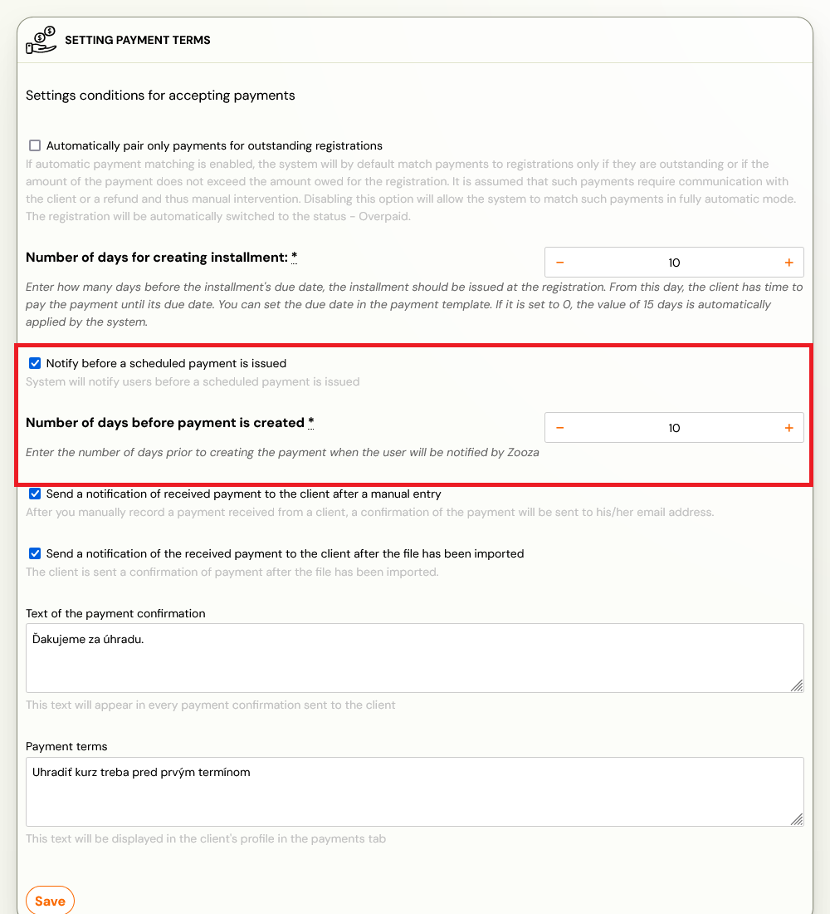
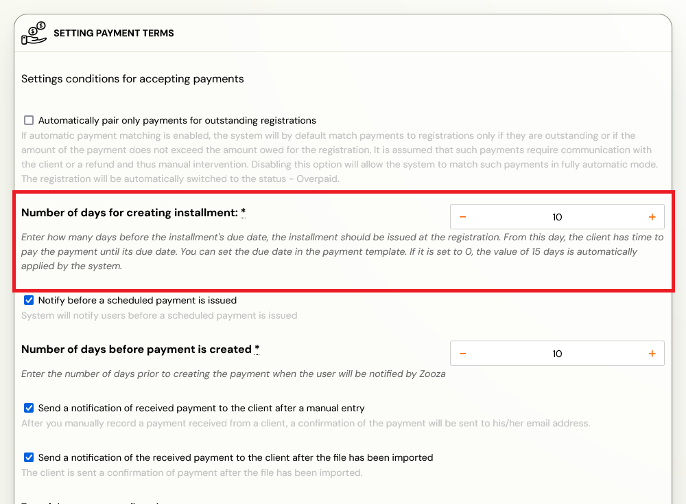

# Automatic reminders for payment schedule

If the client has selected payment with a payment template in the booking or you have set it up manually, they will always be informed of this obligation in time -- automatically by the application. Reminders are sent as email notifications. Learn how to set up payment templates in the [payment templates manual](payment-templates-creation.md).

## Reminder 1: Upcoming payment notification

Informs the client that an instalment payment will be due on their programme booking in a few days (depending on the setup).

1. The reminder must be enabled in **Settings --> Payments**, where you can specify the number of days before the payment is created when the notification should be sent.

2. The notification before the payment is created is sent according to the formula:
   **Due date - Number of days due - Number of days before payment creation**

3. You can edit the text in **Communication --> Message Templates**, under the template titled: **Upcoming Payment Notification**.

4. To communicate the date when the payment will be created, use the dynamic tag: `SCHEDULED_AT_DATE`

## Reminder 2: Payment created notification

Informs the client that a new instalment debt has been created on their booking. The date when the payment is posted and the notification sent follows the formula: **Due Date - Number of days due**.

1. Set the payment due date in **Settings --> Payments**, where you can specify the number of days.

2. Customize the text in **Communication --> Message Templates**, under the template named: **Call for payment**.

3. To communicate the due date, use the dynamic tag: `DUE_DATE`

## Reminder 3: Overdue payment notification

Informs the client that the booking has not been paid by the due date.

1. It is sent on the due date if the booking is in an unpaid/partially paid status.
2. Edit the text in **Communication --> Message Templates**, under the template titled: **Notification of outstanding payment**.
3. To communicate the due date, use the dynamic tag: `DUE_DATE`
