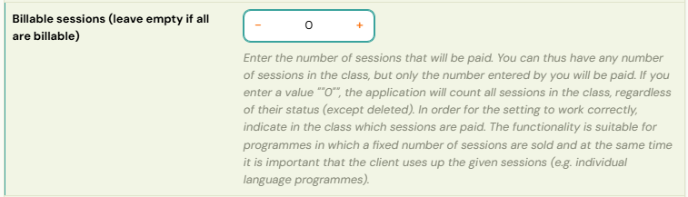
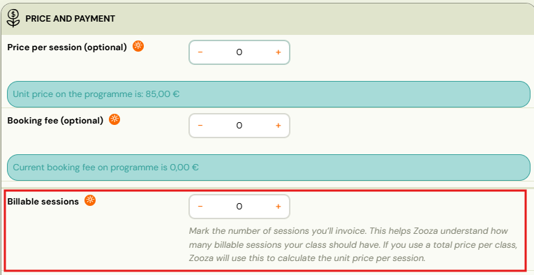
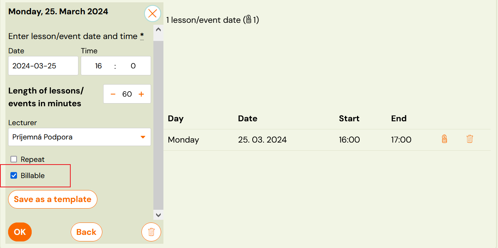
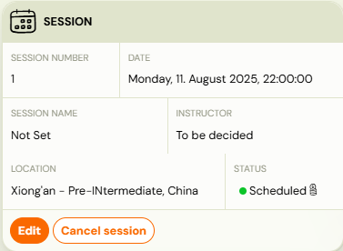
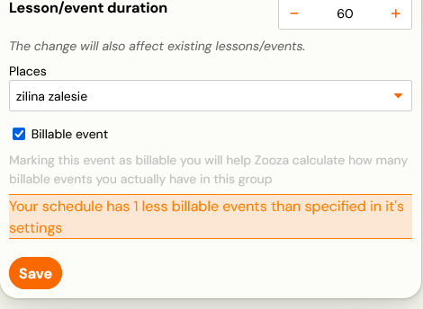
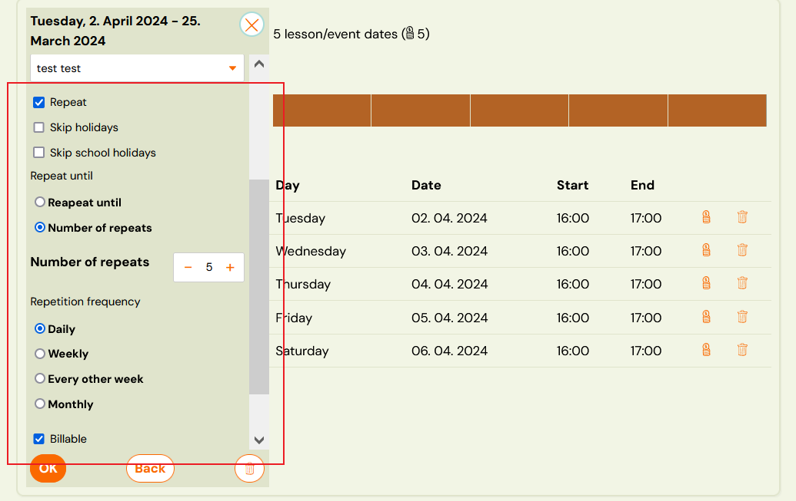
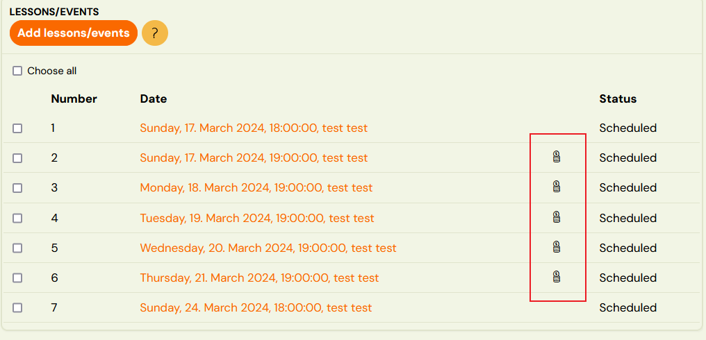

# Billable sessions

In programmes using the **Booking for the full programme duration** type, a client pays for all sessions in the class when they enrol. However, the actual number of sessions in a class may not always match the number the client should pay for. The **billable sessions** feature lets you separate paid sessions from unpaid ones within a single booking.

This is purely a billing feature — it has nothing to do with attendance. It controls how the booking price is calculated.

## When to use billable sessions

- **Free bonus session** — You add an extra session to a class as a credit for a previously cancelled session. Without billable sessions, Zooza would divide the total price across all sessions (including the free one), lowering the unit price incorrectly.
- **Make-up sessions** — A client books a make-up session in a class. This adds a session to the class that should not affect the price calculation for existing bookings.

In both cases, the class ends up with more sessions than originally planned. Billable sessions tell Zooza: "the client pays for X sessions, regardless of how many sessions actually exist in the class."

## How to set it up

Billable sessions are configured at three levels: programme, class, and session.

### 1. Programme level (default for all classes)

1. Go to **Programmes** → select the programme → **Edit Settings**.
2. Open the **Price and Payment** tile.
3. Set the **Billable sessions** field to the number of sessions that should be paid for.

This value becomes the default for all classes within the programme.

### 2. Class level (override per class)

1. Go to **Classes** → select the class → **Price and Payment**.
2. Set the **Billable sessions** field.

If a class has its own value, it overrides the programme-level setting. This allows individual classes to have a different number of billable sessions.

> **Important:** If the programme has billable sessions set (e.g. 12) and the class value is 0, the programme value is used. You cannot set a class to 0 billable sessions when the programme has a non-zero value.

### 3. Session level (mark individual sessions)

Each session must also be marked as billable or not billable:
1. **When creating sessions** — check the **Billable** checkbox.
	

2. **On an existing session** — open the session detail → **Session settings** → toggle the **Billable session** field.
	
   
   

## How it works

For the setup to work correctly, all three levels must be aligned. If you set 10 billable sessions on the programme, you need exactly 10 sessions marked as billable at the session level.

### "The first session should be a free trial and the other 36 paid"

Do not try to build this with billable sessions alone. Unmarking the first session does not turn it into a trial — it only removes it from the price calculation, and the client still books the whole class.

A trial is a **separate setting on the programme**, not a property of a session:

1. Set **billable sessions** to the number the client pays for — 36 in a 37-session class.
2. Go to **Programmes → programme → Settings** and switch the trial on, with a free trial limited to **1** session.
3. Clients register for the trial first. They pay nothing at that point.
4. After the trial they receive an invitation to join the full class, and that is where payment starts.
5. Once you no longer want to take trial bookings, switch the trial off on the programme.

The two settings do different jobs: the trial controls **how a client gets in**, billable sessions control **what they are charged for**. See [Trial sessions](../setup/trial-sessions.md).

**Why billable sessions alone give you the wrong outcome here.** Set the class to 36 billable and leave the 37th unmarked, and the client books the whole class: they owe for 36 sessions **up front** and have 37 available to attend. Payment is mandatory from the start, so the "free" first session is not free — it is bundled into a bill they have to settle before they have decided whether to continue.

A free trial is the opposite shape. They attend one session, pay nothing, and only then choose. If you do not want to charge for the first session, that is the setting you want.

### "I set the number but nothing happened"

This is the most common problem with the feature, and it is not a fault.

Setting the count on the class only declares **how many** sessions are paid. It does not decide **which** ones — you still have to mark them. Until you do, the two halves disagree and Zooza cannot calculate a price.

To fix it on a class where the sessions already exist:

1. Go to the **sessions list** for the class.
2. Select the sessions that should be paid (use the checkboxes).
3. Use the **bulk action** toolbar to mark them as billable.

Each billable session then shows a money symbol in the list. Count those symbols — the total must equal the number on the class.

> If you set the count but marked nothing, the booking price comes out as exactly **0**. See [Outstanding amount](outstanding-amount.md) for the other causes of a zero price.

### Changing the number across many classes at once

You do not have to open each class. Go to **Classes**, tick the classes you want, and use **Bulk edit** — **Billable sessions** is one of the fields you can set for the whole selection, alongside instructor, venue, price, registration fee, billing period and extra capacity.

Useful when a term is shortened, or when a programme is sold as a fixed number of paid sessions and that number changes for every class at once.

> Bulk edit sets the **number**. It does not mark which sessions are billable — that is still per class, as above.

### Adding sessions to a class

When you add sessions to a class that has billable sessions configured, the **Repetition frequency** field automatically pre-fills with the number of missing billable sessions. For example, if the class should have 5 billable sessions but only has 2 marked, the field suggests 3.

### Billable toggle on new sessions

Once billable sessions are configured, a checkbox appears when creating new sessions, letting you mark them as billable or not. You can also toggle the billable status using the billing icon on existing sessions.

## Unit price calculation

When billable sessions are set on a class, Zooza calculates the unit price (price per session) using the billable session count instead of the total number of sessions.

**Example:** A class costs 120 EUR and has 15 sessions total, but only 12 are billable. The unit price is 120 / 12 = 10 EUR per session (not 120 / 15 = 8 EUR).

This applies only to programmes using **Booking for the full programme duration**. Pay-as-you-go programmes already use a fixed unit price per session.

### Changing billable sessions mid-programme

If you change the number of billable sessions during a running programme, you must also update the programme/class price accordingly. Otherwise the unit price calculation will be incorrect.

## Related

- [Tracking billable sessions](tracking-billable-sessions.md) — how to view and monitor billable session status across classes.
