# Blocks creation

The blocks feature allows you to divide the terms within a class into smaller logical units - subgroups that you can use for different purposes depending on the needs of your organization or the type of course.

For example, blocks can be used for:

1. Booking according to interest - the client chooses a specific block that suits him best when registering (e.g. only a certain month or dates on selected days).
2. Time period division – if the class lasts longer (e.g. a whole school year), blocks allow you to divide it into smaller units (e.g. semesters, quarters, camps), and you can issue payments separately for each period according to these blocks.

## Creating blocks

Blocks are created when creating dates in a class, where you decide whether to create a new block or insert the dates into an existing block... This flexibility allows you to manage programmes efficiently and at the same time offer your clients better orientation and choice. For detailed instructions on creating sessions, see [Edit sessions in programmes](edit-sessions-in-programmes.md).

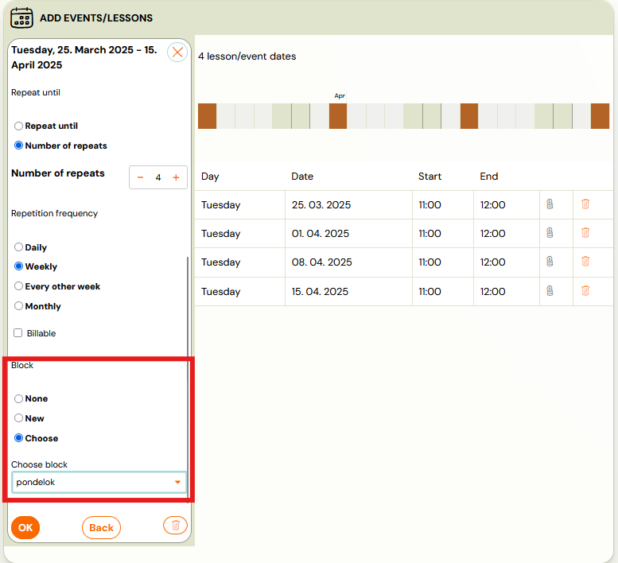

## Modification and application of blocks

## Change blocks on existing terms

If you need to make a change to a block - for example, to change the name or move sessions from one block to another - you can use the bulk session editing feature directly at the class level. Follow these steps:

1. In the term class overview, select the sessions you want to edit.
2. Click Bulk Edit.
3. Select the Change Block option and select the specific edit you want to make on the marked sessions.

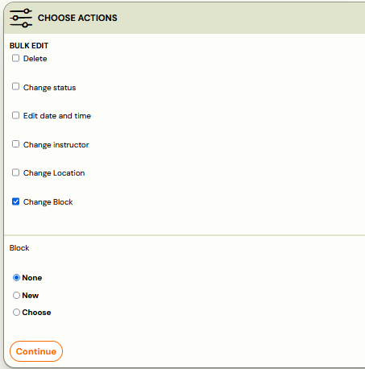

This way, you can easily reallocate or modify blocks without having to modify each session individually.

## Price and payment

Each block you create can have its own price that you expect from clients. You can choose to have the price calculated from the unit price based on the number of dates in the block, or you can enter a fixed amount for the entire block. You also have the option to set a discount - either as a fixed amount (absolute) or as a percentage of the price (relative). The discount is set at the level of the specific block in the class - so it applies only to the block on which you set it. It does not apply to the class as a whole. You adjust all these settings within the class, in the *Price and Payment* tile.

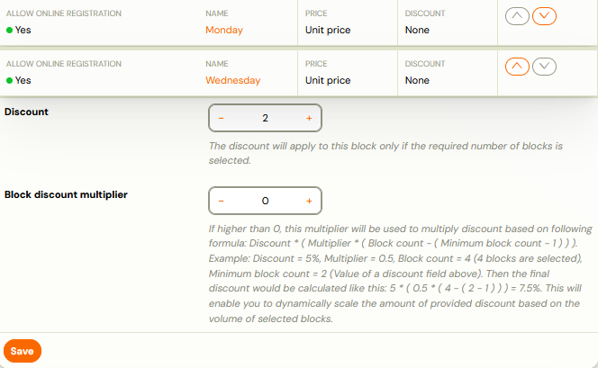

Then it is important to set when the discount on the blocks should be active. You make this setting under the list of blocks in the *Discount* and *Block Discount Multiplier* fields.

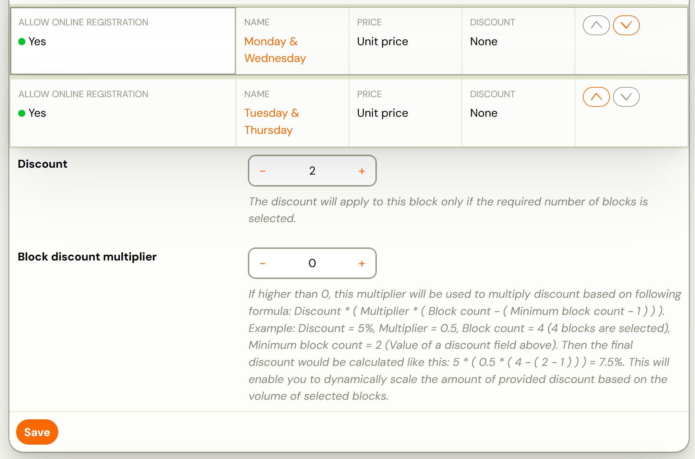

## Online registration

The blocks you create are not automatically activated for online registration. This is because the blocks may also be for your internal use only - for example, if you have sessions scheduled for the whole school year but want to split them into sessions, expecting clients to register for the whole session at once. In this case, the blocks are only used to administratively break down the terms for you, without affecting how clients register.
If you want to give the client the option to register only for a specific block and thus make the block publicly visible in the booking form, enable it in the* Price and Payment *tile - after opening the selected block, check the *Enable online registration *option.

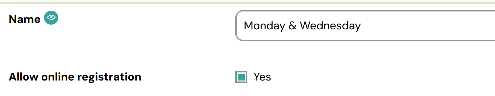

## Payment template

For blocks created on terms, there is a type of payment template called *Periodic Prepayment with a frequency of payment By Block* that is designed just for this purpose. This template will ensure that a payment is always created for the client before the start of the relevant block.

Detailed instructions on how to create payment templates and how to apply them to programmes can be found in this [manual](payment-templates-creation.md).

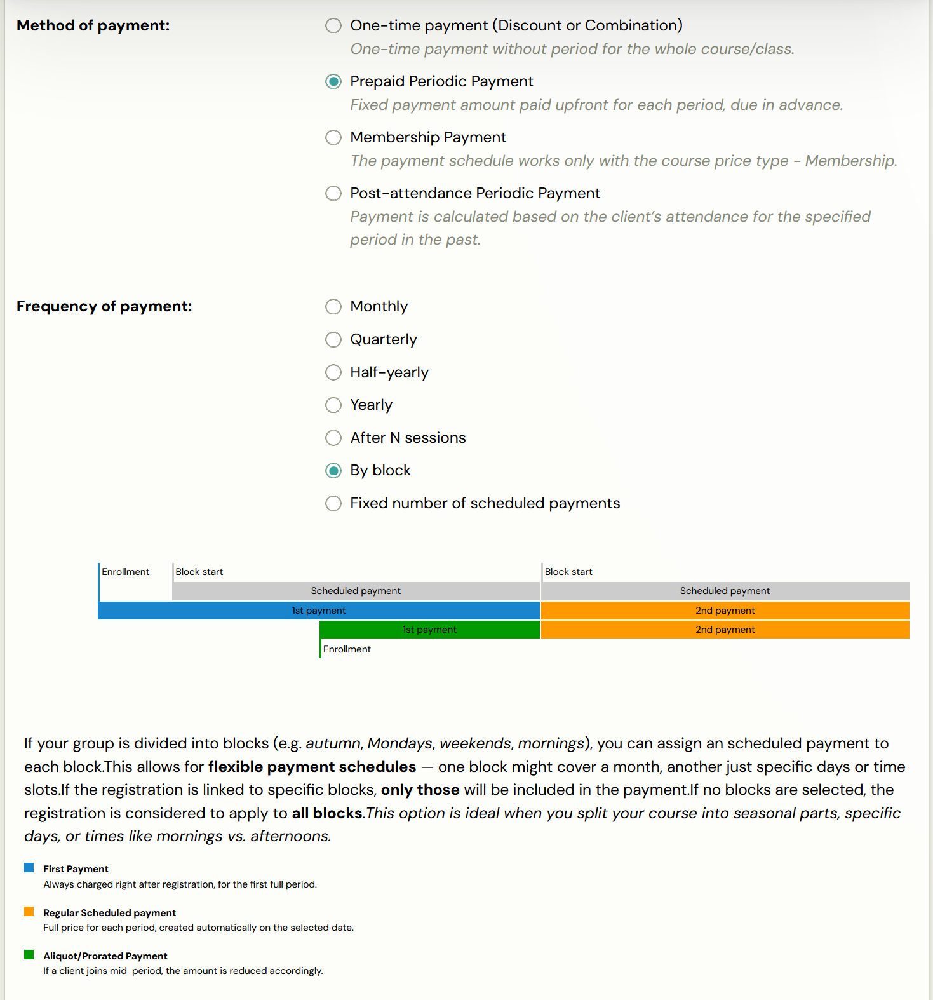

Tip: We recommend using the Periodic Prepayment template with a block-by-block payment frequency when you plan to divide a class into logical units by which you will expect clients to pay - for example, quarters, semesters, and so on.

However, if you offer programmes where the blocks are just an organizational division of dates that run at the same time (e.g., parallel running classes), it is sufficient for you to use a common payment frequency such as monthly, quarterly, or one-time.

## Products

Occasionally, there will be a situation where you need to divide the products in the booking form according to what part of the programme you are in. You can solve this by using blocks and adding products to each block separately, where you set exactly in which block you will offer which product (book, service,...).

1. At the class level, click *Change* in the *Products *tile to add the desired products to the class.
2. Once you have added the products, you will be presented with the option to edit them - click on *Setup*.*
 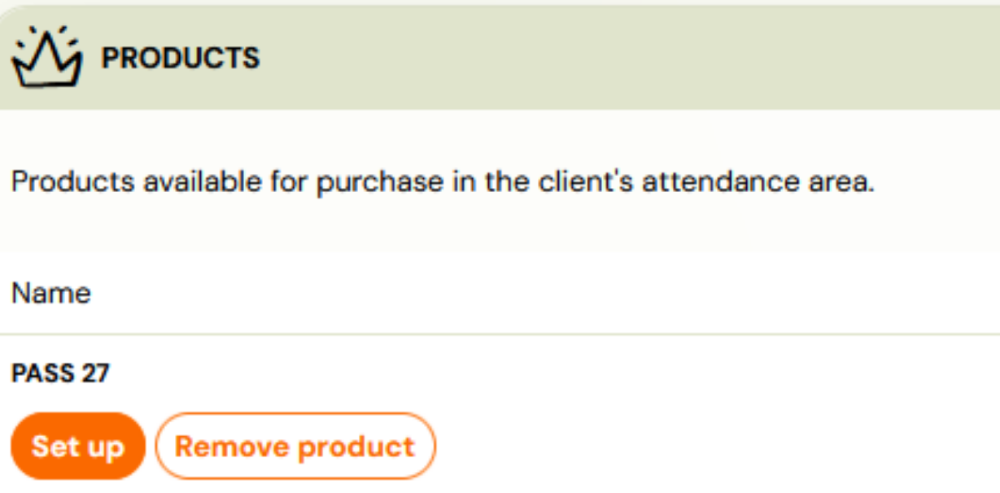
 *
3. Make the product available for purchase in the booking form
 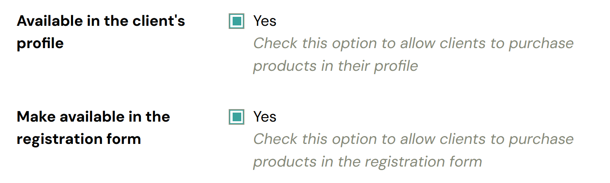
4. Select the blocks in which you want to offer the product and click *Save.*
 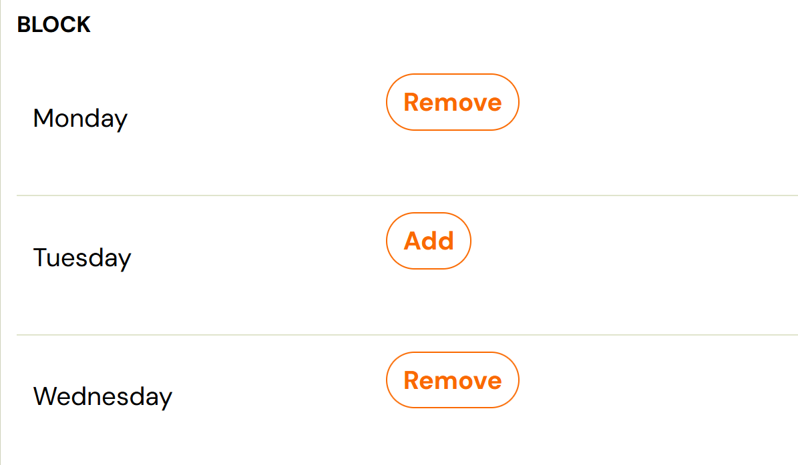

Repeat this process for any products you want to display in the booking form for only the selected blocks. With this setup, you have full control over what you offer to clients and when.

## What the blocks look like in Zooza

## In the list of Sessions

In the session list, you see these blocks next to the programme information:

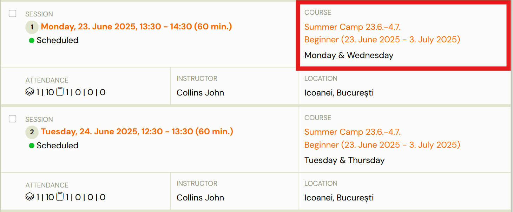

## In booking form

If you have programmes divided into blocks and also enabled online registration, the client chooses which blocks he wants to subscribe to when registering. This option will be displayed to him when he clicks on the* Customize Menu *button. If the client selects the *For the entire programme period *option, the system will automatically register the client for all available blocks within the class and full payment for the entire programme is expected at the same time.

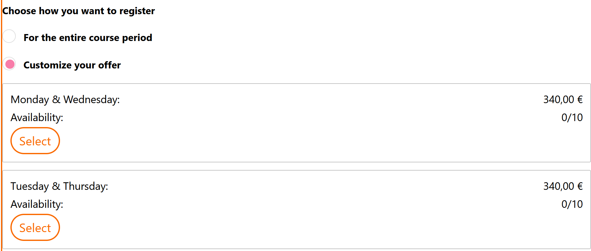

## In booking detail

If the client only registers for the selected blocks via the booking form, you will only see sessions that are part of the selected blocks in the *Attendance *tile in their booking details. Other appointments that the client is not registered for will be marked as *Hidden *in the system and will not be displayed to the client.

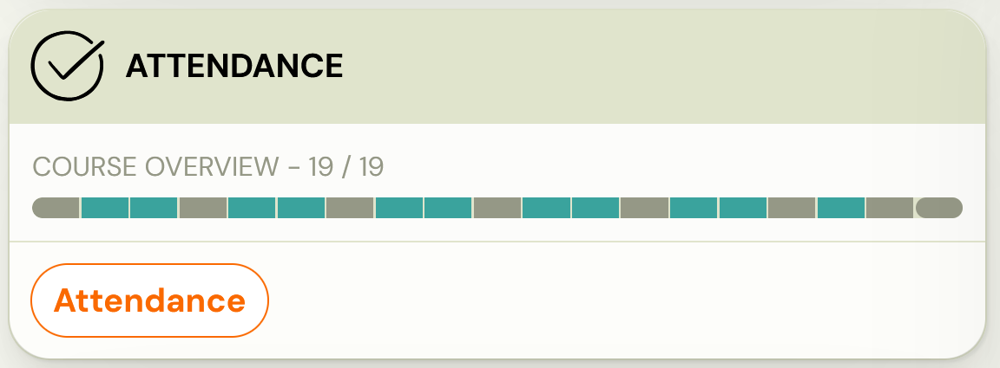

Note: To verify which blocks a client has registered for, go to the Class tile in the* Booking Details* to see a complete overview of which programme, class, and specific blocks the client belongs to. This overview allows you to quickly and easily see the scope of the client's booking.

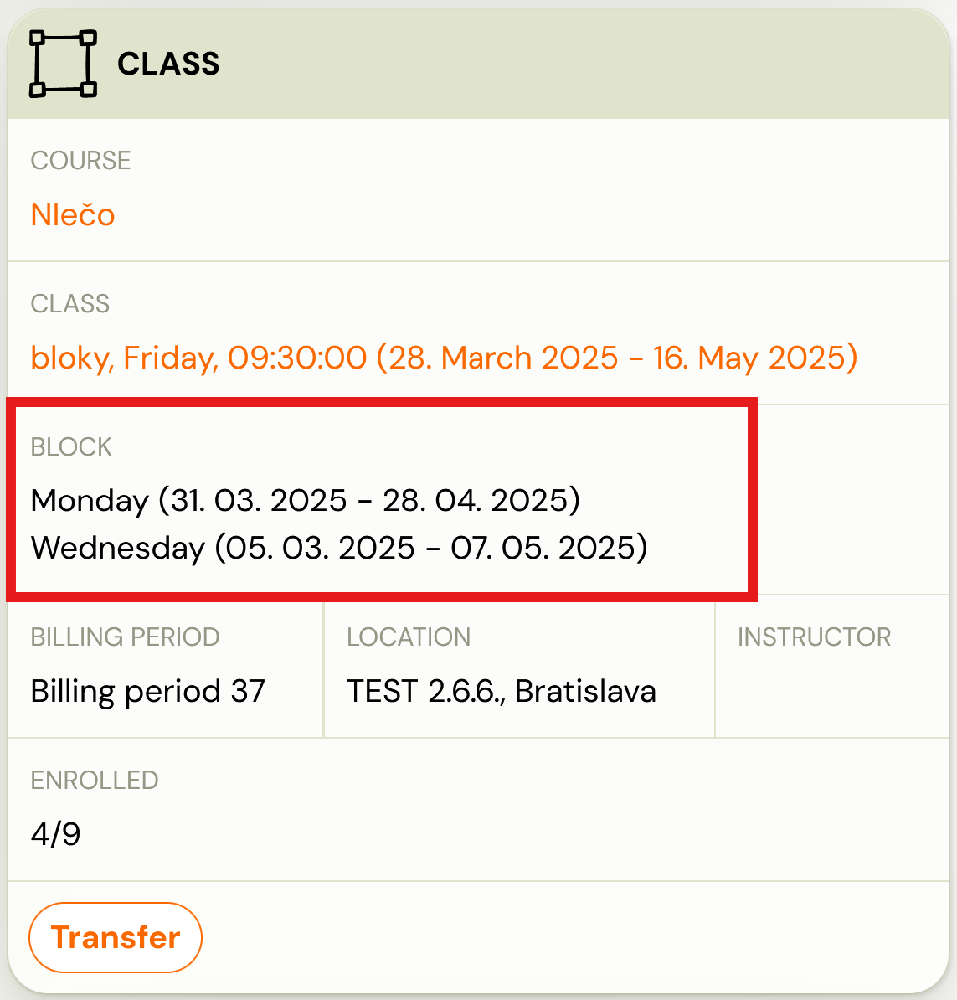
