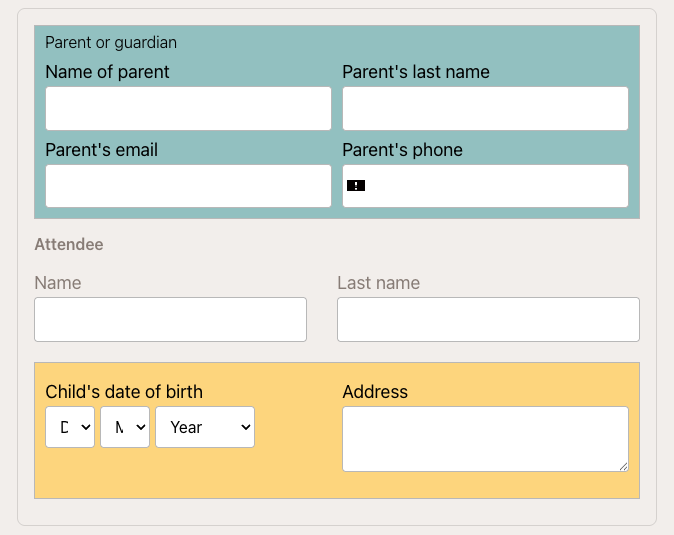
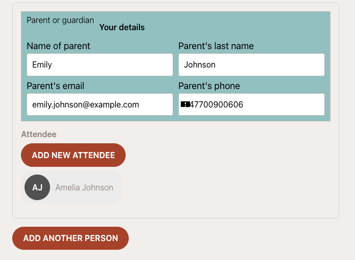

# Attendee selection on the booking form

The booking form handles attendee (participant) data differently depending on two factors:

1. **Programme type** — whether the programme is for children or adults.
2. **Login status** — whether the registering parent is a new visitor or an already logged-in returning client.

---

## Children's programmes

When a programme has the **For children** toggle enabled, the form always separates the **buyer** (parent/guardian) from the **attendee** (child).

The buyer fills in their own details (name, email, phone), and separately fills in the child's details (name, date of birth, any additional fields configured for the programme).

This prevents the common error where a parent enters their own details in the child fields (or vice versa). If you run children's activities and parents are submitting their own name instead of the child's, verify that the **For children** toggle is on in **Programmes → programme → Edit Settings**.

---

## Adult programmes

For adult programmes (**For children** toggle off), the form lets the buyer decide who the attendee is:

- **Same as buyer** — the person registering is also the participant. No separate attendee fields appear.
- **Add new attendee** — the buyer is registering someone else (e.g. a partner, colleague, or family member). Attendee fields appear separately.

This flexibility covers scenarios like a parent enrolling another adult, or a corporate buyer registering an employee.

---

## Returning (logged-in) clients

When a client is already logged in and registers again, the form recognises their account and displays their **previously registered attendees** as selectable cards.

The client can:

- **Click an existing attendee card** — their details are pre-filled automatically. No retyping needed.
- **Click "Same as buyer"** — to register themselves.
- **Click "Add new attendee"** — to register a new person not previously in their account.

This significantly speeds up re-registration for returning families. Instead of typing the child's name and date of birth again, the parent taps the child's card and proceeds directly to payment.

---

## Registering multiple participants at once

The **Add another person** button at the bottom of the attendee section lets the buyer register more than one participant in a single transaction.

Each additional person added increases the total price by the programme price. The system creates a separate booking for each participant.

> **Common issue:** If a client reports that the price doubled unexpectedly, they most likely clicked **Add another person** accidentally. Ask them to refresh the page and start the registration again — the form resets and the price returns to the single-participant amount.

---

## Admin view — who is the attendee on a booking?

In the booking detail, the **Attendee** card shows the participant's name and date of birth. If the booking was made by a parent on behalf of a child, the attendee is the child — not the parent. The parent appears as the buyer/client.

This distinction matters for:
- Attendance records (the child is marked as present/absent)
- Age-based eligibility (make-up sessions, capacity rules)
- Reports (counts are per attendee, not per buyer)

---

## Related

- [Booking form settings overview](./booking-form-settings.md) — widget-level settings, field visibility
- [Additional fields on the booking form](./additional-fields.md) — custom fields per programme
- [Programme settings](./programme-settings.md) — For children toggle and programme type
