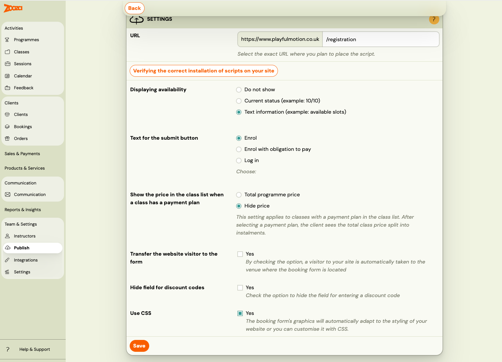
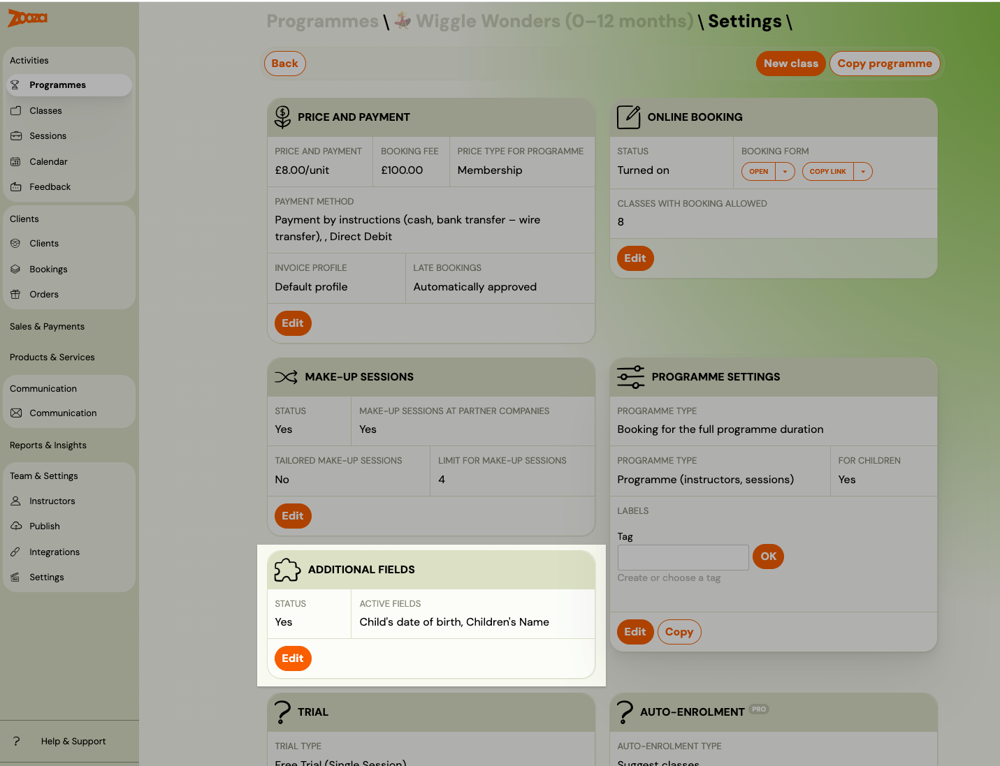
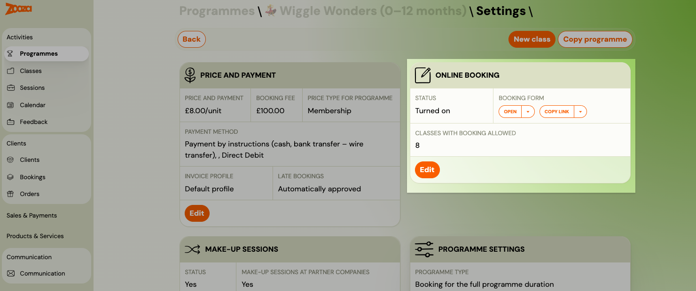
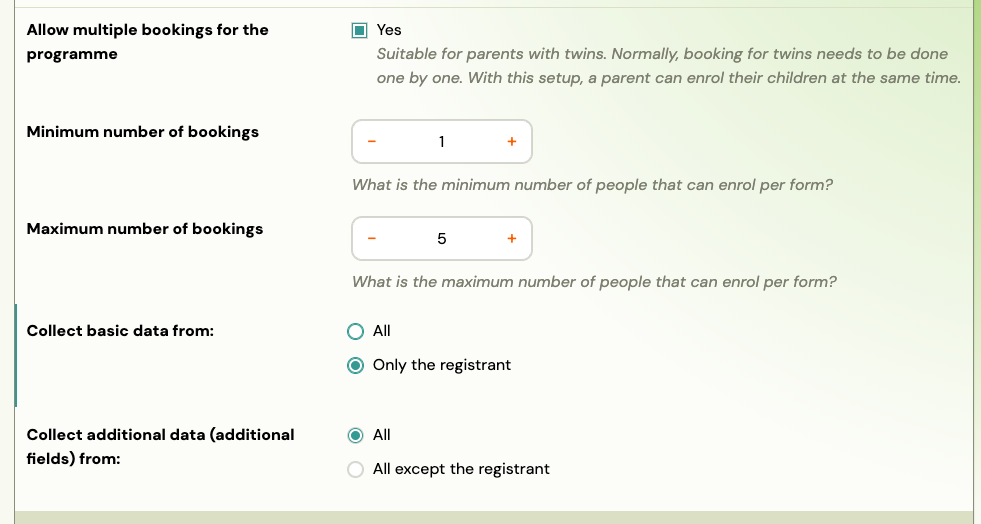
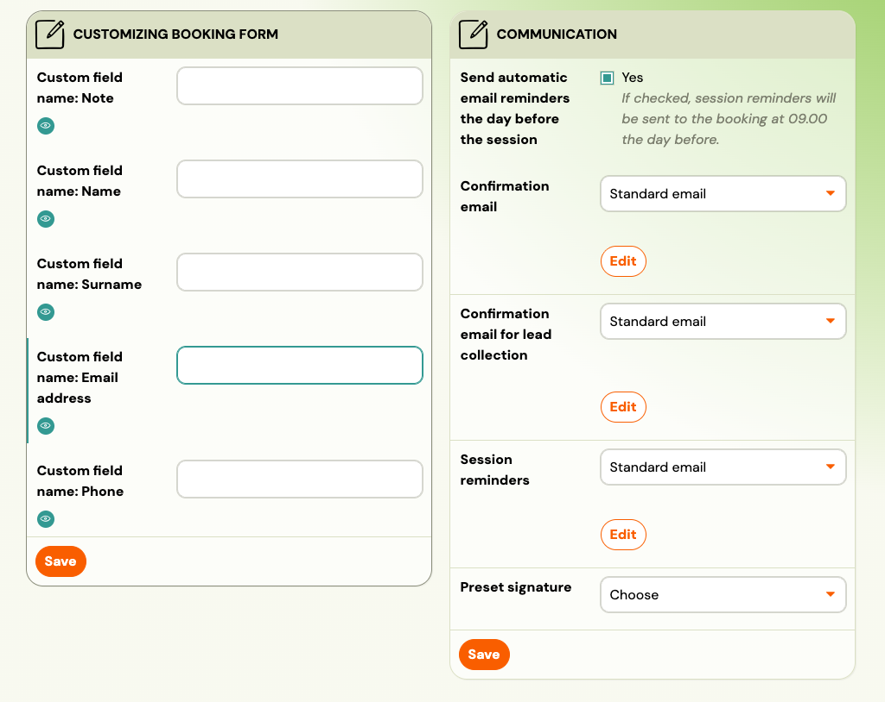

<!-- Synonyms: where is booking form settings, how to configure registration form, where to find form settings, registration form setup, booking form customization, nastavení registračního formuláře, kde najdu formuláře, registrační formulář nastavení, kde nastavit registrační formulář, nastavenia registračného formulára, kde nastavím formulár, registrácia nastavenia formulár, registrációs form beállítások, hol találom az urlap beállításokat, regisztrációs urlap testreszabása, formulár nastavenie kde, kde sa nastavuje registračný formulár -->

# Booking form settings overview

Booking form behaviour is configured at **three separate levels** in Zooza. When you want to change something about the form, the right place to look depends on what you want to change.

| What you want to change | Where to go |
|---|---|
| How the form looks and behaves globally (button text, availability display, CSS) | **Team & Settings → Publish → widget → Configure** (Booking form) |
| What data the form collects (extra fields, date of birth, address) | **Programmes → programme → Additional Fields** |
| Which classes appear, field labels, multiple children, communication | **Programmes → programme → Online Booking → Edit** |
| Price, payment method, booking fee | **Programmes → programme → Settings → Price and Payment** |

## Level 1 — Widget settings (global appearance and behaviour)

Go to **Team & Settings → Publish**, click your widget, then click **Configure** next to **Booking form**.

These settings apply to all programmes shown in that widget:

| Setting | Options | Notes |
|---|---|---|
| **Displaying availability** | Do not show / Current status (e.g. 10/10) / Text information (e.g. available slots) | Controls what capacity information clients see on the class list |
| **Text for the submit button** | Enrol / Enrol with obligation to pay / Log in | The label on the registration button |
| **Show the price when a class has a payment plan** | Total programme price / Hide price | When a payment plan is set, choose whether to show the full price or hide it |
| **Transfer the website visitor to the form** | Yes / No | If checked, visitors are automatically scrolled to the booking form |
| **Hide field for discount codes** | Yes / No | Hides the discount code input on the form |
| **Use CSS** | Yes / No | If enabled, the form automatically adapts to your website's styling; you can also add custom CSS |

> **Note:** These are widget-level settings. If you have multiple widgets deployed on different pages, each widget can have its own configuration.

## Level 2 — Additional fields (what data to collect)

Go to **Programmes** → open a programme → **Additional Fields → Edit**.

Here you configure what extra information is collected during registration, on top of the standard name/email/phone fields. You can enable built-in fields (date of birth, address, child's name) or add up to 5 custom fields.

See [Additional fields on the booking form](additional-fields.md) for the full reference.

> **Note:** Additional fields are configured per programme. To use the same fields on multiple programmes, set up one programme and then use **Copy programme**.

## Level 3 — Online Booking settings (per-programme)

Go to **Programmes** → open a programme → **Online Booking → Edit**.

This is where most per-programme form behaviour is configured.

### Booking options

| Setting | Description |
|---|---|
| **Allow online booking** | Show or hide this programme from the online booking form. |
| **Priority** | Controls display order on the form (0–1000; higher number = shown first). Default is 0 (alphabetical). |
| **Display in catalogue** | Whether classes from this programme appear in the menu on your website. |
| **Booking Options Shown on Website** | Choose what clients can book: Default (client chooses), Full programme only, Trials only, Blocks only, or Trials or blocks. |

### Multiple bookings (for twins / families)

| Setting | Description |
|---|---|
| **Allow multiple bookings for the programme** | Lets a parent enrol multiple children in a single form submission. |
| **Minimum number of bookings** | Minimum number of people per form submission (default: 1). |
| **Maximum number of bookings** | Maximum number of people per form submission (default: 5). |
| **Collect basic data from** | All (collect name/email/phone for each child) or Only the registrant (one set of contact details). |
| **Collect additional data from** | All (additional fields filled in for each child) or All except the registrant. |

### Other booking visibility

| Setting | Description |
|---|---|
| **If the class reaches full capacity, do not show it in the booking form** | Hides the class once it is full. |
| **Hide from booking form N hours before the programme begins** | Stops showing the class on the form a set number of hours before it starts. |

### Class settings

Select which specific classes from this programme are visible in the online booking form.

### Customizing booking form (field labels)

You can rename the standard fields that appear on the form. The fields you can relabel are:

- Note
- Name
- Surname
- Email address
- Phone

Each field has a visibility toggle (eye icon) to show or hide it on the form.

### Communication

| Setting | Description |
|---|---|
| **Send automatic email reminders the day before the session** | If enabled, a reminder is sent at 09:00 the day before each session. |
| **Confirmation email** | Choose which email template is sent after a standard booking. |
| **Confirmation email for lead collection** | Template sent after a lead collection booking. |
| **Session reminders** | Template used for session reminder emails. |
| **Preset signature** | Email signature used in outgoing messages for this programme. |

## Price and Payment

Go to **Programmes** → open a programme → **Settings → Price and Payment → Edit**.

Here you set the programme price, booking fee, price type (term / block / unit), payment method, and whether late bookings are automatically approved. See [Programme Settings Reference](../reference/programme-settings.md) for the full field list.

## Related

- [Additional fields on the booking form](additional-fields.md) — full guide for data collection fields.
- [Customizing widgets](customizing-widgets.md) — CSS styling, embed code customization, URL filtering.
- [Allowing multiple booking](allowing-multiple-booking.md) — collecting data from multiple attendees in one form.
- [Booking Widget FAQ](../faq/booking-widget-faq.md) — common questions about the booking widget.
- [Publish (Widgets) reference](../reference/publish-widgets.md) — full field reference for the Publish screen.
