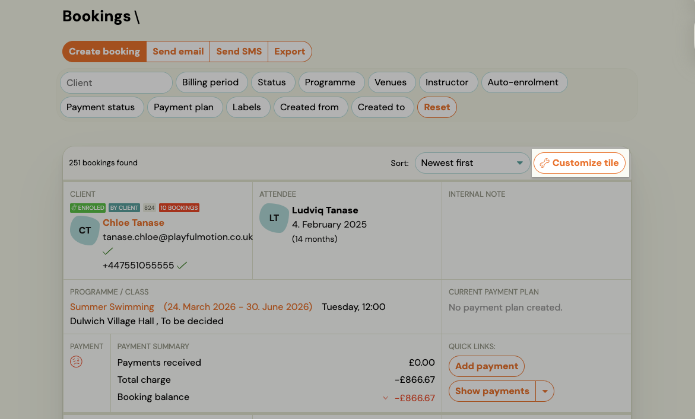
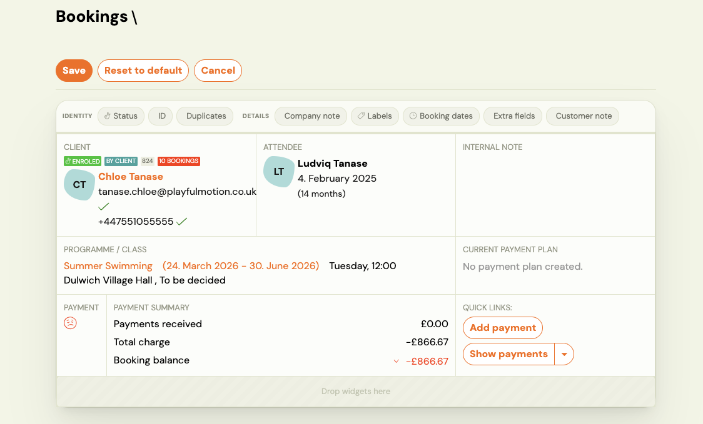

# Customizing the booking tile

Each row in the Bookings list is a **booking tile** — a compact card showing the most relevant information about a booking. You can choose exactly which fields appear on the tile and in what order, so your team always sees what matters most without opening the booking detail.

---

## Opening the customize panel

<video src="../../assets/videos/booking-tile-customize.webm" controls style={{maxWidth: '100%', borderRadius: '6px'}}></video>

1. Go to **Clients** → **Bookings**.
   
2. Click **Customize tile** in the top-right corner of the list.
   

The tile switches into edit mode. A row of available widgets appears above a live preview of your booking tile.

---

## Available widgets

Each widget adds a specific block of information to the tile:

| Widget | What it shows |
|---|---|
| **Identity** | Client name, email, phone, verification ticks, booking count badge, and status badges (Enrolled, By Client, etc.). Always visible — cannot be removed. |
| **Status** | Booking status badges only (e.g. Enrolled, Waiting list, Trial). |
| **ID** | Booking reference number. |
| **Duplicates** | Highlights if the client has potential duplicate records. |
| **Details** | Programme name, class date range, day/time, location, and instructor. |
| **Company note** | Internal note attached to the client's company record. |
| **Labels** | Booking labels/tags. |
| **Booking dates** | Booking creation date and other key dates. |
| **Extra fields** | Custom extra fields collected during registration (e.g. address, medical notes). |
| **Customer note** | Note visible to the client. |

---

## Adding and removing widgets

- **Add** — drag a widget from the widget bar and drop it into the tile preview area ("Drop widgets here").
- **Remove** — drag a widget out of the tile preview, or click the remove icon on the widget.
- **Reorder** — drag widgets within the tile to change their order.

The live preview updates as you make changes so you can see exactly how the tile will look.

---

## Saving your layout

Click **Save** to apply your layout. The new tile layout is applied immediately across the entire Bookings list.

Click **Reset to default** to restore the original Zooza layout. This cannot be undone.

Click **Cancel** to discard changes.

> **Note:** The tile layout is saved per user account. Each team member can configure their own view without affecting others.

---

## The booking count badge

When the **Identity** widget is active, each client shows a badge with their total number of bookings — for example **10 BOOKINGS**. This is useful for quickly identifying high-value clients or spotting clients who have booked many times without you needing to open their profile.

---

## Tips

- **Operations teams** often keep Identity + Details + Payment visible to monitor outstanding balances at a glance.
- **Front desk staff** may prefer Identity + Status + Booking dates for quick check-ins.
- **Instructors** typically need only Identity + Details.
- If you manage multiple programmes, Extra fields can be useful if you collect registration-specific data (e.g. medical info, skill level).

---

## Related

- [Bookings list reference](../reference/bookings-list.md) — full Bookings screen overview.
- [Additional fields](./additional-fields.md) — how to set up custom extra fields.
- [Labels](./labels.md) — creating and managing booking labels.
