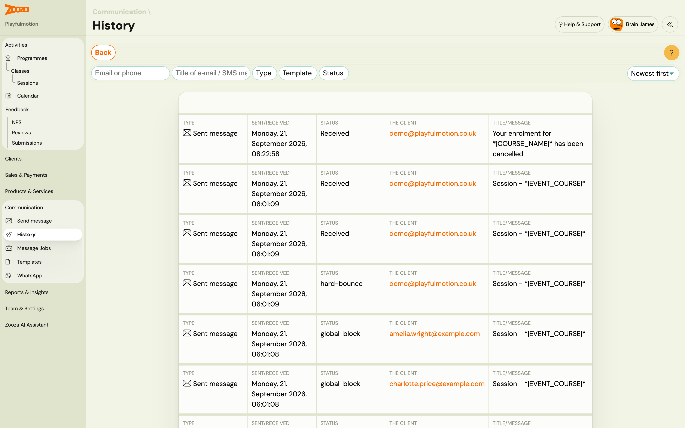

# Bulk email send tracking

When you send an email to a large group of clients, Zooza processes it as a **message job** in the background. You can track progress, see delivery results, and cancel a send that is still in progress.

## SMS works the same way as email

Bulk SMS runs through the same queue and the same progress view as bulk email. There
is no separate SMS delivery screen any more — send from the composer, and you land on
the job's progress page exactly as you would for an email.

Two things this fixed, both of which you may have run into:

- **The send that "failed" but went out anyway.** Sending SMS to a large audience used
  to time out. You saw an error, sent again, and the audience received the message
  twice — with your SMS credit charged twice. The send is now accepted immediately and
  delivered in the background, so there is no timeout to fail on.
- **The double-click double-send.** Creating the same send twice — a double click, a
  slow request, a browser retry — now returns the send that already exists instead of
  starting a second one. This applies to email as well, which carried the same risk.

> **If you saw the old error, the messages had almost certainly gone out.** Check the
> send history before resending anything.

## How bulk sending works

1. You compose and configure the send as usual (see [Sending Email/SMS](sending-email-sms.md)).
2. When you confirm, Zooza counts the exact recipient list and creates a job.
3. Sends to **100 or more recipients** require your approval before any emails are dispatched.
4. Once approved, sending runs in the background in chunks.
5. Progress updates automatically — no need to stay on the page.

> Sends under 100 recipients are approved automatically and start immediately.

## Approval gate

For large sends, Zooza shows you the exact recipient count before sending starts.

| Element | Description |
|---|---|
| Recipient count | Exact number of recipients in this send — locked at job creation, not re-queried. |
| **Approve** | Start sending. Zooza begins processing in the background. |
| **Cancel** | Abandon the send. No emails are dispatched. |

> The recipient count shown at approval is the count that will actually be sent — it cannot change after the job is created.

## Job statuses

| Status | What it means |
|---|---|
| **Pending approval** | Job created. Waiting for you to click Approve. No emails sent yet. |
| **Queued** | Approved, but another send for your account is already active. This send will start automatically when the active one finishes. |
| **Sending** | Actively processing and dispatching emails. |
| **Completed** | All recipients processed. Check Sent and Failed counts for the result. |
| **Cancelled** | Send was cancelled. Emails already dispatched before cancellation were delivered. |
| **Failed** | A job-level error stopped the send. Contact support if this happens. |

## Progress view

While a send is running, the progress view shows:

| Field | Description |
|---|---|
| **Sent** | Recipients successfully handed off to the mail gateway. |
| **Failed** | Recipients that could not be processed (e.g. missing email address). |
| **Skipped** | Recipients excluded during processing (e.g. duplicate email within the same send). |

## Queue — one active send at a time

Only one bulk send can be active per account at a time.

If you start a second send while the first is still running, the second send enters the queue. It starts automatically as soon as the first one completes — no action needed from you.

The progress view shows the queue position if your send is waiting:

> *"Your send is queued. Sending will start automatically when the current send finishes."*

## Cancelling a send

You can cancel a send that is **Pending approval**, **Queued**, or **Sending**.

1. Open the progress view for the active send.
2. Click **Cancel**.

Emails already dispatched before you cancelled were delivered and cannot be recalled. Unsent chunks are stopped immediately.

## Send history

You can review past sends and their results from the Communication section.

Each entry shows the job status, recipient count, sent count, failed count, and the date the send was created.

## Nothing arrived, and the send looked like it worked

Check whether it is still processing before assuming it failed.

1. Open **Send history** (above) and look at the job status. A job sitting at **Pending approval** never started — someone has to click Approve. A job **In progress** is still working through the list; large sends take time.
2. Go to **Reports & Insights → Session notifications** (`/#reports/event_notifications`) and scroll to the end. This shows what the system has actually processed and is the fastest way to tell "still running" from "finished and delivered nothing".
3. Only then look at delivery — see [Email delivery troubleshooting](../troubleshooting/email-delivery.md).

> **A job can sit for days without being stuck.** Sends go into a shared queue and leave it when the queue frees up — that is deliberate, and it is part of how deliverability is kept high across every account. If the queue was congested when you sent, a batch can wait considerably longer than you would expect.
>
> Cancelling and resending does not help; it puts you back at the end. If a job has waited long enough to worry you, tell support the job number rather than resending — they can see where it is in the queue.

> **It is almost never a plan limit.** Your plan does include a monthly email allowance, but hitting it is rare and is not the first thing to suspect when a send appears to do nothing. Queueing, an unapproved job, or a delivery problem account for nearly every case. Check those three before anyone starts talking about upgrading.

If the job completed, the recipient count was right, and the report shows the messages processed, the problem is delivery rather than sending — and that is a different investigation.

## Related

- [Send Email Reference](../reference/communication-send-email.md) — full UI reference for the send flow.
- [Sending Email/SMS Guide](sending-email-sms.md) — step-by-step instructions.
- [Email Communication FAQ](../faq/email-communication-faq.md) — common questions.
