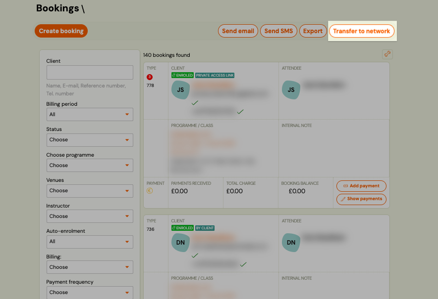
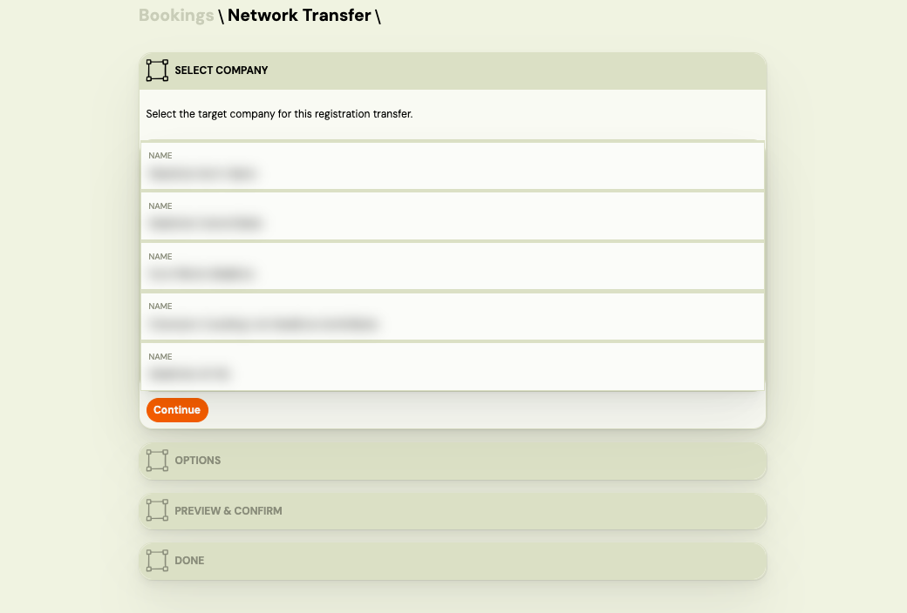

# Bulk Network Transfer

Bulk Network Transfer lets you move multiple client registrations from your company to another company in the same Zooza network — in a single action. It is the franchise equivalent of a booking transfer, applied at scale.

This feature is only available to companies that are part of a Zooza network. If you do not see the transfer option, your account may not be connected to a network.

---

## When to use it

- A client has been attending your branch but wants to continue at a sibling branch.
- You are closing or merging a location and need to migrate all active registrations to another branch.
- A cohort of clients is being reassigned to a different franchise company for an upcoming term.

---

## How it works

The transfer creates new registrations at the target company based on the registrations you select. Depending on the **cancel mode** you choose, the original registrations at the source company are either cancelled immediately or cancelled only after the target company accepts the transfer.

Before committing, the system shows a **preview** (dry run) of how many registrations will be transferred and how many will be skipped — with a reason for each skipped registration.

---

## What transfers with the registration

When the target company accepts the transfer, the following data is applied to the new registration:

| What | Detail |
|---|---|
| **Debt** | The amount the client still owed at the source company is recorded as a new charge on the target registration. |
| **Paid** | The amount the client already paid at the source company is recorded as a credit on the target registration. |
| **Internal note** | The company note from the source registration is copied. |
| **Public note** | The public note from the source registration is copied. |
| **Custom fields** | Registration-level extra fields carry over. |
| **Custom client ID** | The source company's internal client ID is set at the target company, if one does not already exist there. |

**What does not transfer:**

| What | Why |
|---|---|
| Payment history and transactions | Individual payment records and logs stay with the source company. |
| GoCardless mandate | Direct Debit mandates are bank-level agreements tied to the source company's account. The client must set up a new mandate with the target company. |
| Stripe subscription | Stripe subscriptions belong to the source company's Stripe account and cannot be moved. |
| Programme or class | The target company selects the class to enrol the client into when accepting the transfer. |

> **How the balance works:** The client's payment balance is reconstructed at the target company — not copied transaction by transaction. If the client paid €120 and still owes €30, the target registration starts with a €30 charge and a €120 credit, both referencing the source company. The target company gets a clean starting point, not a full payment history.

---

## Step-by-step

### 1. Open the Bookings list

Go to **Bookings** and use the filters to narrow down the registrations you want to transfer — for example, filter by programme, class, or status.

### 2. Select the registrations

Check the registrations you want to transfer. Use **Select all** to include all results from the current filter.

### 3. Choose Bulk action → Network transfer

Click **Bulk action** and select **Network transfer**.

### 4. Set the transfer parameters

In the transfer dialog:

- **Target company** — select the sibling company to transfer registrations to.
- **Cancel mode** — choose what happens to the source registrations:
  - **Cancel immediately** — the original registrations are cancelled as soon as you confirm.
  - **Cancel on accept** — the original registrations remain active until the target company accepts the transfer.
- **Note** (optional) — internal note visible to both companies.

### 5. Preview the results

Click **Preview** (dry run). The system shows:

- **Will be transferred** — number of eligible registrations.
- **Will be skipped** — registrations that cannot be transferred, with a reason for each (e.g. already has a pending transfer, invalid status).

Review the skipped list. If needed, go back and adjust your selection.

### 6. Confirm

Click **Transfer** to execute. The system processes each registration individually. Ineligible registrations are automatically skipped — they do not block the rest from transferring.

---

## After the transfer

- Transferred registrations appear in the target company's Bookings list.
- Skipped registrations remain at the source company unchanged.
- If you used **Cancel on accept**, the source registrations stay active until the target company confirms.

---

## Why are some registrations skipped?

| Reason | Meaning |
|---|---|
| `already_has_pending_transfer` | This registration already has an unresolved network transfer in progress. |
| `invalid_status` | The registration status does not allow transfer (e.g. cancelled, deleted). |
| Other | The registration failed internal validation. Check the registration detail. |

---

## Related

- [Network Application](./network-application.md) — franchise reporting overview
- [Transfer and copy bookings](./transfer-and-copy-bookings.md) — transferring a booking within the same company
