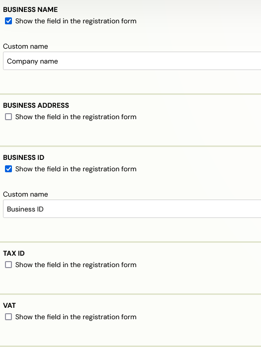
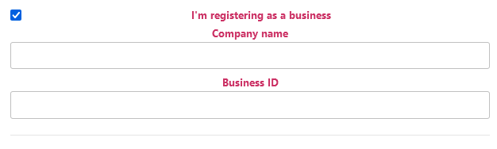
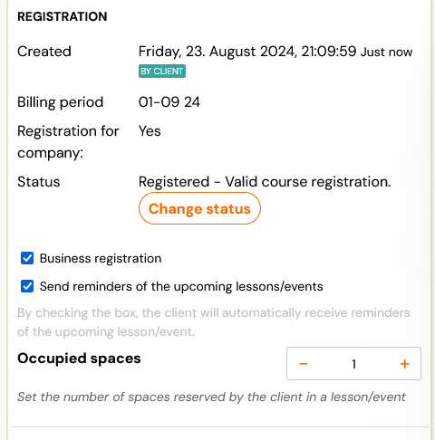

# Business booking

If your clients are not individuals, but companies, you can also allow them to create company bookings. But this option needs to be enabled first.

It is turned on or off at the programme level, more precisely in the *Extra Fields* section.

For corporate orders, you must enable at least one of the following fields:

1. Company - Company name
2. Company address - Business address
3. Business ID
4. TAX ID
5. VAT

If one or more fields are active, the booking form will add the option to enrol per company. Once clicked, the selected extra fields are displayed in a booking form and the client can fill them in. Only the *Business name* and *Business ID*  fields are required.

As with the other extra fields, you must enter a custom name.

### Whether clients see a checkbox depends on you

- **Fields not mandatory** → the form shows a checkbox ("Register as company"). Business fields stay hidden until the client ticks it, so private clients never see them.
- **Fields mandatory** → there is no checkbox. Every client is asked for company details.

If you want the checkbox behaviour and are not getting it, one of the business fields is still set to mandatory.

### The VAT field disappears on its own

If the invoice profile used by the programme is **not registered for VAT**, Zooza hides the VAT field even when you have enabled it. There is no setting for this and nothing is broken — asking a client for a VAT number you cannot put on an invoice would only produce data you must ignore.

To show the VAT field, the programme must use an invoice profile that is a VAT payer. See [Invoice profiles](../setup/invoice-profiles-and-bank-accounts.md).

> Business fields that are enabled but have **no custom name** entered do not render on the form. If a field is missing and mandatory/VAT is not the reason, check that it has a name.

Any booking that contains at least one of these fields filled in is flagged in the system as "Business Booking".

If you have invoice generation enabled, the resulting invoice will have the company details as the billing details and not the client details.
