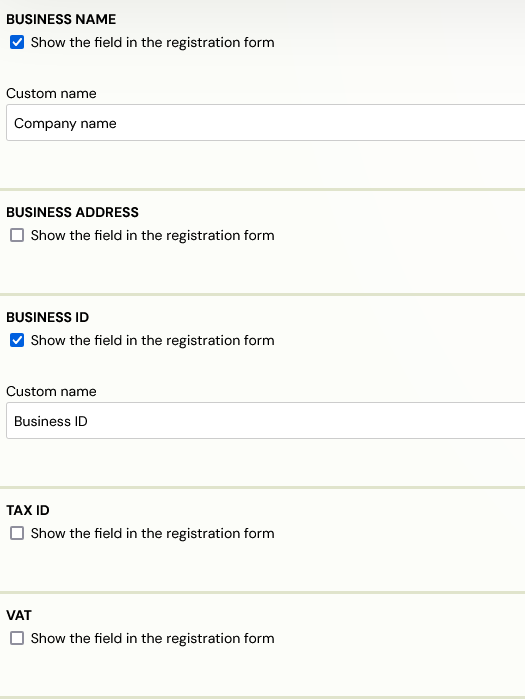
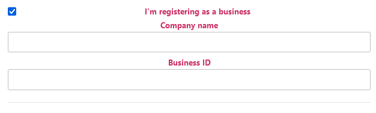
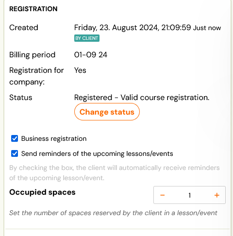

# Business registration

If your clients are not individuals, but companies, you can also allow them to create company registrations. But this option needs to be enabled first.

It is turned on or off at the course level, more precisely in the* Extra Fields* section.

For corporate orders, you must enable at least one of the following fields:

1. Company - Company name
2. Company address - Business address
3. Business ID
4. TAX ID
5. VAT

If one or more fields are active, the registration form will add the option to register per company. Once clicked, the selected extra fields are displayed in a registration form and the customer can fill them in. Only the* Company *and *Business ID *number fields are required.

As with the other extra fields, you must enter a custom name.

Any registration that contains at least one of these fields filled in is flagged in the system as "Business Registration".

If you have invoice generation enabled, the resulting invoice will have the company details as the billing details and not the customer details.
