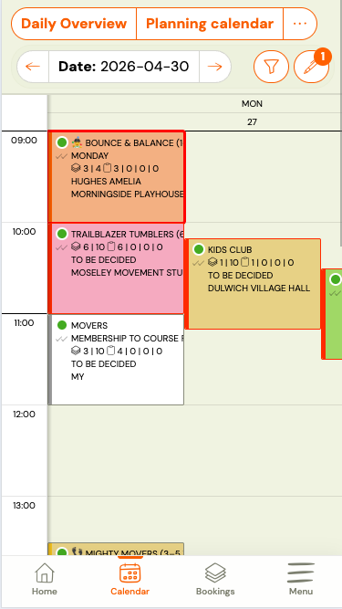
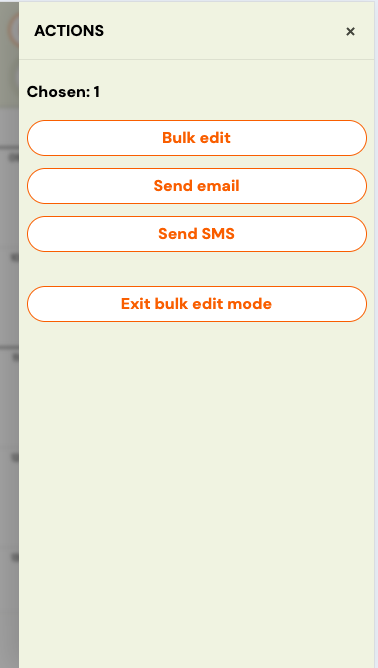

# Calendar bulk actions

From the Calendar, you can select multiple sessions at once and perform the same action on all of them — send an email, send an SMS, or open the bulk edit flow.

---

## Enable bulk selection

### On desktop

1. Go to **Calendar**.
2. In the toolbar above the calendar grid, click **Bulk edit**.
3. The calendar switches to selection mode. Click sessions to select them — selected sessions are highlighted.

### On mobile

1. Go to **Calendar**.
2. In the sticky toolbar at the top, tap **Actions**.
3. A side drawer opens. Tap **Enable bulk selection**.
4. The drawer closes. Tap sessions in the calendar to select them.

---

## Select sessions

Click or tap any session tile to add it to your selection. Click again to deselect. The current count of selected sessions is shown:

- **Desktop:** in the bulk actions toolbar.
- **Mobile:** as a badge on the **Actions** button.

---

## Perform a bulk action

Once you have selected one or more sessions:

### On desktop

The actions appear in the inline toolbar above the calendar: **Edit**, **Send email**, **Send SMS**.

### On mobile

Tap the **Actions** button to open the drawer again. The available actions are listed there: **Edit**, **Send email**, **Send SMS**. Tapping an action starts the flow and closes the drawer.

---

## Turn off bulk selection

- **Desktop:** click **Turn off** in the toolbar, or navigate away.
- **Mobile:** open the **Actions** drawer and tap **Turn off**.

Your selection is cleared.

---

## Available bulk actions

| Action | What it does |
|---|---|
| **Edit** | Opens the bulk session editor — change time, instructor, location, or cancel multiple sessions at once. |
| **Send email** | Opens the email composer pre-addressed to all clients booked into the selected sessions. |
| **Send SMS** | Opens the SMS composer pre-addressed to all clients booked into the selected sessions. |

---

## Related

- [Automated notifications](./automated-notifications.md)
- [Bulk email send and tracking](./bulk-email-send-tracking.md)
