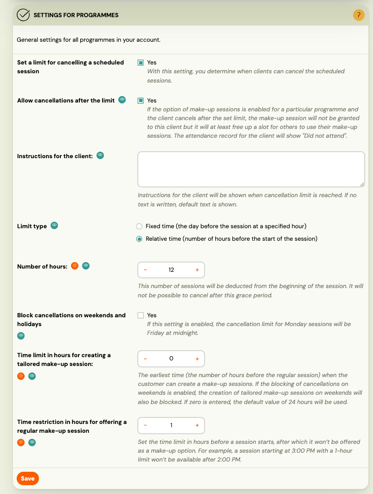

# Cancellation limit settings

Zooza lets you define how late a client can cancel a scheduled session. This is a **global setting** — it applies to all programmes in your account. You can use it to protect your schedule, set fair make-up session rules, and control what clients see when they try to cancel too late.

Go to **Settings** → **Programmes** to configure these options.

## Enable the cancellation limit

Toggle **Set a limit for cancelling a scheduled session** to **Yes** to activate the feature. Once enabled, clients cannot cancel a session after the limit has passed — unless you explicitly allow late cancellations (see below).

## Limit type

Choose how the cut-off time is calculated:

- **Fixed time** — the cancellation deadline is set to a specific hour on the day before the session.
- **Relative time** — the deadline is a number of hours before the session starts. For example, setting 12 hours means a 3:00 PM session cannot be cancelled after 3:00 AM the same day.

Enter the number of hours in the **Number of hours** field when using relative time.

## Allow cancellations after the limit

Set **Allow cancellations after the limit** to **Yes** if you want clients to still be able to cancel even after the cut-off — but without receiving a make-up credit.

When this is enabled and a client cancels late:
- The slot is freed up for other clients.
- No make-up credit is granted.
- The attendance record shows **Did not attend**.

If this is set to **No**, clients cannot cancel at all after the deadline. They will see the custom instructions text instead (see below).

## Instructions for the client

Enter a message in the **Instructions for the client** field. This text is shown to clients when they reach the cancellation limit. If left empty, Zooza displays a default message.

Use this to explain your cancellation policy or provide contact details for manual cancellation requests.

## Block cancellations on weekends and holidays

Enable **Block cancellations on weekends and holidays** to prevent clients from cancelling on weekends and public holidays. When enabled, the cancellation deadline for Monday sessions moves to **Friday at midnight** — giving clients a full working week to cancel without a weekend loophole.

This applies to all holiday types: public holidays, school holidays, and [custom holidays](custom-holidays.md) your company has created. If a cancellation deadline falls on any of these, it moves to the preceding business day.

## Make-up session time restrictions

Two additional settings control when make-up options are available to clients:

**Time limit in hours for creating a tailored make-up session**
Sets the earliest point (in hours before the regular session) when a client can create a tailored make-up booking. If set to 0, the system uses the default value of 24 hours.

**Time restriction in hours for offering a regular make-up session**
Sets how close to a session's start time it can still appear as a make-up option. For example, with a value of 1, a session starting at 3:00 PM will no longer be offered as a make-up option after 2:00 PM.

## Related

- [Make-up sessions FAQ](../faq/make-up-sessions-faq.md)
- [Programme settings](programme-settings.md)
