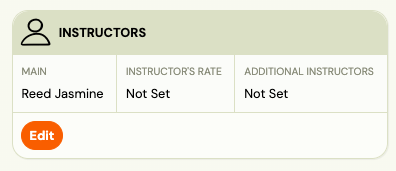
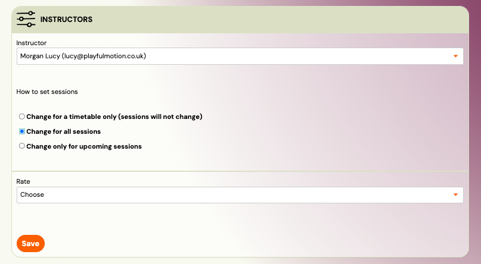
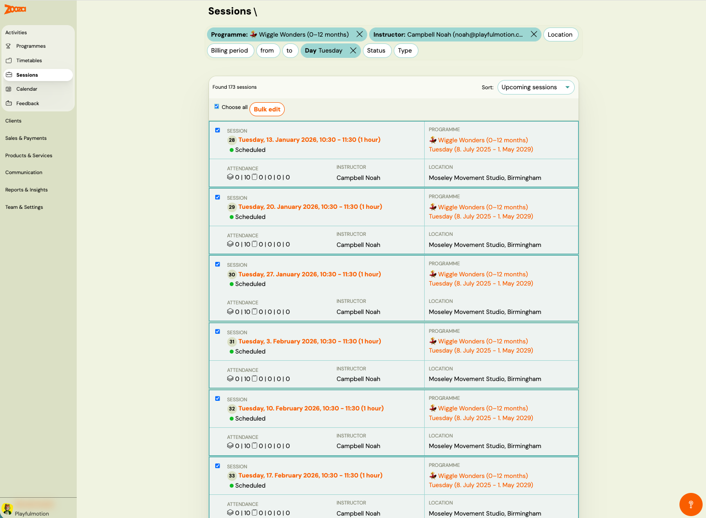
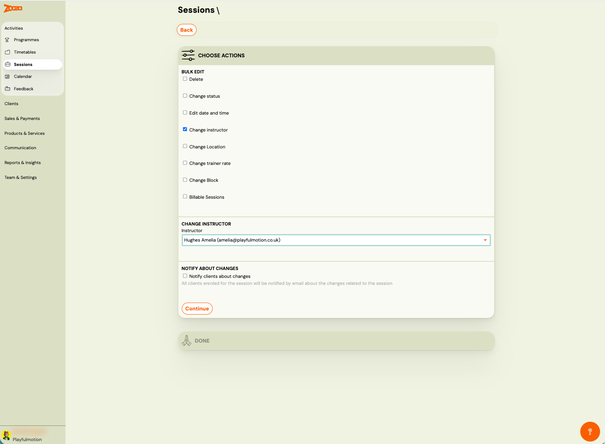

# How to change an instructor in a class or session

In Zooza, you can change an instructor either at the class level or directly on sessions, depending on what you need.

 

## Changing an instructor at the class level

1. Open the Class (Timetable) you want to update.
2. Find the Instructor setting.
 
3. Select a different instructor.
4. Choose whether the change should apply to:
All sessions, or
5. Only upcoming sessions.

This sets the main (responsible) instructor for the class. Past sessions are not affected.

## Changing an instructor for specific sessions

If you need to change the instructor only for selected sessions:

1. Go to Sessions.
2. Use filters (for example by date, class, or location).
 
3. Select one or more sessions.
4. Use Bulk actions and choose Change instructor.
 

This is useful when covering a specific day, substitution, or temporary change.

## What updates automatically

After the change, the new instructor is automatically updated in:

- the instructor’s calendar,
- reports,
- and session reminders and notifications.

No extra steps are needed.
