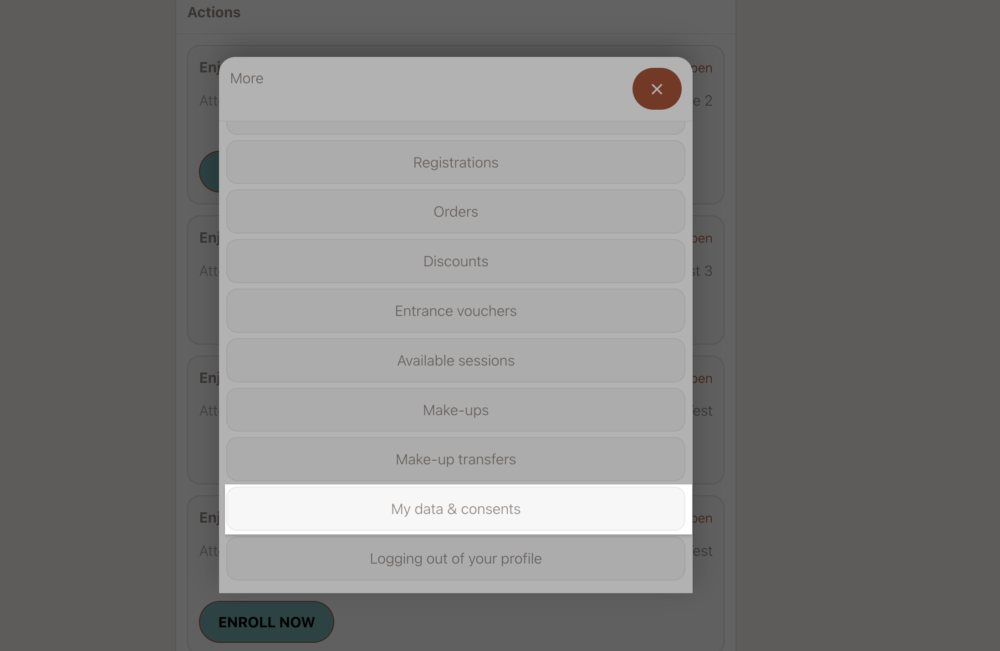
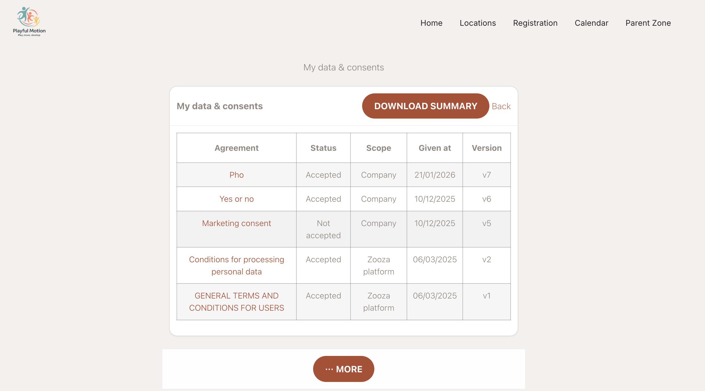

# How clients view and download their consent history

Clients can view a full record of every consent they have given to your company — and download it as a PDF. This is useful when a client asks what data they consented to share, or when you need to confirm that consents are on file.

---

## Where clients find their consents

Clients access their consent history through their **Client Profile** (the client-facing area of Zooza).

In the Client Profile, navigate to the **My data & consents** section.

---

## What the consent overview shows

The consent history lists every agreement that applies to the client, in three categories:

| Category | What it includes |
|----------|-----------------|
| **Platform consents** | Zooza-level agreements (terms of service, privacy policy) |
| **Company consents** | Agreements set by your business (your own terms, data processing consent) |
| **Course consents** | Programme-specific agreements the client accepted when booking |

For each agreement, the client can see:
- Whether they accepted or declined it
- The version of the agreement they saw at the time

---

## Downloading a PDF

Clients can download a single PDF that summarises all their consents. The PDF is generated on demand — it is not stored in advance. It is self-contained: it includes the full text of each agreement alongside the client's response.

There is no action required from you as admin to enable this — it is available to all clients automatically.

<!-- REVIEW: Confirm whether admin can also generate the consent PDF on behalf of a client from the admin side. -->

---

## What to tell clients who ask for their consent record

If a client asks for a copy of their consent history:

1. Ask them to log in to their Client Profile.
2. Go to **My data & consents**.

   

3. Click **Download PDF**.

   

The PDF is generated immediately and saved to their device.

---

## Related

- [GDPR and client data](../faq/client-management-faq.md)
- [Client Profile overview](client-profile-101.md)
