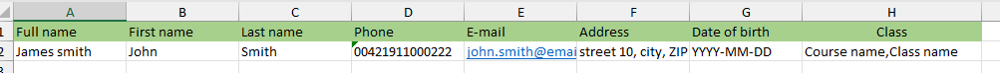
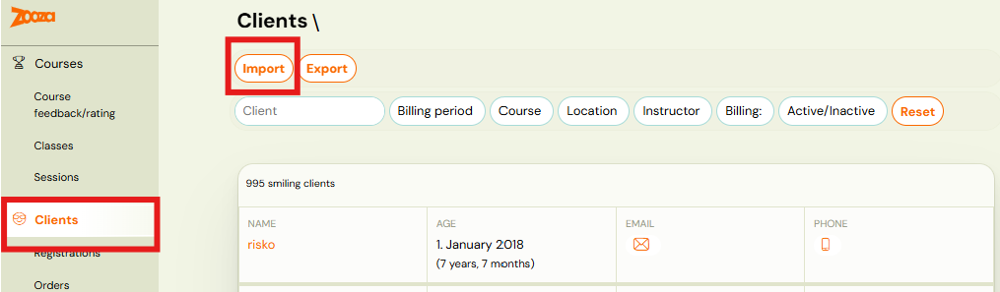
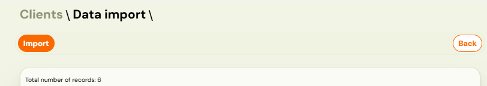
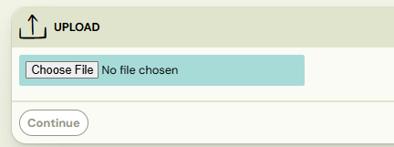
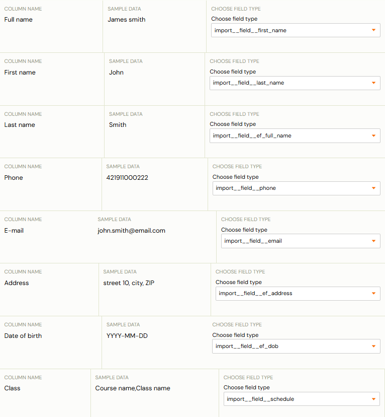
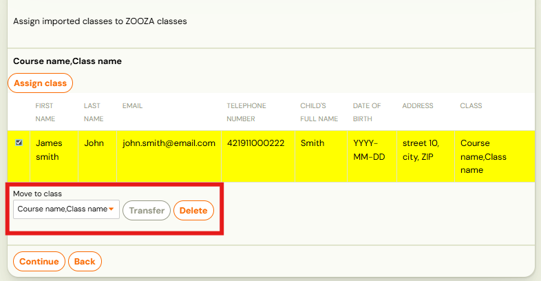
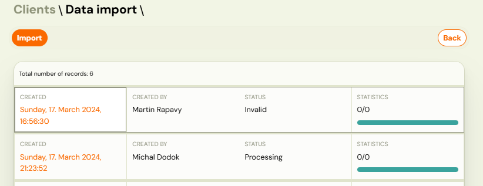

# Client import

When you are a new client, or if you need to move existing clients from one Zooza account to another, the Client Import feature can save you time.

Important: Before starting the import, make sure the required courses and classes are already created in Zooza. Clients can only be imported into existing classes.

## Data preparation

1. Download the spreadsheet provided in this article.
2. Fill in all required fields as shown below

| Column name | Value | Note | Required |
|---|---|---|---|
| Full name | James Smith | For courses where the attendee is different from the client (e.g., a child), enter the attendee’s name here. | Y |
| First name | John | First name of customer | Y |
| Last name | Smith | Last name of customer | Y |
| Phone | 00421377 | Use the format starting with 00 instead of + (e.g., 00421...). | Y |
| Email | john.smith@email.com |  | Y |
| Date of Birth | YYYY-MM-DD | Use this date format exactly. | N |
| Class | name of required class | Must match the class name exactly as it appears in Zooza. | N |

The table in Excel will look like this:

Important! To successfully import your data, save the spreadsheet in .csv format. Other Excel formats will not work.

## Import to Zooza

1. In Zooza, go to the *Clients *tab in the menu and click *Import*.
 
2. Create a new import by clicking the *Import *button.
 
3. Upload the .csv file you prepared.
 
4. Map the spreadsheet headers to the corresponding Zooza fields (as shown in the example image) and click *Continue*.
 
5. If the classes already exist in Zooza, assign clients to the appropriate classes and click *Continue*.
 
6. Zooza will validate each row of your spreadsheet and notify you if any
data is incorrectly formatted. You can then adjust your spreadsheet and
re-import the file.

Notes:

1. If you do not assign a class, the client will be created in Zooza but no registration will be created.
2. You can perform a partial import from your spreadsheet to verify that you are importing the correct clients into the right classes.
3. The import process may take some time, depending on the number of rows in your spreadsheet. You can track the progress and status of the import in the List of Imports.
 
