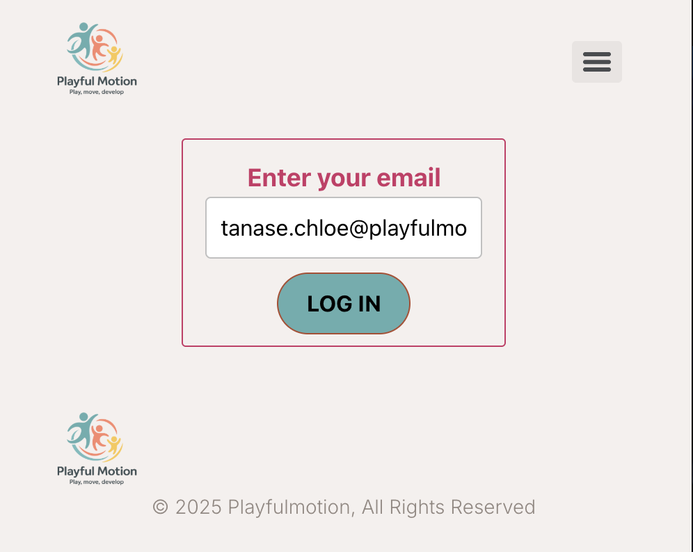
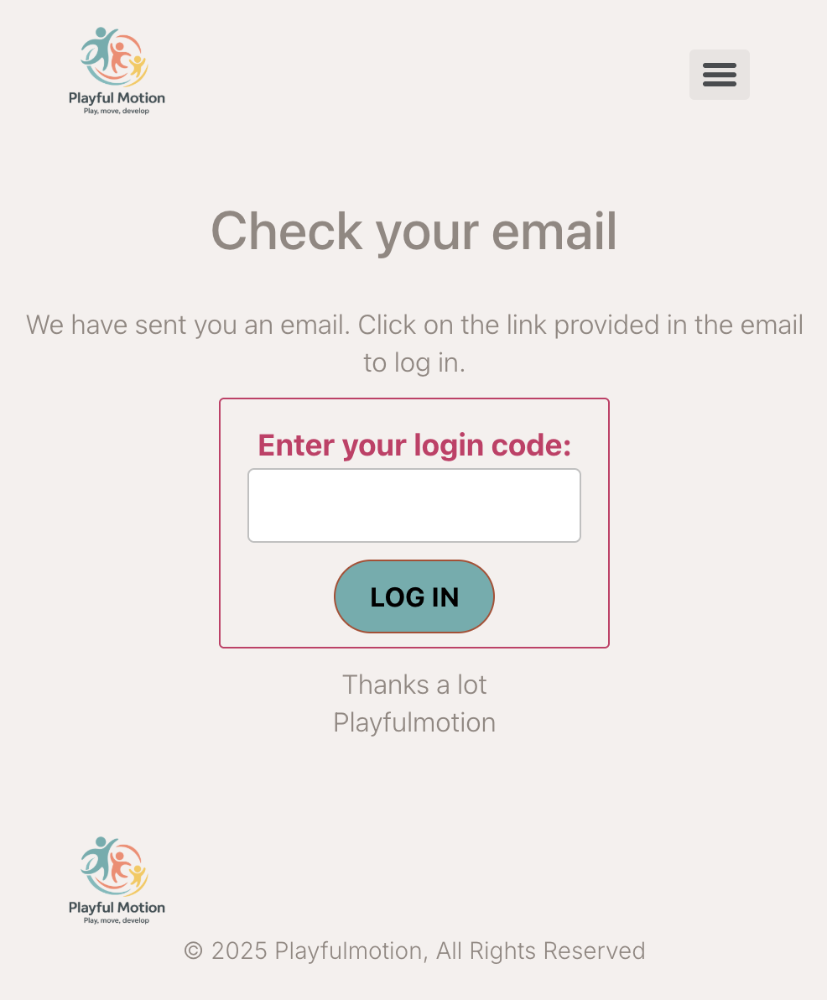
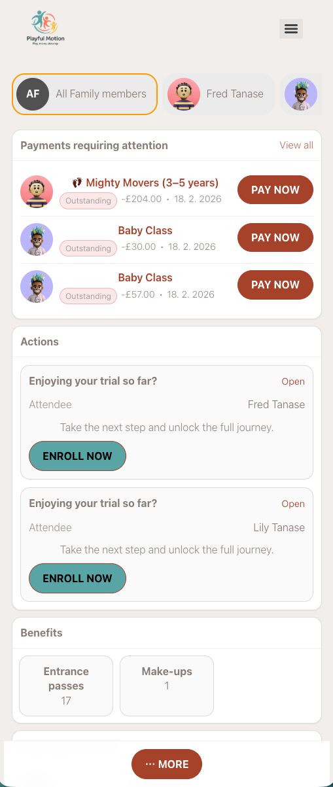
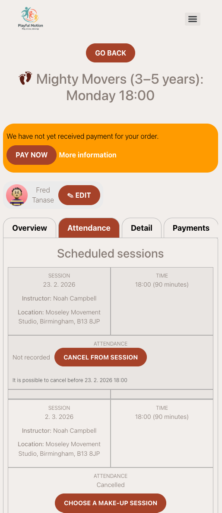
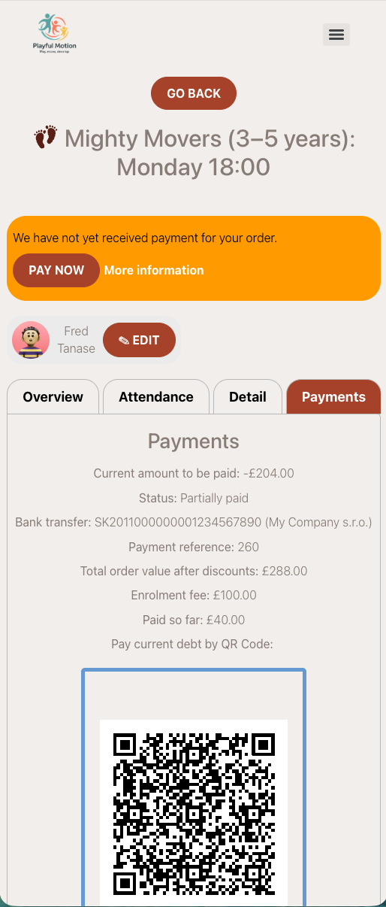
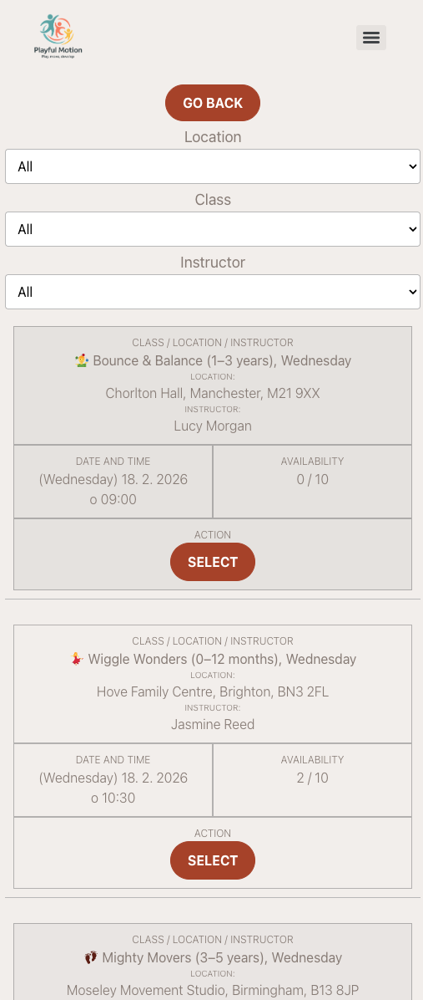

<!-- Synonyms: client profile, parent portal, client portal, customer portal, profil klienta, rodičovský portál, klientský profil -->

# Client Profile 101

The Client Profile is a self-service dashboard where clients manage their bookings, sessions, payments, benefits, and orders in one place. It works on both mobile phones and computers and does not require remembering any password.

> **For admins:** The Client Profile reduces support requests — clients can check payment status, find invoices, book make-up sessions, and view their benefits without contacting you.

## Logging in

1. The client opens the Client Profile URL (embedded on your website or sent via email).
2. They enter the email address used during booking.
3. They receive a **one-time login code** or a **secure login link** by email.
4. Clicking the link or entering the code logs them in automatically.

There is no password to create or remember. Each login sends a fresh email.

> **Tip for admins:** Use the `WIDGET_PROFILE_URL` dynamic tag in your email templates to automatically insert the correct Client Profile URL for each client.

## Home page overview

Once logged in, the client sees their home page with:

- **Family members** — switch between children (or attendees) at the top.
- **Active and past bookings** — all bookings in one place.
- **Quick actions** — pay, book make-ups, view sessions.

### Switching between family members

If a client has multiple children enrolled, they can switch between them by clicking a name or avatar at the top. Some sections (like orders or family-level discounts) are shared and do not change when switching.

## Bookings and programme overview

Opening a booking shows the programme dashboard:

- **Upcoming sessions** — what is next.
- **Programme details** — key information about the programme.
- **Quick actions** — access to sessions, payments, and benefits.

## Sessions

In the sessions tab, clients can view:

- All scheduled sessions.
- Attended sessions.
- Cancelled or missed sessions.

The list stays up to date automatically. If the provider uses online sessions, a livestream link may appear here.

## Payments and invoices

In the payments section, clients can:

- See which payments are **unpaid** and which are **paid**.
- **Pay online** — open the unpaid item and continue to the payment gateway (if online payment is enabled) or view payment instructions (for bank transfer).
- **Download invoices or receipts** (if the provider enables invoicing).

The payment status updates automatically after payment.

## Make-up sessions

If a client cancels a session or misses it, and the provider allows make-ups, the client can:

1. See available make-up sessions in their profile.
2. Select a make-up session from the available options.
3. Confirm the make-up directly.

Make-up availability depends on real capacity — if no suitable session with space is available, the option does not appear. Clients receive email or WhatsApp reminders about available make-ups.

## Benefits

The Benefits section groups all "extras" in one place:

| Benefit type | What the client sees |
|---|---|
| **Make-ups** | Available and used make-up sessions (with history). |
| **Discounts** | Available and expired discounts. Some discounts are family-level. |
| **Entry passes** | Prepaid visit passes — remaining entries, expiration date, status. See [Entry pass — client view](entry-pass-client-view.md). |
| **Credits** | Prepaid credit balance, where and when credits were used. |

This helps clients answer their own questions: "Do I still have a make-up?", "How many entries are left on my pass?", "Where did my credit go?"

## Orders

The orders section shows:

- **Unpaid orders** — number and details.
- **Paid orders** — history of completed orders.

Clients can open an order to see its details, including items purchased, payment status, and entry pass entries.

## Sharing a booking

In the booking details, clients can share access with another person — for example, another parent, a grandparent, or an older child. The shared person receives notifications and updates related to the booking.

> **For admins:** You can also set up shared access from the admin side. See [Client Management FAQ](../faq/client-management-faq.md) for details on giving a second parent access.

## Bottom navigation menu

On mobile, a quick navigation menu at the bottom lets clients jump directly to a section (Bookings, Benefits, Orders) without scrolling.

## Related

- [Client Profile FAQ](../faq/client-profile-faq.md) — common questions about the Client Profile.
- [Client Management FAQ](../faq/client-management-faq.md) — admin-side client management.
- [Entry pass — client view](entry-pass-client-view.md) — how clients see and use entry passes.
- [Customizing widgets](customizing-widgets.md) — embedding the Client Profile on your website.
