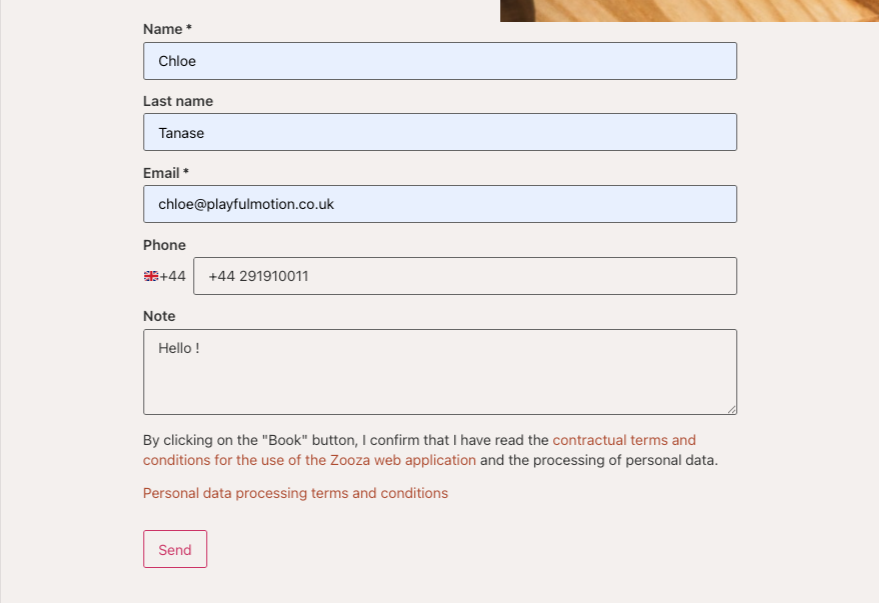
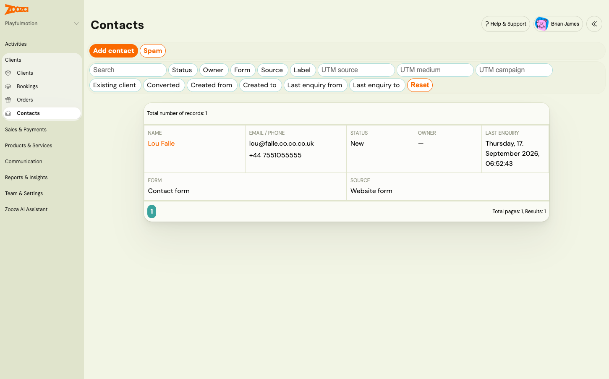

# Contact form (lead capture): turn website enquiries into contacts

Most providers have a contact form on their website. Someone fills it in, an email lands in a mailbox, and that is where the trail ends. Nobody can tell which campaign brought the person, whether anyone replied, or whether they ever became a client.

The Zooza **contact form** replaces that form. It is a widget you place on your website, the same way you place the booking form. Every enquiry sent through it becomes a **contact** in Zooza, together with the page it was sent from, the campaign that brought the visitor, the answers to your own questions and the consents they gave. Your team follows the contact up in Zooza and, when the person is ready, converts it into a client with one click.

People also call this **lead capture** or a lead form. In Zooza the screens are called **Contacts** and **Contact forms**, and one sent form is an **enquiry**.

## What you get

- **A form that asks only what you need.** Name, email, phone and a message are built in. You can switch each one on or off and make it required. Add your own questions as [custom contact fields](../setup/custom-contact-fields.md), for example *What are you interested in?* or *Child's age*.
- **Every enquiry in one place.** Go to **Clients → Contacts** to see who wrote, from which form, when, and what they answered. Filter by status, owner, form, label, campaign or any custom field answer.
- **Nothing gets lost.** Your team is emailed about each enquiry, and you can reply straight from that email. A to-do can be created for the contact owner. The visitor can get an automatic reply in their language.
- **You know where the enquiry came from.** The page URL, referrer, UTM parameters and Meta or Google click ids are stored on every enquiry. The widget also fires analytics events, so an enquiry can count as a conversion in Google Tag Manager, GA4 or Meta Pixel.
- **No spam, no CAPTCHA.** Spam protection is invisible to the visitor. Suspicious enquiries go to a separate Spam list you can review.
- **A path to a booking.** A contact is not a client. When the person decides to join, convert the contact into a client and book them as usual. If they already are a client, Zooza links the contact to them automatically.

## What businesses use it for

### A paid campaign that collects interest, not bookings

You run Meta or Google ads for a new term. Asking people to pick a class and pay from an ad is a big step, so the ad leads to a page with a short form instead: name, phone or email, and *What are you interested in?* Each person becomes a contact tagged with the campaign. Your team calls or messages them, answers questions, and only then books them into a class. In Contacts you filter by **UTM campaign** to see exactly what each campaign brought in.

### Replacing the generic contact form on your website

Enquiries stop ending up in one person's inbox. Each one has an owner, a status and a history, and a colleague can pick it up when the owner is away. Reply to the notification email and the answer goes directly to the enquirer. The enquiry stays on the contact's timeline for everyone to see.

### Interest in a new venue, programme or term before the schedule exists

Sometimes you want to know whether there is demand before you create anything. A contact form needs no programme, no class and no price. Ask *Which location?* and *Preferred day?*, collect contacts, and open the class once you have enough. Zooza also has a [lead collection class](lead-collection.md) for this. The difference: a lead collection class creates a **booking** inside an existing programme. A contact form creates a **contact**, with nothing set up in advance. Use the contact form when you are still deciding, and lead collection when the programme exists and you only lack the timetable.

### One form for several locations or pages

Put the same form on every location page and add a hidden field whose value comes from the embed code, for example `location`. Each enquiry then carries the location it was sent from, and each location manager filters Contacts by their own value. If a location needs different questions or a different owner, give it its own form configuration instead.

## How a contact becomes a client

1. A visitor sends the form. Zooza creates a contact with the status **New**, or adds the enquiry to an existing contact with the same email address.
2. Your team is notified. The contact owner, or whoever picks it up, follows up and moves the status to **In progress** or **Lost**.
3. When the person is ready to join, click **Convert to client** on the contact. Zooza creates the client and marks the contact **Converted**. Then create their booking as you would for anyone else.
4. If the person books through your booking form themselves using the same email address, the contact is marked converted automatically.

If an enquiry comes from someone who is already your client, the contact shows **Existing client** with a link to their profile. Contacts never appear in the Clients list, so your client counts and client lists stay clean.

## Quick start

1. Optional: create your own questions in **Team & Settings → General → Custom contact fields**. See [Custom contact fields](../setup/custom-contact-fields.md).
2. Open **Team & Settings → General → Contact forms**. Every company already has a default configuration. Decide which fields it asks, which consents it shows and what happens after sending. See [Set up a contact form](../setup/contact-form-setup.md).
3. Go to **Team & Settings → Publish**, open your widget and configure the **Contact form** row. Copy the embed code and paste it into your website. See [Put the contact form on your website](../setup/contact-form-on-your-website.md).
4. Send a test enquiry from your website. The form's status in Contact forms changes to **Receiving enquiries** and the contact appears under **Clients → Contacts**.
5. Add the people who should be emailed about enquiries in **Notification center** under **New contact enquiry**. Then work the contacts. See [Work with contacts and enquiries](working-with-contacts.md).

If you run campaigns, read [Track campaigns and conversions from the contact form](contact-form-campaign-tracking.md) before you launch, so the campaign parameters are captured from day one.

## Good to know

- One contact form per page. Any number of pages can carry the form.
- The WordPress plugin's shortcode does not render the contact form. Paste the embed code into a Custom HTML block instead.
- Contacts have no CSV export and no bulk actions yet.
- Contacts are kept until you erase them. Erasing a contact is permanent and removes its enquiries and notes.

## Related

- [Set up a contact form](../setup/contact-form-setup.md)
- [Custom contact fields](../setup/custom-contact-fields.md)
- [Put the contact form on your website](../setup/contact-form-on-your-website.md)
- [Work with contacts and enquiries](working-with-contacts.md)
- [Track campaigns and conversions from the contact form](contact-form-campaign-tracking.md)
- [Contact form and contacts FAQ](../faq/contact-form-and-contacts-faq.md)
- [Lead collection](lead-collection.md)
