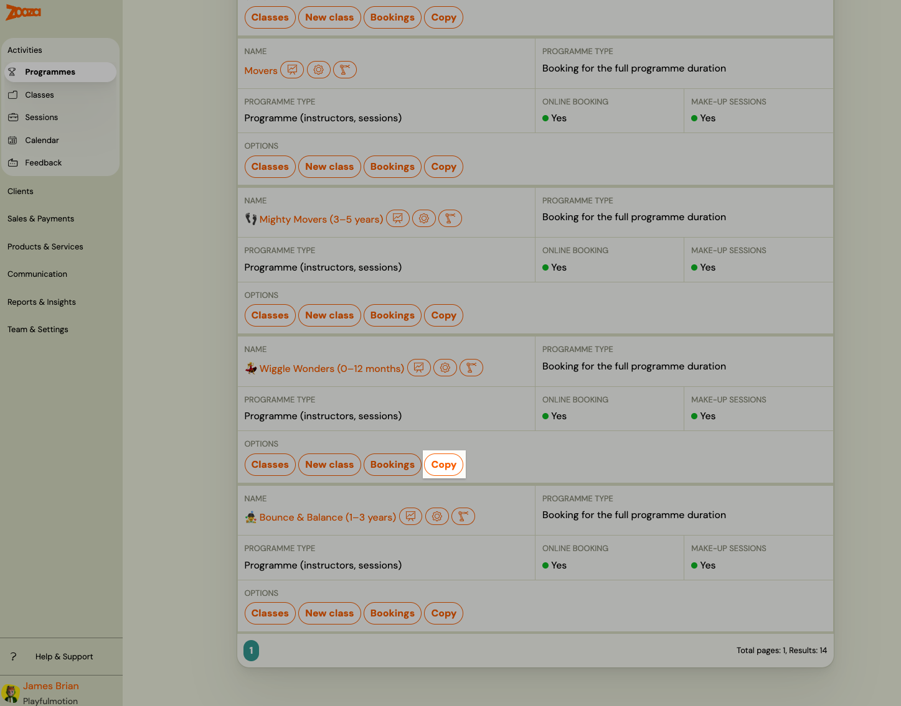
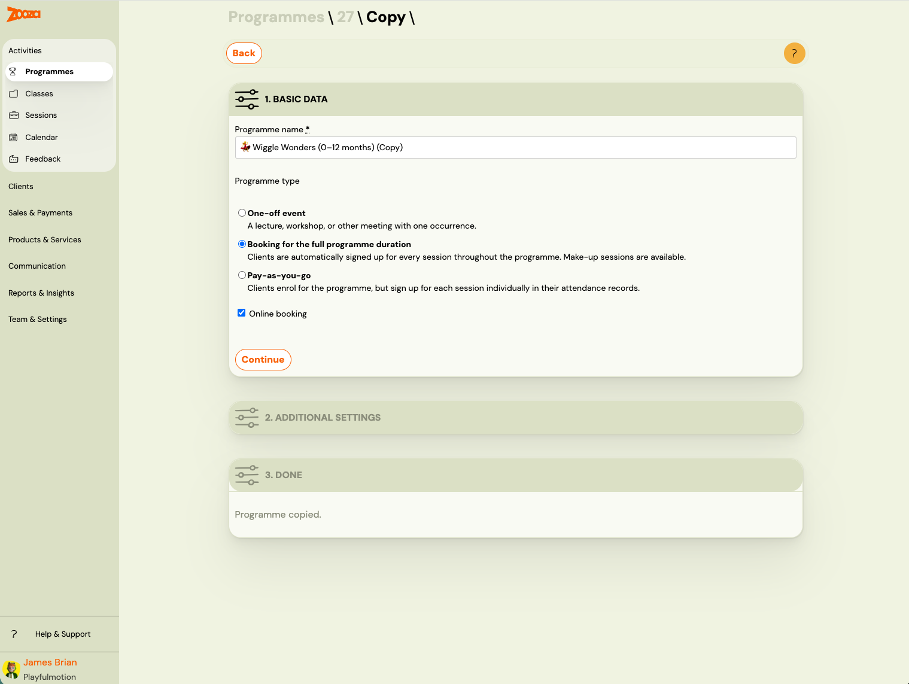
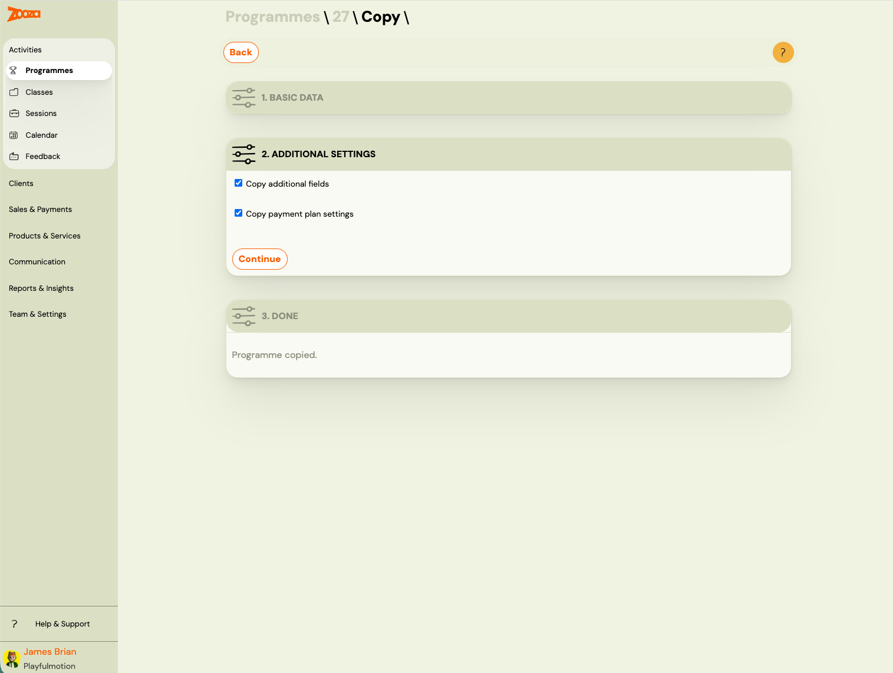
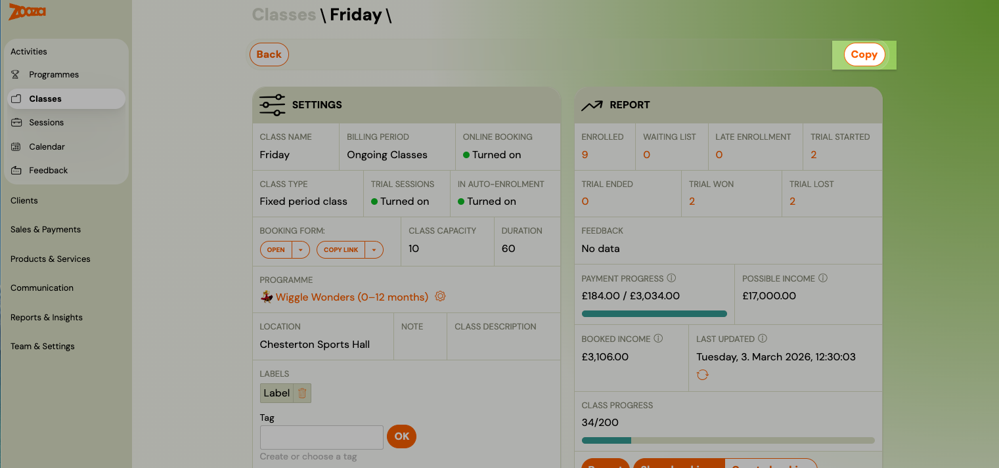
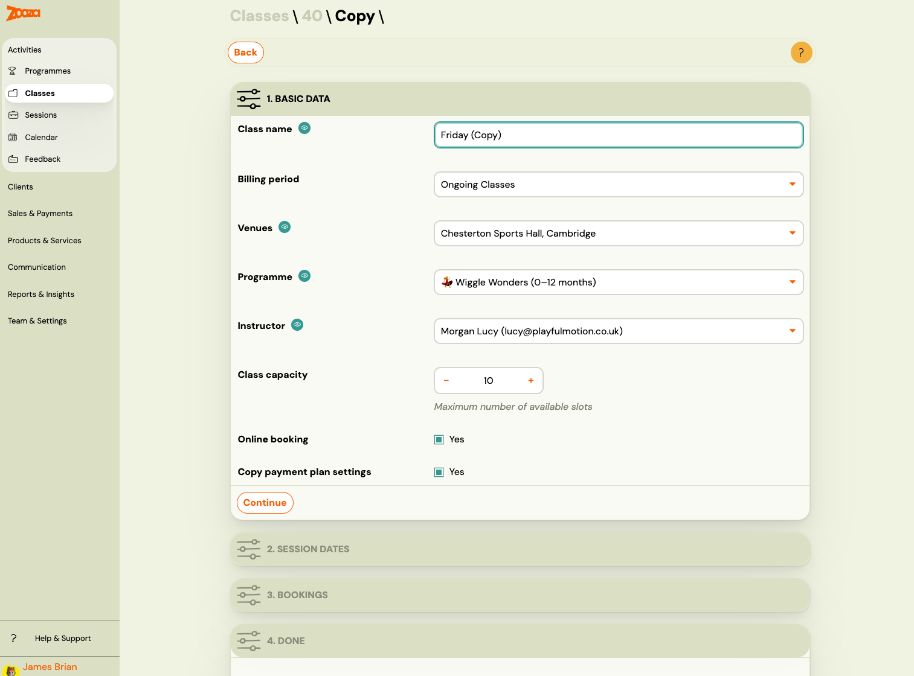
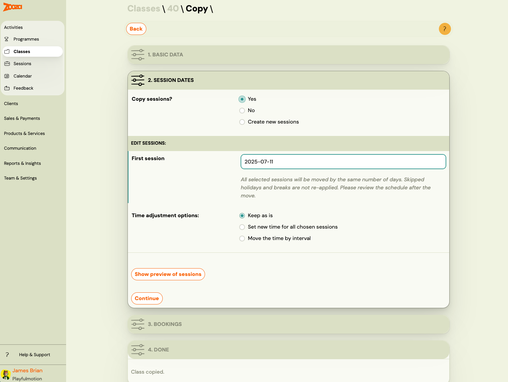
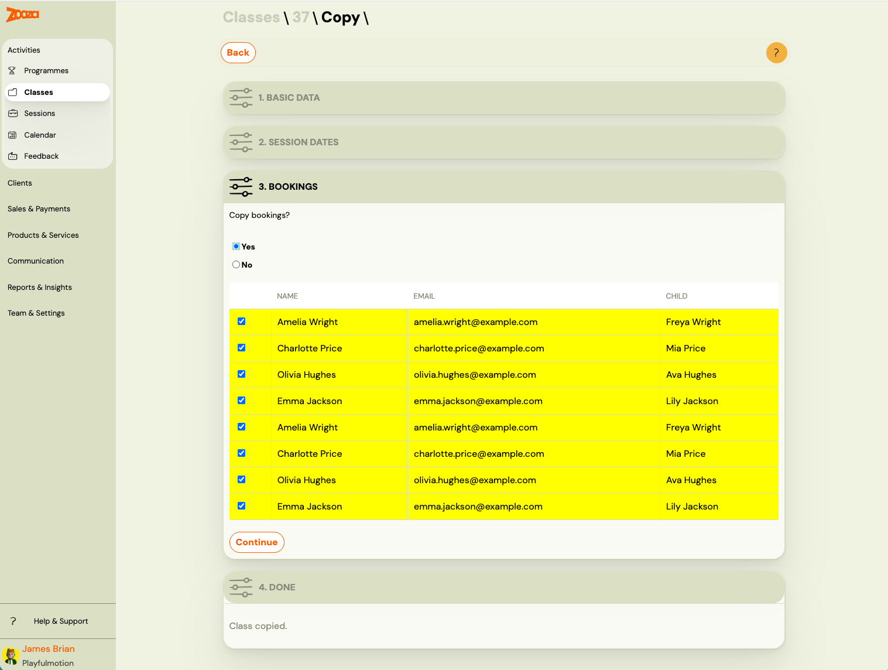

# Copy a programme or class

Copying is the fastest way to set up a new season or billing period. Instead of creating a programme or class from scratch, you copy an existing one and adjust what needs to change — name, dates, and optionally the existing bookings.

You can copy at two levels:
- **Programme** — creates a new programme with the same settings.
- **Class** — creates a new class within a programme, with the option to copy sessions and bookings.

## Copy a programme

Use this when you want to create a new programme that mirrors the structure of an existing one.

1. Go to **Programmes** and find the programme you want to copy.
2. Click **Copy** next to the programme name, or open the programme and click **Copy programme**.
3. Edit the name and adjust any settings as needed.

You can choose to copy:
- **Extra field settings** — carries over any additional fields on the booking form.
- **Payment template settings** — copies the payment schedule configuration.

> **Note:** The option to copy payment templates is only available when copying a full-duration programme that already has payment templates configured.

## Copy a class

Use this when you want to create a new class (group) within a programme — for example, a continuation class for the next billing period.

1. Open the programme and go to the class you want to copy.
2. Click **Copy** on the class.
3. Edit the class details and select the options you need.

### What you can change when copying a class

| Setting | Description |
|---------|-------------|
| **Name** | Change the name for the new class, or keep the original (remove the "Copy" suffix). |
| **Location** | Assign a different venue. |
| **Instructor** | Assign a different instructor. |
| **Class capacity** | Set a different maximum number of clients. |
| **Show in online registration** | Control whether the new class appears in the booking widget. |
| **Copy payment template settings** | Carry over the payment schedule configuration. |

### Copy sessions (dates)

You can choose whether to copy the session schedule:

- **Move to a new first date** — shift all sessions by setting a new start date. The same pattern (day of week, time) is applied from that date onwards.
- **Apply a time change** — shift all sessions by a fixed number of days or weeks.
- **Keep the same times** — sessions are created with the same dates as the original.

After setting the dates, you can **preview the new sessions** before confirming.

### Copy bookings

You can optionally copy the existing bookings (registrations) along with the class. This is useful when most clients are continuing to the next period unchanged. If someone decides not to continue, delete their individual booking afterwards.

> **Important:** Copying bookings is not the same as transferring them. When bookings are copied:
> - A **new booking number** is created for each client.
> - **Make-up credits, attendance history, and payment data are not transferred** — the new booking starts clean.
> - The original booking remains unchanged and accessible to the client in their profile.
>
> If you need to move a client while keeping their payment or credit history, use the **Transfer** function on the individual booking instead. See [Transfer and copy bookings](transfer-and-copy-bookings.md).

## When to use Copy vs Transfer

| Goal | Use |
|------|-----|
| New season for the same group of clients | **Copy class** with bookings |
| One client switching to a different class | **Transfer booking** |
| Creating a second parallel class with same settings | **Copy class** without bookings |
| Repeating a programme in a new period | **Copy programme** |

## Related

- [Transfer and copy bookings](transfer-and-copy-bookings.md) — moving individual client bookings between classes.
- [New programme with existing clients](new-programme-existing-clients.md) — strategies for term transitions.
- [Transfer and Copy FAQ](../faq/transfer-and-copy-faq.md)
