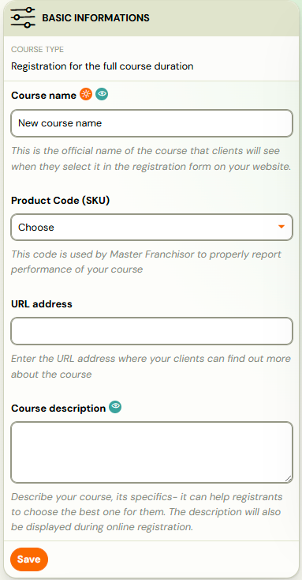
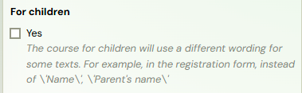
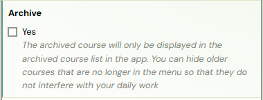
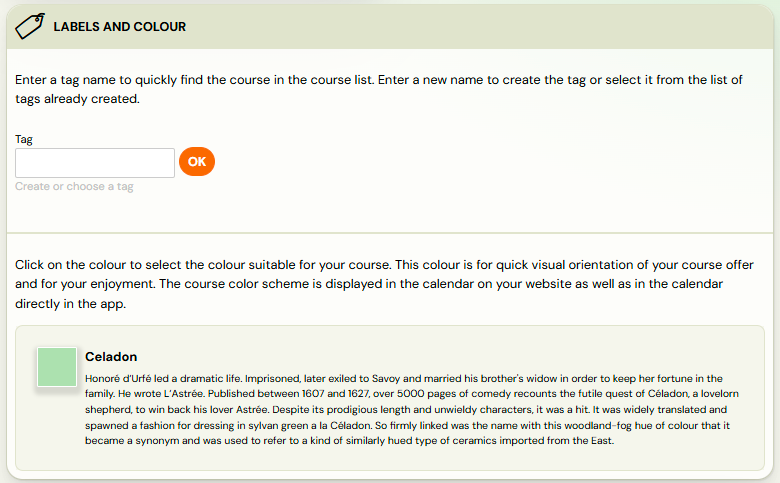
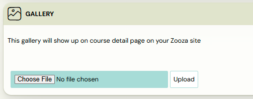

# Course settings tile

Course settings are pre-filled when you create the course, but you can adjust them at any time. The settings are organised into several sections:

1. Basic information
2. Additional settings
3. Labels and colours
4. Gallery

## Basic information

In this section, you can define the core details of your course:

1. *Course name -* the name displayed to clients and used throughout the system.
2. *Product Code (SKU)* -if you are part of a network, this is the product code assigned by the master franchisor.
3. *URL address* where the course description is more detailed
4. *Course description*
 

## Additional settings

1. In the *Course Type* section, you can adjust the format of the course — for example, changing it to an online session, a photography course, or a standard course with scheduled sessions.
2. You can also update the *Target audience* if the course changes from group classes to individual sessions, or vice versa.
3. Selecting the *For children* checkbox changes the wording in certain parts of the application. For example, in the registration form, “Name” will become “Parent’s Name.”
 
4. If you check the *Archive *box and save the settings, the course will be removed from your active course list and placed in the archive. A full explanation of this feature is available [HERE](https://support.zooza.online/portal/en/kb/articles/delete-archive-courses).
 

## Labels and colours

1. In the *Tag *field, you can optionally enter a category name for the course. Tags are for your internal use only and help you organise and filter your courses more easily. To save the tag, click OK next to the field. For more details on using tags, see the [Tags manual.](https://support.zooza.online/portal/en/kb/articles/labels-and-extra-fields)
2. You can also assign a course colour (if it wasn’t set during the course creation wizard) to help clients easily identify your courses. For example, a course for 3–4-year-olds could be set to “Zooza Orange,” making it instantly recognisable on the calendar, such as on Tuesdays and Thursdays.

## Gallery

At the bottom of Course settings tile you have a ready-made gallery that will appear in the course details on your Zooza website. For information on how Zooza Sites work and how to set them up click [here](../setup/zooza-sites.md).

