# Course settings

After creating your course, Zooza will automatically take you to the Course Overview page. Here, you can add classes, adjust settings, and review your course’s details.

## Course overview

## New course

If you’ve just created a blank course, the overview page will display a setup checklist designed to guide you through each step. You can follow the checklist in order, marking each item as completed as you go. This ensures nothing is missed before your course goes live. Each setting has its own documentation about how to proceed.

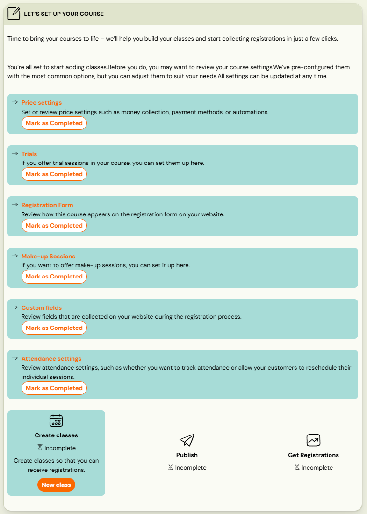

## Course with classes

If your course already has ongoing or completed classes, the overview page will show a Performance overview along with a list of all active and finished classes. At the top of the page, you’ll find quick access to:

1. Edit settings
2. Create a new class
3. Copy course

Selecting *Edit Settings* the course detail page will open, where multiple settings are grouped into tiles for easy navigation.

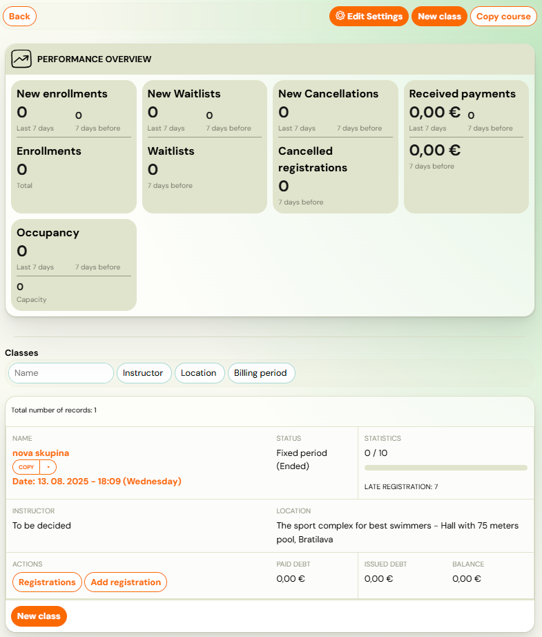

## Course Settings

Each registration type has a different bundle of settings divided into tiles that can be modified.

1. Price and Payment
2. Online Registration
3. Make-up Sessions *(full duration courses* only)
4. Course Settings
5. Additional Fields
6. Trial (*full duration courses* only)
7. Auto-Enrollment (*full duration courses* only)
8. Feedback
9. Attendance
10. Class linking (*open courses* only)

You can edit each section by clicking its *Edit *button.

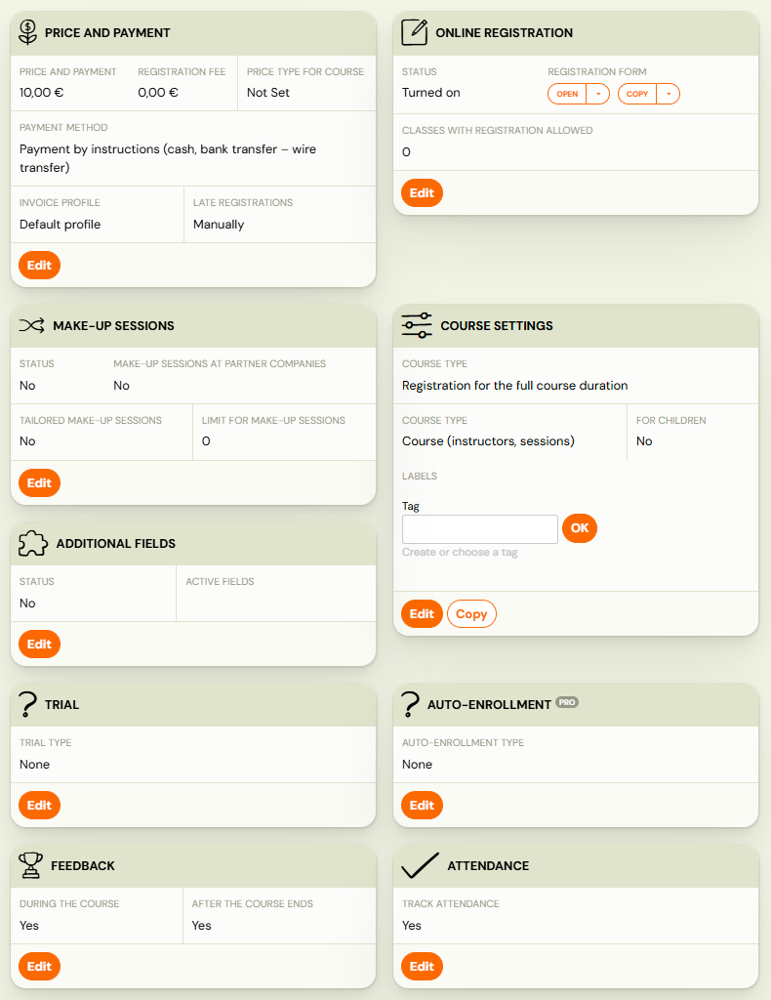

## Price and payment

This setting is set when creating the course, but you can update the *unit price* or *registration fee* later if needed.

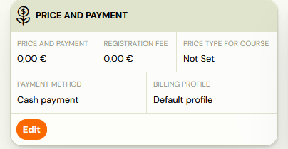

1. For guidance on correctly setting prices*, *refer to the [Pricing Setup manual.](https://support.zooza.online/portal/en/kb/articles/setting-the-price-on-a-course)
2. For help configuring payment reminders, see the [Payment Reminders Guide.](automatic-payment-reminders-detailed.md)

## Online registration

To configure how the course will appear on your website and how communication with clients will be handled, use the* Online Registration *tile. A detailed explanation of each feature is available in the [Online Registration manual.](../setup/online-registration.md)

->vymen screenshot za asdfasdfasf.png

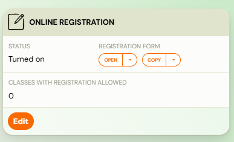

## Make-up sessions

If attendance recording is enabled, you can also set up make-up sessions for missed classes. Full guidance on configuring make-up sessions is available in this [manual](https://support.zooza.online/portal/en/kb/articles/replacement-lessons).

Note: This function is available for* full duration courses* only.

## Course settings

This setting is set when creating the course, but you can change it anytime and add more information about the course. All information is available [here](course-settings-tile.md).

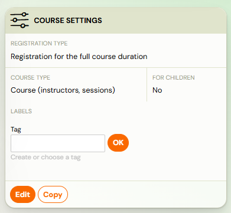

## Additional fields

At the course level, you can add *Additional Fields* to the registration form to collect additional information from participants, such as age, allergies, or skill level. For detailed instructions on creating and managing extra fields, see the [Additional Fields manual](https://support.zooza.online/portal/en/kb/articles/labels-and-extra-fields).

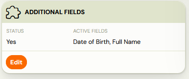

## Trial

In the *Trial *tile,
 you can set up a menu of trial sessions that clients without a long-term
 commitment can sign up for. You can read how to set up trial sessions [here](../setup/trial-lessons.md).

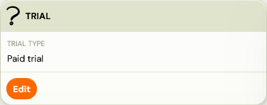

## Auto-enrollment

*Auto-enrollment* is a pro feature designed to make re-enrollment easier and more
efficient for your existing clients. It allows you to offer them a new
course before their current one ends, giving them priority access and a
streamlined sign-up process. Detailed instructions on setting up and
using auto-enrollment can be found in the [Auto-enrollment manual.](../setup/auto-enrollment.md)

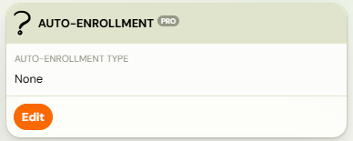

Note: This function is available for* full duration courses* only.

## Feedback

In the *Course Feedback* section, you can choose if and when the system should automatically send clients a form inviting them to evaluate your course.

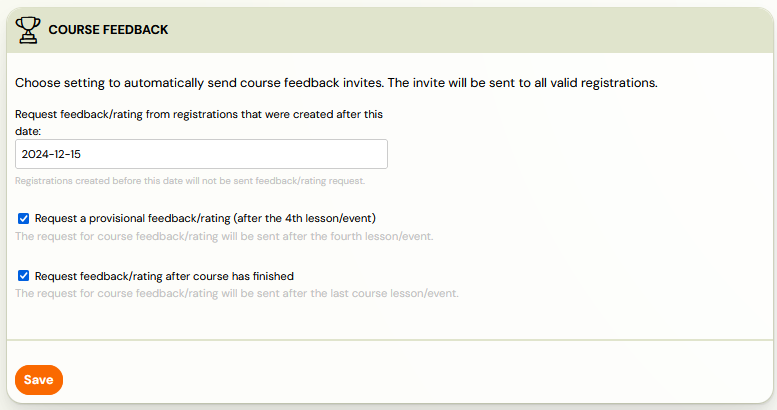

## Attendance

In some courses — including one-session events such as camps or tours — it may not be necessary to record attendance, since you expect participants to attend for the entire scheduled time. In these cases, you can disable attendance tracking in the *Attendance *tile. By default, this function is enabled by the system.

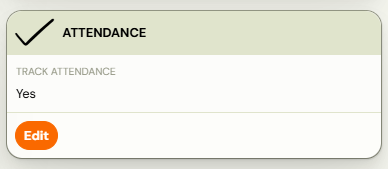

Note that when attendance tracking is turned off, make-up sessions cannot be offered. For a full explanation of how this feature works in all scenarios, see the [Attendance manual](https://support.zooza.online/portal/en/kb/articles/attendance-setup).

## Class linking

Zooza offers a possibility to link multiple classes together which will enable clients to enroll to one class (e.g. based on age restriction, level,...) and then enroll to sessions from other classes. Detailed definition of this functionality can be found[here.](group-connection.md)

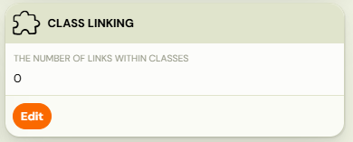

Note: This function is available for* open courses* only.
