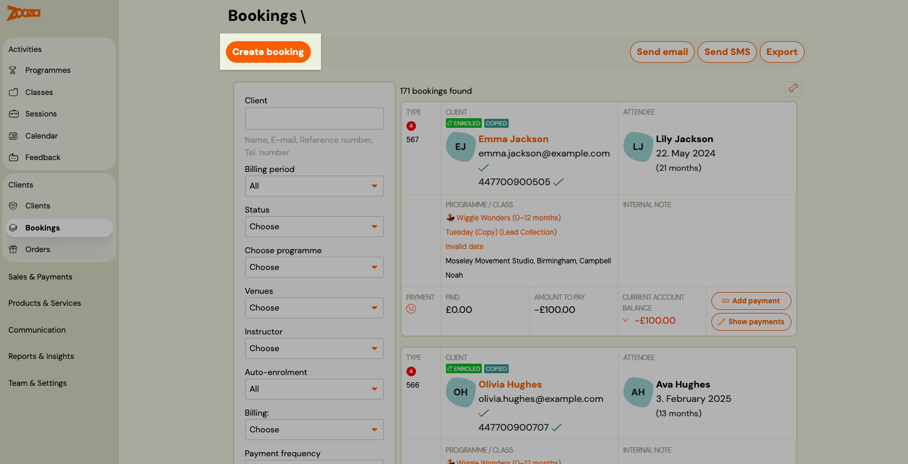
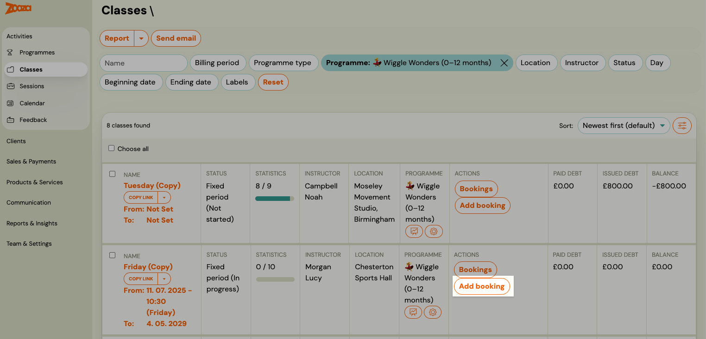
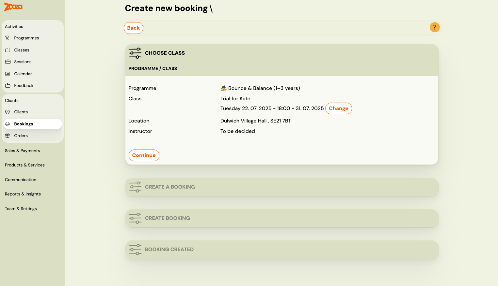
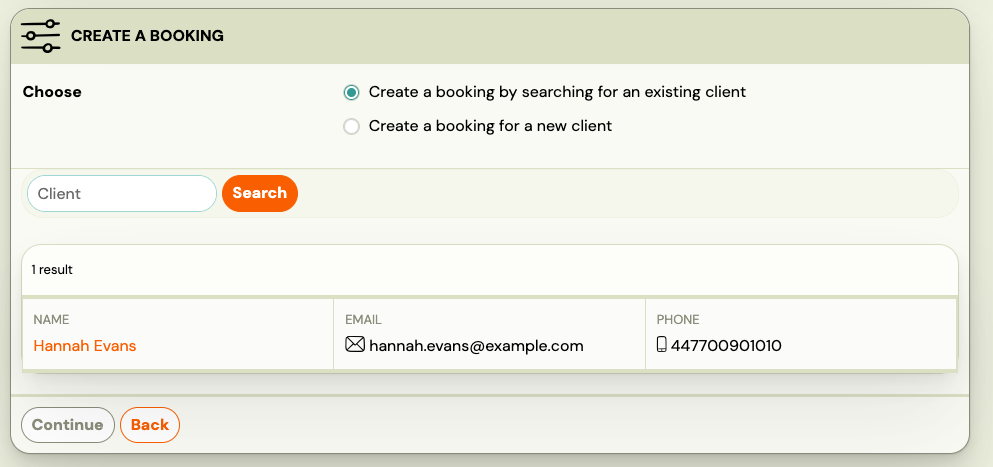
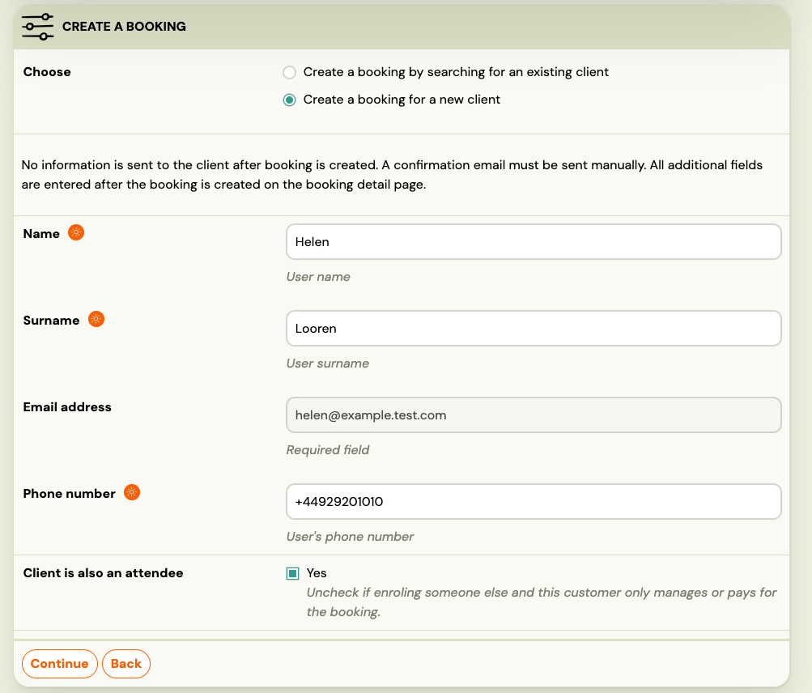
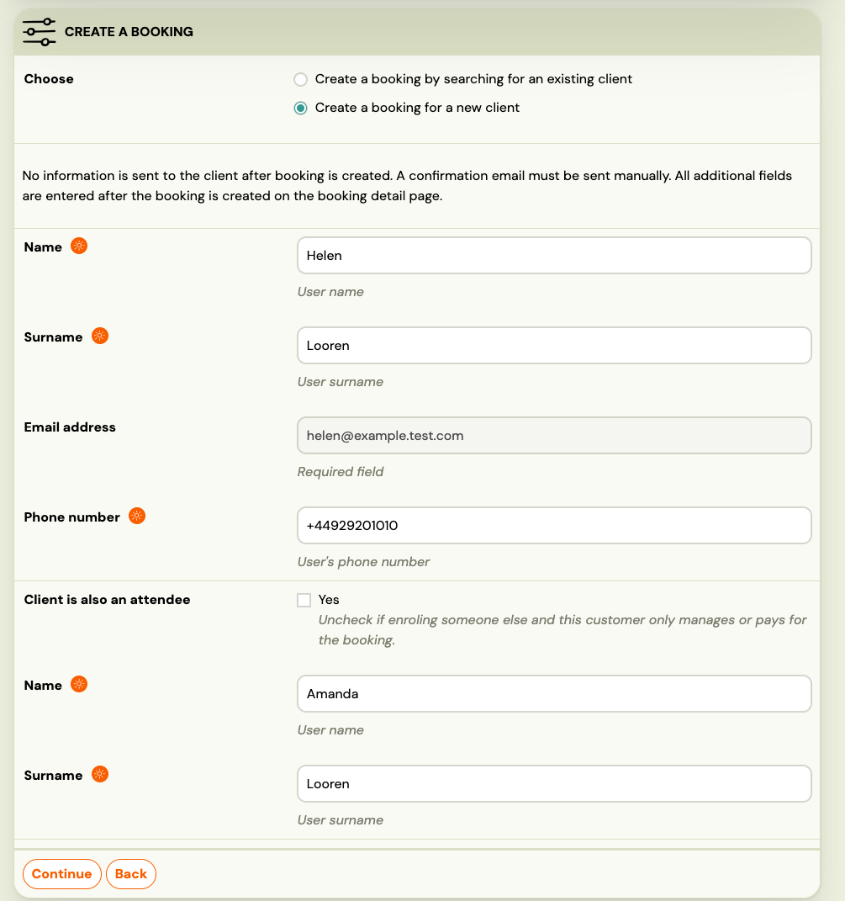

# Creating a booking manually

Admins and staff can create a booking for a client at any time — for a new client or one already in the system. A booking ties a client to a class and sets up their payment schedule.

## Three ways to start

**From the Bookings list** — Go to **Bookings** and click **Create booking** at the top of the page.

**From the Classes list** — Go to **Classes**, find the class, and click **Add booking** on the class row.

Starting from the Classes list or class detail pre-selects the class. Starting from the Bookings list opens the wizard at the class selection step.

## Step 1 — Choose the class

If you started from the Bookings list, select the class the booking should be created for. The wizard shows the programme, class name, location, and instructor.

Click **Change** to pick a different class.

## Step 2 — Choose the client

Select whether this is an existing client or a new one.

### Existing client

Search by name, email address, or phone number. The results show the client's name, email, and phone. Click the client to select them.

### New client

Fill in the client's details. **Email address** is the unique identifier — enter it first to check whether the client already exists.

| Field | Notes |
|---|---|
| **Name** | Required |
| **Surname** | Required |
| **Email address** | Required. Used as the unique identifier and for login. |
| **Phone number** | Optional |

#### Client is also an attendee

By default, the client (the person who pays and logs in) is also the attendee (the person attending sessions). This is the standard case for adults booking for themselves.

For programmes where a **parent or guardian** registers on behalf of a child, uncheck **Client is also an attendee**. Two additional fields appear — enter the attendee's **Name** and **Surname**.

## After the booking is created

Once you confirm, the booking is created and the client is enrolled. No confirmation email is sent automatically — if needed, send it manually from the booking detail.

From the booking detail you can:

- Review and adjust the payment schedule.
- Record or write off a debt.
- Send a confirmation or payment email.
- Set attendance, add notes, or manage credits.

## Related

- [Allowing multiple bookings per client](allowing-multiple-booking.md)
- [Managing client attendance — admin](admin-attendance-management.md)
- [Make-up session — complete guide](replacement-hours-complete.md)
