<!-- Synonyms: create class, new class, add class, create timetable, new timetable, group creation, vytvorenie triedy, nová trieda, pridanie triedy, vytvorenie rozvrhu -->

# Creating a class

Classes divide a programme into time periods — for example, by term, level, or location. When you repeat a programme, you do not need to create a new programme with all its settings from scratch. Instead, add a new class that automatically inherits the programme settings.

This guide walks you through creating a class, filling in the required details, and understanding what you see after the class is created.

## How to create a class

You can create a class in two ways:

1. Directly after programme creation — Zooza takes you to the programme settings where you can add the first class.
2. From the **Programme Overview** page — click **New Class**.

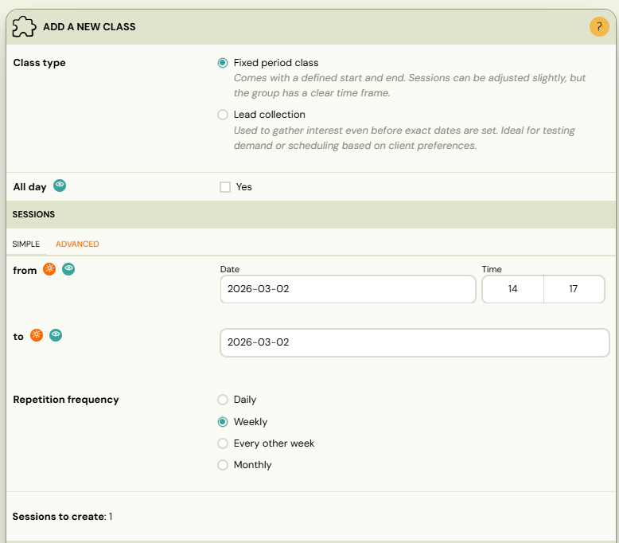

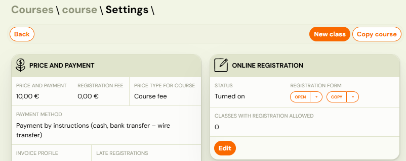

## Step 1 — Choose the class type

Select one of the two class types:

| Type | Description |
|---|---|
| **Fixed Period** | A class with scheduled sessions (dates and times). Use this for most programmes — courses, terms, camps. |
| **Lead Collection** | A class without sessions. Use this to collect interest from potential clients before scheduling. When you add sessions later, it becomes a fixed period class. See [Lead collection](lead-collection.md). |

## Step 2 — Fill in class details

Fill in the following fields:

| Field | Description | Required |
|---|---|---|
| **Class name** | A descriptive name (e.g., "Monday 9:00 – Beginners"). | Yes |
| **Billing period** | The term or period this class belongs to (e.g., "Autumn 2025"). | Yes |
| **Location** | The venue where sessions take place. | Yes |
| **Instructor** | The assigned instructor. Options: a specific instructor, *To be decided*, *Instructor unassigned*, or *Guest instructor*. | Yes |
| **Rate** | Instructor pay rate for this class. Only shown if rates are configured. | No |
| **Capacity** | Maximum number of attendees per session. | Yes |
| **Duration of sessions** | Length of each session in minutes. | Yes |
| **Online Registration** | Leave checked if you want the class to appear on the booking form immediately. Uncheck to set it up first and publish later. | — |

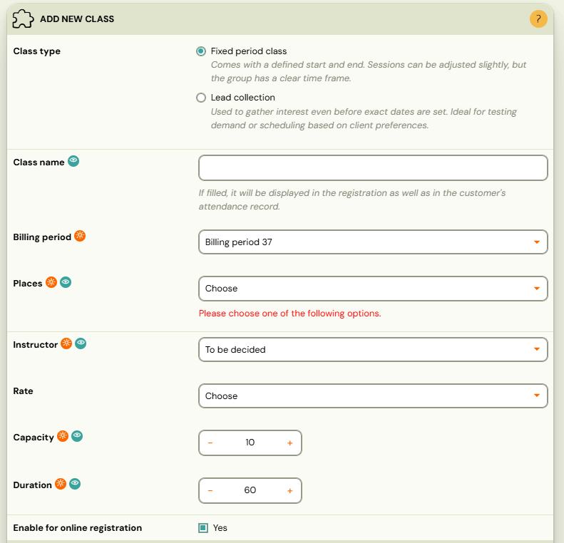

> **Note:** Fields marked with an orange icon are required.

## Step 3 — Define sessions (Fixed Period only)

If you selected **Fixed Period**, you can define sessions immediately:

| Mode | How it works |
|---|---|
| **Simple Setup** | Enter a start date, end date, and repetition frequency (e.g., every Monday). Zooza calculates and displays the number of sessions automatically. |
| **Advanced Setup** | Opens the full session creation wizard for detailed configuration — specific dates, times, holidays to skip, billable sessions, and blocks. |

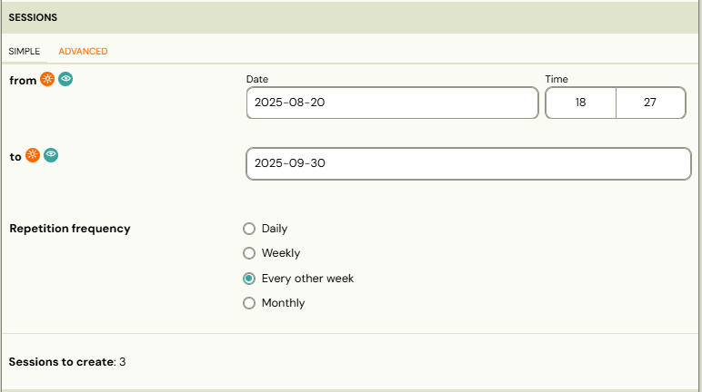

You can also skip this step and add sessions later from the class detail page.

## Step 4 — Set the class price (optional)

If this class should have a different price than the programme default, enter it here. Otherwise, leave the field empty — the programme price applies automatically.

This is useful when different class levels or locations have different pricing.

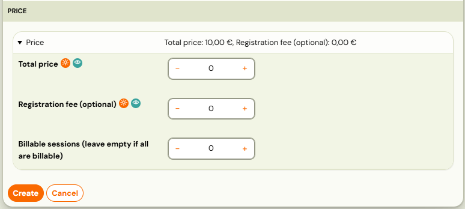

## After creating the class

After saving, Zooza shows a summary of all classes created during this session. From here you can:

- Create another class.
- Open the newly created class.
- Navigate to the **Classes** section to see the full list.

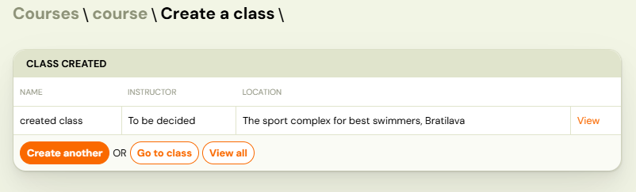

> **Tip:** If you need to create multiple similar classes (e.g., same programme, different time slots), it can be faster to create one class and then **copy** it from the programme overview.

## Classes overview

All classes across all programmes are visible in the **Classes** section in the left menu (**Activities** → **Classes**).

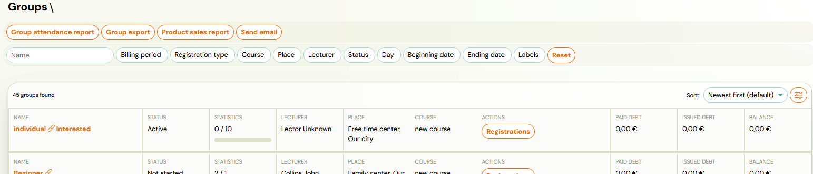

### Filters

You can filter classes by:

- Class name (text search)
- Billing period
- Programme type
- Programme
- Location
- Instructor
- Status
- Day
- Start and end date
- Labels

### Action buttons

Above the filter you have action buttons:

| Button | What it does |
|---|---|
| **Class attendance report** | Exports a complete attendance report for all filtered classes. |
| **Class export** | Exports summary information about filtered classes in tabular form. |
| **Product sales report** | Overview of all bookings and products purchased during registration. |
| **Send email** | Send a mass email to clients in filtered classes. Works the same as [Sending email/SMS to clients](sending-email-sms.md). |

You can also change the sort order and choose between **Registration Progress** and **Class Progress** views.

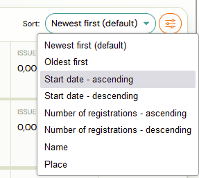

## Understanding the class tile

Each class in the list shows summary information at a glance:

| Information | Description |
|---|---|
| **Class name** | The name you assigned. |
| **Date range** | Start and end date of the class. |
| **Status** | Current state of the class (see table below). |
| **Instructor** | Assigned instructor name. |
| **Location** | Venue name. |
| **Paid debt** | How much of the total debt has been paid so far. |
| **Issued debt** | Sum of all debts created from all booking types (including late and waiting list). |
| **Balance** | Current account status. |

### Class statuses

| Status | Meaning |
|---|---|
| **Not started (Active)** | The class has not started yet but is active and available for booking. |
| **Active** | The class is active and currently accepting bookings. |
| **In progress (Active)** | The class has already started and is still active. |
| **Ended (Active)** | The class has ended but is still technically active (e.g., waiting for final payments). |
| **Ended** | The class has ended and is no longer active. |
| **Archived** | The class has been manually archived. |
| **Ended (Archived)** | The class has ended and was archived. |

> **Important:** Financial numbers (paid debt, issued debt, balance) are recalculated every 30 minutes. They may not reflect the most recent changes immediately.

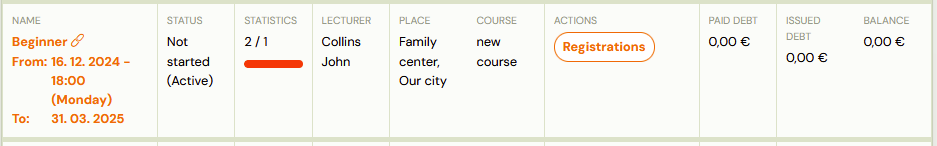

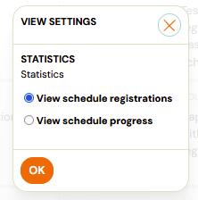

## Class detail

Clicking on a class opens the **Class Detail** page, where all settings and data are organised into sections:

- **Settings** — class name, capacity, venue, billing period, online registration toggle, labels.
- **Instructors** — primary and additional instructors.
- **Products** — products linked to this class.
- **Price and Payment** — class-level price override and payment frequency.
- **Documents** — attached documents.
- **Make-up Sessions** — make-up rules for this class.
- **Report** — session-by-session attendance report.
- **Sessions** — full list of sessions with status, attendance, and actions.

### Labels on classes

In the class settings, you can assign a **label** to the class for internal organisation. Labels let you filter classes in the Classes overview. See [Labels](labels.md) for details.

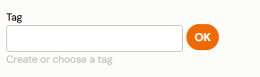

### Report section

The Report section shows booking and financial data:

- Current number of bookings.
- Waiting list and late booking count.
- Payment progress (recalculated every 30 minutes):
  - Current debt from bookings in "Enrolled" status.
  - Estimated income at 100% capacity.
  - Maximum possible income at full capacity (including waiting list and late bookings).

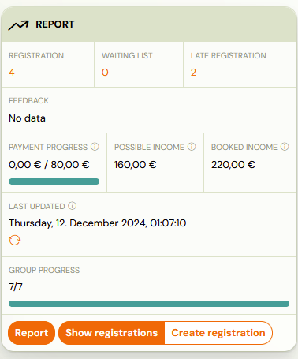

## Related

- [Programme, class, session definition](programme-class-session-definition.md) — understanding the hierarchy.
- [Class Detail](../reference/class-detail.md) — full field reference for the class detail page.
- [Classes List](../reference/classes-list.md) — reference for the classes overview screen.
- [Edit sessions in programmes](edit-sessions-in-programmes.md) — adding and editing sessions.
- [Lead collection](lead-collection.md) — using lead collection classes.
- [New programme with existing clients](new-programme-existing-clients.md) — copying classes with bookings.
- [Labels](labels.md) — using labels to organise classes.
