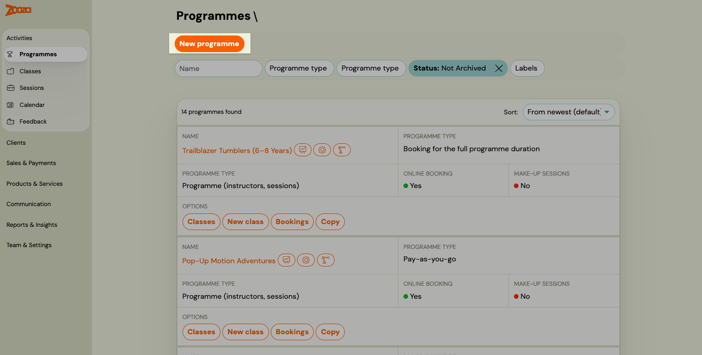
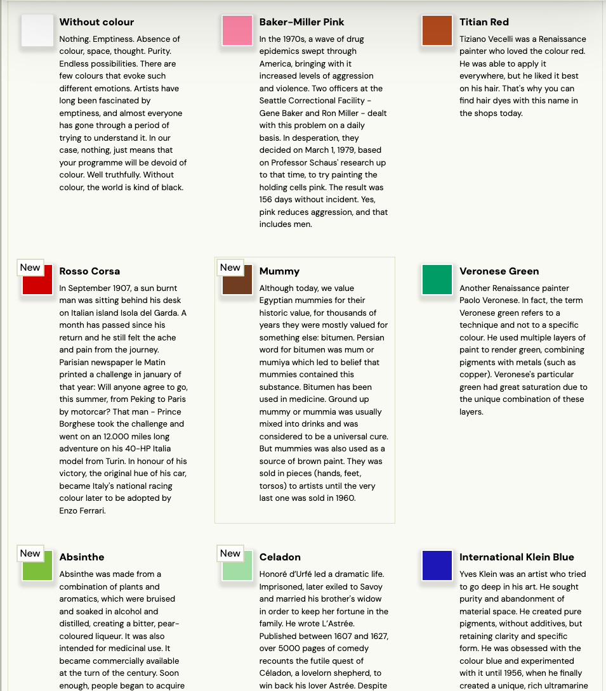
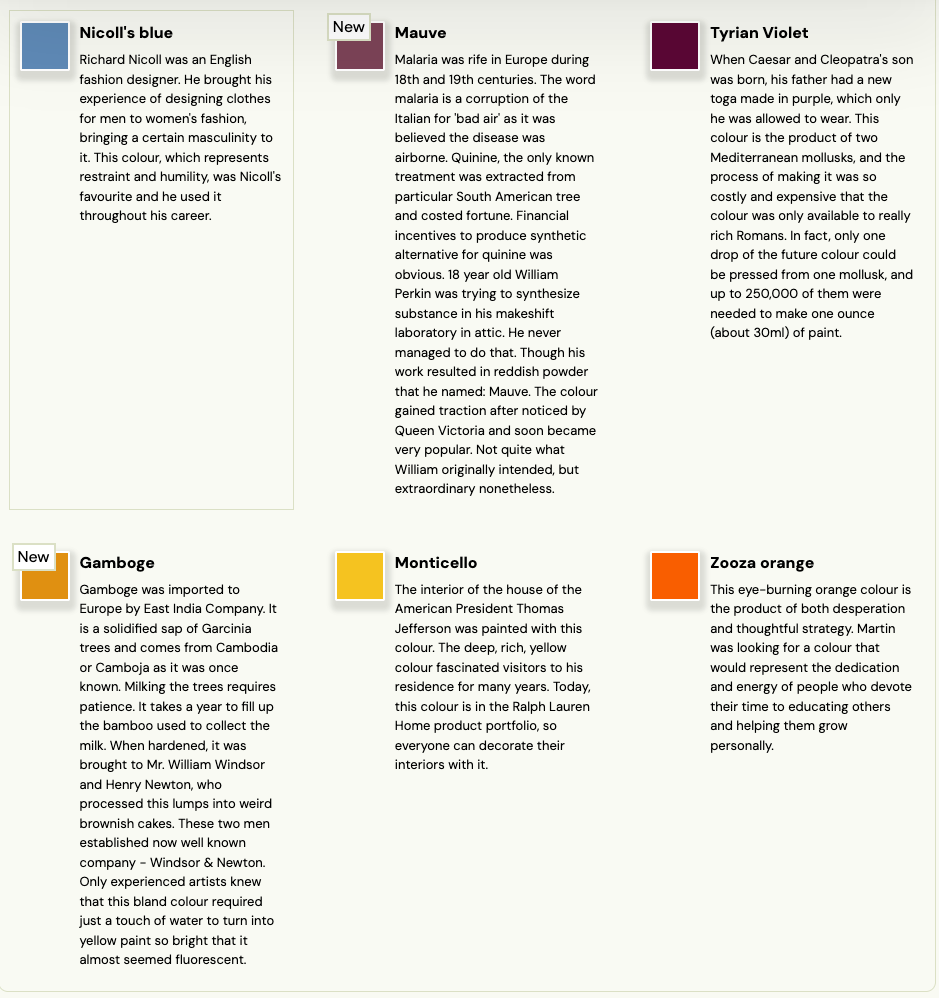
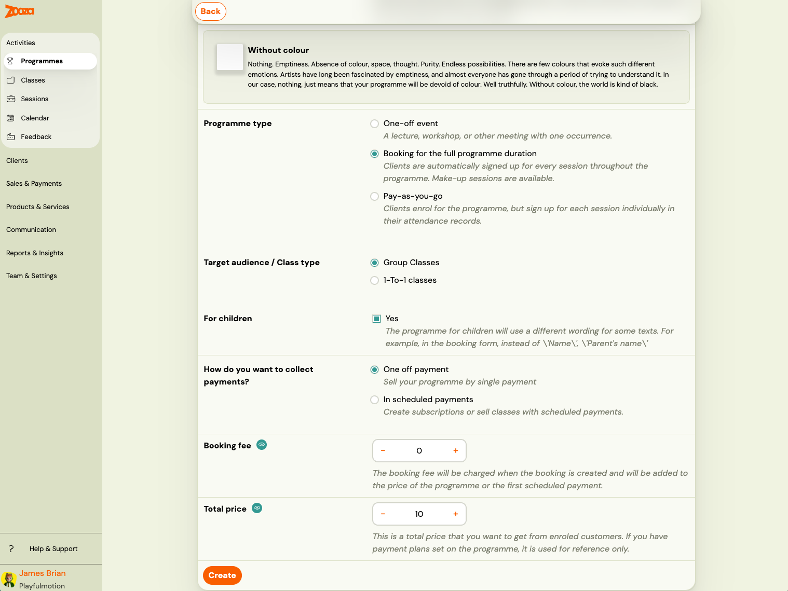
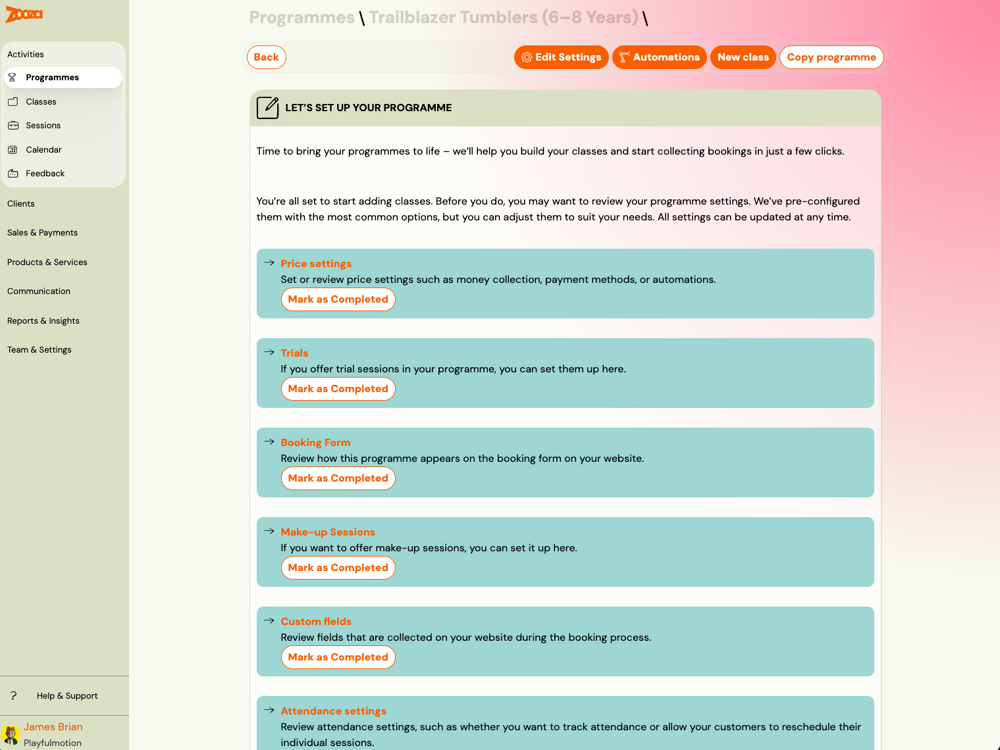

# Create a programme

A programme is the top-level container — it holds your pricing, payment settings, and booking form configuration. Classes and sessions are added inside the programme. You create a programme once per product or service, then add new classes each time the schedule changes.

> **When to create a new programme vs. a new class**
>
> - Create a **new programme** when you are launching a brand-new product or service (different age group, skill track, or offering).
> - Create a **new class** when you are running the same product again — new term, new time slot, new location, or new instructor. The class inherits all programme settings automatically.
>
> For a deeper explanation of how programmes, classes, sessions, and billing periods relate to each other, see [Programme, class, session definition](programme-class-session-definition.md).

## How to create a programme

Go to **Programmes** in the left menu and click **New Programme**.

## Step 1 — Name and colour

**Name** — Enter the programme name as clients will see it on the booking form and in their profile. Be specific enough to distinguish it from similar programmes (e.g., "Gymnastics – 6 to 8 years" rather than just "Gymnastics").

**Colour** — Choose a colour that will represent this programme:
- In the **admin app** — the colour appears on the programme tile and in the calendar.
- In the **online booking widget and web calendar** — clients see the colour to visually distinguish programmes.

Each colour in the picker has a label and a short description. The label is displayed in the web calendar alongside the programme name. Choose a colour that fits the character of the programme — or leave it without a colour if you prefer a neutral look.

## Step 2 — Programme settings

### Programme type

Choose the type that matches how clients will use this programme:

| Type | Description | Typical use |
|---|---|---|
| **One-off event** | A single session on a specific date. Clients enrol and attend once. | Lectures, workshops, open days, consultations |
| **Booking for full programme duration** | Multiple sessions over a defined period. Clients sign up for all sessions at once. | Term courses, semesters, ongoing classes |
| **Pay-as-you-go** | Clients enrol once and then choose which individual sessions to attend. They pay only for sessions they book. | Drop-in classes, flexible schedules |

> **Note:** You can offer [entry passes](creating-entry-passes.md) alongside pay-as-you-go programmes to let clients prepay for a bundle of sessions. See the full [Pay-as-you-go guide](pay-as-you-go-programme.md) for details.

### Target audience

| Option | Use when |
|---|---|
| **Group classes** | Multiple clients attend the same sessions together. |
| **1-to-1** | Each session is with one client only (private lessons, personal training, individual consultations). |

### For children

Toggle this on if the programme is for children. When enabled:
- The booking form includes a **child profile** section (name, date of birth, notes).
- Attendance and class management features display child-relevant information.

Leave it off for adult programmes or programmes where the participant and the paying client are the same person.

### Payment collection

Choose how clients will pay:

| Option | How it works |
|---|---|
| **One-off** | The full amount is collected in a single payment at the time of booking. |
| **Scheduled payments** | Payments are split into instalments. You configure the schedule using payment templates. |

### Booking fee

An optional one-time fee charged at the moment of booking, separate from the programme price. Leave it at 0 if you do not charge a booking fee.

### Total price

The full price of the programme for a single client. If individual classes within this programme will have different prices, you can override the price at the class level — but set a sensible default here.

## Create

Click **Create** to save the programme. Zooza will redirect you to the programme overview, where you can add the first class.

## Next step — add a class

A programme without a class cannot accept bookings. After creating the programme, add at least one class to define the schedule, location, and instructor. See [Creating a class](creating-a-class.md).

## Related

- [Programme, class, session definition](programme-class-session-definition.md) — understanding the hierarchy.
- [Creating a class](creating-a-class.md) — adding classes and sessions to the programme.
- [Programme settings](programme-settings.md) — full reference for all programme-level settings.
- [Pay-as-you-go programme](pay-as-you-go-programme.md) — setting up flexible session-based programmes.
- [Copy a programme or class](copy-programme-and-class.md) — fastest way to set up a new term.
- [Programmes, Timetables and Sessions FAQ](../faq/programmes-timetables-sessions-faq.md)
